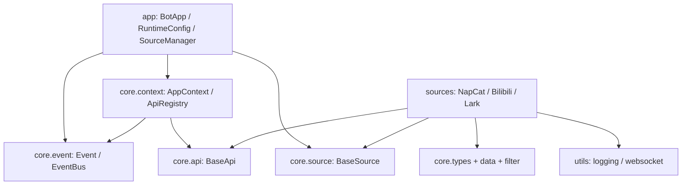

# 框架开发

本栏目面向 ButterBot 维护者，解释生命周期、任务所有权、模块依赖和内部实现。
如果只是调用稳定 API，请阅读[API 参考](/api/)；如果要接入新平台，请阅读
[扩展开发](/extensions/)。

## 模块职责

依赖向 core 流动。core 不导入 app 或具体 source 实现。

## 公共与内部边界

- 用户门面：`butterbot.app.__all__`；
- 扩展契约：core 各子包 `__all__`；
- 内置适配：`butterbot.sources.napcat/bilibili/lark.__all__`；
- 内部实现：下划线符号、DTO 解析 helper、`BasePollingSource` 私有轮询方法、
WebSocket 内部状态。

这里可以记录内部类和实现细节，但不因此把它们提升为公共 API。公共兼容性只由
门面、明确的 `__all__`、API 文档和对应契约测试共同定义。

## 测试结构

`tests/` 镜像 app、core、sources、utils。关键架构契约已有测试：

- Source 启动回滚与取消；
- manager 动态增删和停止韧性；
- EventBus 回调排空与超时取消；
- API registry 幂等关闭；
- NapCat pending 请求清理；
- Bilibili 轮询节奏；
- 示例语法与最小示例真实退出。

## 继续阅读

- [核心概念](./core-concepts.md)
- [生命周期](./lifecycle.md)
- [项目架构](./project-architecture.md)
- [事件系统](./event-system/)
- [Source 生命周期](./source-system/lifecycle.md)
- [API 系统](./api-system/base-api.md)
- [内部设计与约定](./conventions.md)
