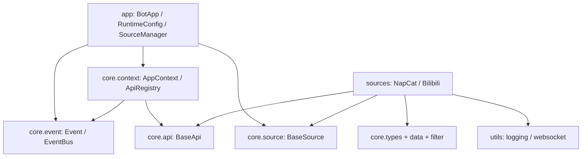

# 项目架构

本栏目面向维护者和扩展作者，记录当前实现，而非规划中的抽象。

## 模块职责

依赖向 core 流动。core 不导入 app 或具体 source 实现。

## 公共与内部边界

- 用户门面：`bilipy_bot.app.__all__`；
- 扩展契约：core 各子包 `__all__`；
- 内置适配：`bilipy_bot.sources.napcat/bilibili.__all__`；
- 内部实现：下划线符号、DTO 解析 helper、`BasePollingSource` 私有轮询方法、
  WebSocket 内部状态。

## 测试结构

`tests/` 镜像 app、core、sources、utils。关键架构契约已有测试：

- Source 启动回滚与取消；
- manager 动态增删和停止韧性；
- EventBus 回调排空与超时取消；
- API registry 幂等关闭；
- NapCat pending 请求清理；
- Bilibili 轮询节奏；
- 示例语法与最小示例真实退出。

## 继续阅读

[控制流、任务所有权与能力审计](./control-flow.md)。
