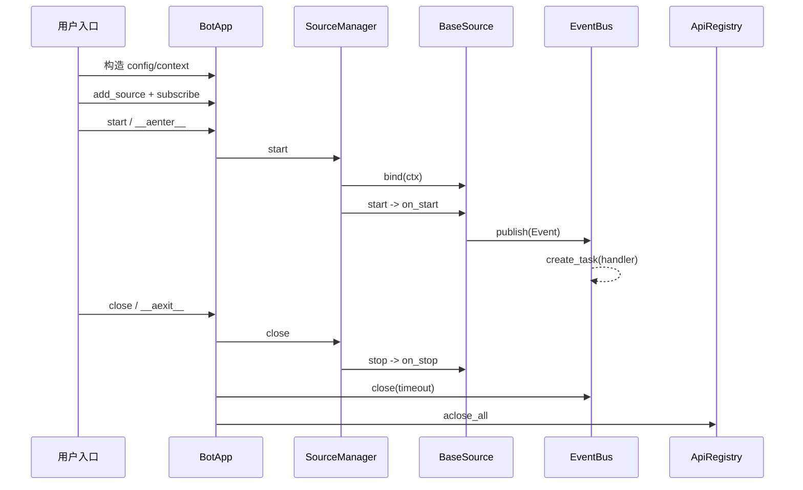

# 控制流与能力审计

## 初始化与关闭控制流

## 错误边界

- 构造：文件/YAML/builder 错误直接反馈调用者；
- 启动：manager 聚合 Source 失败并回滚；
- 生产：由具体 Source 定义单次错误是否可恢复；
- 分发：EventBus 记录 Handler task 异常；
- 关闭：Source 停止尽量继续；API 单例逐个关闭；
- 取消：Source 状态先回滚，manager 清理后再传播。

## 任务所有权

| 任务 | 创建位置 | 回收位置 |
| --- | --- | --- |
| Handler task | `EventBus.publish` | done callback / `EventBus.close` |
| Bilibili 轮询 task | `BasePollingSource.on_start` | `on_stop` |
| NapCat 消息 task | `NapcatClient.start` | `NapcatClient.stop` |
| WebSocket 主任务 | `AsyncWebSocketClient.start` | client `stop` |
| Bilibili 房间线程 | `BiliDanmakuSource` | `stop_room/on_stop` |

## 项目能力清单

| 状态 | 能力 | 证据 |
| --- | --- | --- |
| 已实现且可用 | 应用入口与上下文管理器 | `butterbot/app/bot_app.py::BotApp` |
| 已实现且可用 | Source 生命周期与启动回滚 | `core/source/base_source.py::BaseSource`、`app/source_manager.py::SourceManager` |
| 已实现且可用 | 事件订阅、过滤、回调排空 | `core/event/event_bus.py::EventBus` |
| 已实现且可用 | API 单例和异步释放 | `core/context/api_registry.py::ApiRegistry` |
| 已实现且可用 | NapCat 适配 | `sources/napcat/source/napcat_source.py::NapcatSource` |
| 已实现且可用 | Bilibili 三类 Source | `sources/bilibili/source/` |
| 已实现但原文档不足 | cancellation/timeout/任务所有权 | `tests/core/event/test_event_bus_close.py` 等 |
| 有文档但实现已变化 | 旧 core 导入路径 | 原 `docs/SOURCE.md` 与 source README |
| 已实现且可用 | 命名 Source 配置与环境变量合并 | `app/config.py::RuntimeConfig.from_yaml` |
| 已实现且可用 | 本地单进程 CLI | `butterbot/cli/`、`pyproject.toml::project.scripts` |
| 尚未实现 | 通用 Plugin/Middleware/Router/Session | 包内无对应稳定契约 |
| 无法确认 | 正式文档域名、Logo、部署平台 | 仓库无相关配置或资产 |

## 架构约束

1. Source 只生产 Event，不直接依赖业务 Handler；
2. core 只依赖 `ConfigProvider`，不依赖 YAML；
3. 创建 task 的组件负责保存和回收；
4. 应用关闭先停生产者，再排空消费者，最后关 API；
5. 状态规则在注册期展开，运行期按 UUID + 状态查表；
6. 外部网络不进入单元测试。
