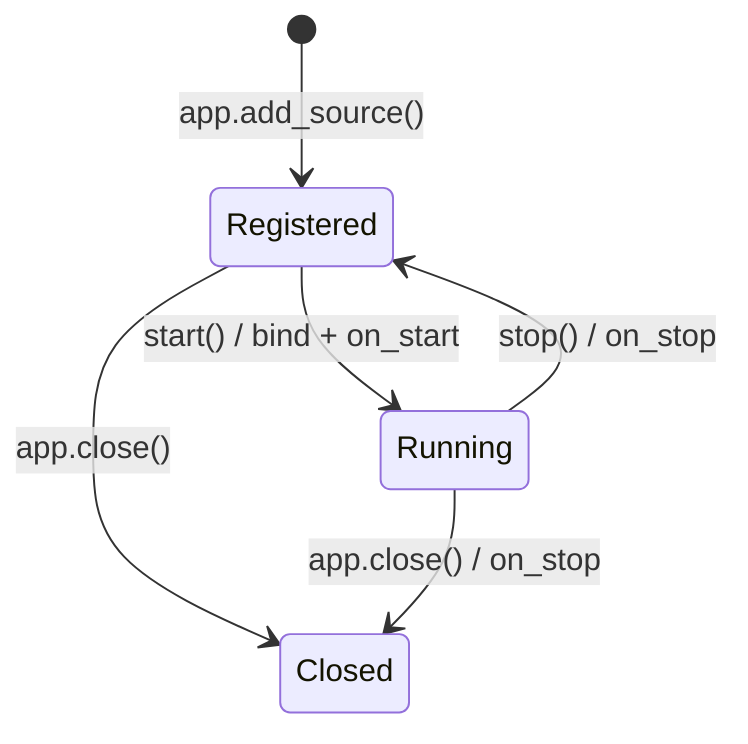

# 开发 Source

## 契约

自定义事件源继承 `BaseSource`，必须：

- 设置 `supported_types: ClassVar[type[BaseType]]`；
- 实现 `async on_start()`；
- 实现 `async on_stop()`；
- 用 `self.ctx.bus.publish(self.uuid, event)` 发布事件；
- 释放自己创建的任务、连接和监听器。

不要重写 `start()`/`stop()`，它们负责幂等状态和启动失败回滚。

## 生命周期



`self.ctx` 只有在 manager 绑定后可用；不要在 `__init__()` 读取它。

## 最小完整实现

仓库中的
[`examples/minimal_source_example.py`](https://github.com/GEYUANwuqi/ButterBot/blob/dev_main/examples/minimal_source_example.py)
包含经过 smoke test 的 Source、Data、Type、订阅和关闭流程。

关键任务模板：

```python
async def on_start(self) -> None:
    self._task = asyncio.create_task(self._run())


async def on_stop(self) -> None:
    task = self._task
    self._task = None
    if task is None:
        return
    if not task.done():
        task.cancel()
    try:
        await task
    except asyncio.CancelledError:
        pass
```

## 发布

```python
event = Event(data=MyData(...), status=MyType.READY)
await self.ctx.bus.publish(self.uuid, event)
```

`publish()` 只调度 Handler，不等待处理完成。Source 的生产循环不应依赖 Handler
执行顺序。

## 配置和 API

设置类级默认配置键：

```python
class MySource(BaseSource):
    config_key = "my_service"
    supported_types = MyType

    @property
    def api(self) -> MyApi:
        return self.ctx.api_ctx.get(MyApi, self.config_key)
```

构造器收到 `config_key` 时应传给 `super().__init__()`，支持多实例配置。

## 错误处理

- `on_start()` 失败：直接抛出原异常，框架负责回滚；
- 生产循环取消：重新抛出或退出循环；
- 可恢复单次错误：在明确边界记录并继续；
- 不可恢复错误：让拥有该任务的组件观察并记录，避免静默停止；
- `on_stop()` 应尽量幂等。

## 发布与兼容性

公开导出只包含使用者需要的 Source、Type、配置和数据类型。不要要求用户导入
私有 helper。升级时把事件状态值和 Data 字段视为兼容性边界。
