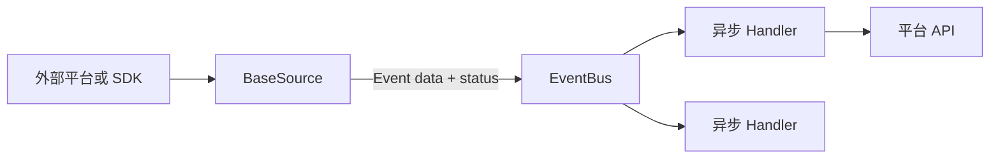

# 项目介绍

## 本页目标

了解 ButterBot 的运行模型、适用场景与明确边界。

## 它解决什么问题

外部平台通常以不同方式提供数据：WebSocket 推送、轮询 API、SDK 回调等。
ButterBot 将这些输入统一为 `BaseSource` 事件源，并把产生的数据包装为
`Event[Data]`。应用通过 `EventBus` 将事件交给已注册的异步处理器。

这种分离适合把平台输入与业务处理解耦，例如：

- 监听 NapCat 的 OneBot 事件并调用 API 回复；
- 轮询 Bilibili 动态或直播状态；
- 监听 Bilibili 直播弹幕；
- 基于 `BaseSource` 接入自定义异步数据源。

## 当前真实能力

- `BotApp` 负责配置、上下文、事件总线、事件源和 API 容器。
- `BaseType` 枚举描述事件状态，并支持层级与正则订阅。
- `BaseFilter` 在回调执行前进行同步内容过滤。
- `BaseSource` 与 `BaseApi` 提供公开扩展契约。
- 内置 NapCat 和 Bilibili 适配。
- 关闭时停止事件源、排空回调并释放 API 资源。

## 不属于当前能力的内容

当前代码没有通用 Plugin、Middleware、Router、Session 或 CLI 抽象。
`RuntimeConfig` 读取 Python 参数或 YAML，不会自动把环境变量映射为配置字段。
文档不会用这些术语包装不存在的功能。

## 设计边界

`butterbot.app` 是用户应用的主要导入门面；`butterbot.core` 暴露扩展契约。
集成实现可以依赖 core，但 core 不依赖 app 或具体平台。这个方向让扩展契约
不与 YAML 加载方式或某个平台绑定。

## 下一步

- [安装](./installation.md)
- [快速开始](./quick-start.md)
- [核心概念](/concepts/)
