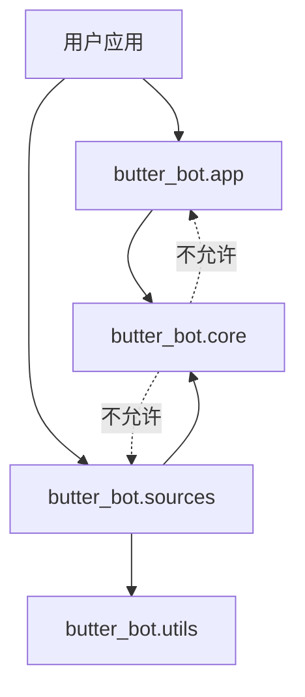

# 项目结构

## 本页目标

明确用户入口、扩展契约、内置适配与测试所在位置。

```text
butter_bot/
├── app/                 # BotApp、RuntimeConfig、SourceManager
├── core/
│   ├── api/             # BaseApi
│   ├── context/         # AppContext、ApiRegistry、ConfigProvider
│   ├── data/            # 数据模型基础设施
│   ├── event/           # Event、EventBus、Subscriber
│   ├── filter/          # BaseFilter 与组合过滤器
│   ├── source/          # BaseSource
│   └── types/           # BaseType
├── sources/
│   ├── bilibili/        # Bilibili API、Source、Data、Type
│   └── napcat/          # NapCat API、Source、Data、Filter、Type
└── utils/               # 日志、WebSocket 与小型工具
```

## 应用开发者从哪里导入

优先从 `butter_bot.app` 导入高层公共 API：

```python
from butter_bot.app import BotApp, Event, RuntimeConfig
```

内置适配从对应包导入：

```python
from butter_bot.sources.napcat import NapcatSource, NapcatType
```

## 扩展开发者从哪里导入

实现自定义扩展时，从具体 core 子模块导入契约：

```python
from butter_bot.core.api import BaseApi
from butter_bot.core.context import AppContext, ConfigProvider
from butter_bot.core.source import BaseSource
from butter_bot.core.types import BaseType
```

不要依赖以下内容：

- 以下划线开头的符号；
- `SourceManager` 的内部状态；
- `pydantic._internal` 等第三方内部 API；
- 内置 Source 的私有轮询方法。

## 依赖方向



## 测试结构

`tests/` 基本镜像生产包结构。异步测试使用 `pytest-asyncio` 严格模式；
Source 和 API 测试通过替身避免外部网络。修改公共生命周期时，应优先查看
`tests/app/`、`tests/core/event/` 和 `tests/core/source/`。

## 下一步

- [生命周期](./lifecycle.md)
- [项目架构](/architecture/)
