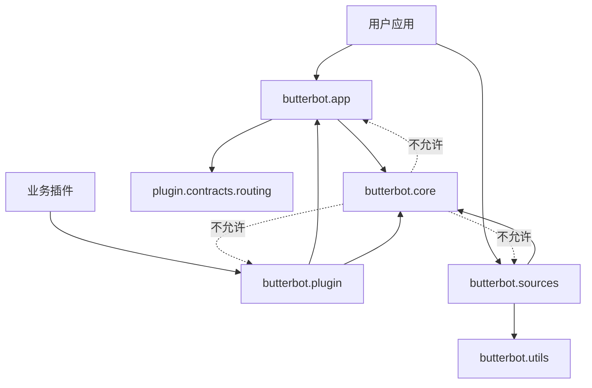

# 项目结构

## 本页目标

明确用户入口、扩展契约、内置适配与测试所在位置。

```text
butterbot/
├── app/                 # BotApp、RuntimeConfig、SourceManager
├── cli/                 # 应用加载、配置检查与本地进程管理
├── core/
│   ├── api/             # BaseApi
│   ├── context/         # AppContext、ApiRegistry、ConfigProvider
│   ├── data/            # 数据模型基础设施
│   ├── event/           # Event、EventBus、Subscriber
│   ├── filter/          # BaseFilter 与组合过滤器
│   ├── source/          # BaseSource
│   └── types/           # BaseType
├── plugin/
│   ├── contracts/       # ButterPlugin、descriptor、路由和订阅契约
│   ├── discovery/       # catalog、目录加载、manifest、来源与设置
│   ├── runtime/         # bootstrap、registrar、manager 与生命周期事务
│   └── errors.py        # 插件系统共享异常
├── sources/
│   ├── bilibili/        # Bilibili API、Source、Data、Type
│   └── napcat/          # NapCat API、Source、Data、Filter、Type
└── utils/               # 日志、WebSocket 与小型工具
```

## 应用开发者从哪里导入

优先从 `butterbot.app` 导入高层公共 API：

```python
from butterbot.app import BotApp, Event, RuntimeConfig
```

内置适配从对应包导入：

```python
from butterbot.sources.napcat import NapcatSource, NapcatType
```

## 插件作者从哪里导入

业务 Handler、本地目录插件和 distribution 插件统一从
`butterbot.plugin` 导入插件契约：

```python
from butterbot.plugin import (
    Event,
    ButterPlugin,
    PluginRegistrar,
    SourceRef,
    SubscriptionSpec,
)
```

普通插件不应导入 `butterbot.core`。只有实现新事件源、数据模型、状态类型或底层
API 的适配作者需要使用 core：

```python
from butterbot.core.data import BaseDataMixin
from butterbot.core.source import BaseSource
from butterbot.core.types import BaseType
```

不要依赖以下内容：

- 以下划线开头的符号；
- `SourceManager` 的内部状态；
- `pydantic._internal` 等第三方内部 API；
- 内置 Source 的私有轮询方法。

## 依赖方向



`BotApp` 只导入轻量的 `plugin.contracts.routing`；反向组合应用的 bootstrap、
registrar 和 manager 由 `butterbot.plugin` 门面延迟导出，因此模块级导入图不会
形成循环。业务插件只依赖根门面，不把上述内部分类当作稳定导入路径。

`butterbot/plugin/` 内部同一目录的模块使用单点相对导入；跨
`contracts/discovery/runtime` 目录或访问根目录模块时使用完整
`butterbot.plugin...` 绝对导入。

## 测试结构

`tests/` 基本镜像生产包结构。异步测试使用 `pytest-asyncio` 严格模式；
Source 和 API 测试通过替身避免外部网络。修改公共生命周期时，应优先查看
`tests/app/`、`tests/plugin/`、`tests/core/event/` 和
`tests/core/source/`。

## 下一步

- [生命周期](./lifecycle.md)
- [项目架构](/architecture/)
