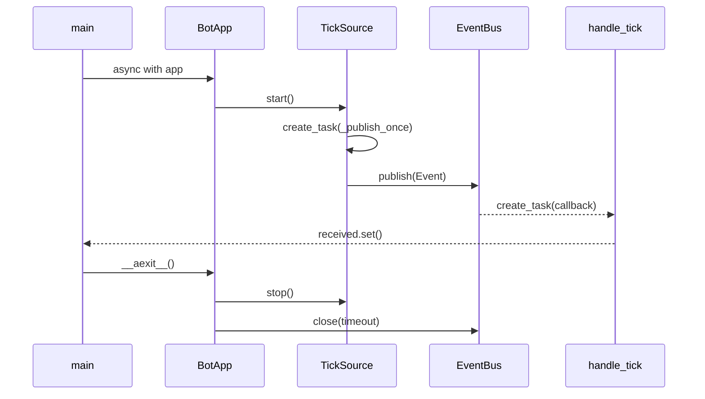

# 快速开始

## 本页目标

运行一个不需要网络、Token 或配置文件的完整应用，观察一次事件分发并确认
进程没有遗留后台任务。

## 前置条件

已按[安装](./installation.md)准备仓库开发环境。

## 运行仓库示例

```bash
uv run examples/minimal_source_example.py
```

预期输出：

```text
ready
```

该文件由测试直接执行，不只是语法片段。

## 完整代码

@[code python](../../examples/minimal_source_example.py)

## 发生了什么

1. `RuntimeConfig()` 创建一个空的内存配置，不读取 `config.yaml`。
2. `app.add_source(TickSource)` 只注册事件源，不立即启动。
3. `@app.subscribe(...)` 在启动前注册异步处理器。
4. `async with app` 调用 `app.start()`，`TickSource.on_start()` 创建自己拥有的任务。
5. Source 发布 `Event[TickData]`，`EventBus` 创建并持有 Handler 任务。
6. Handler 设置 `received`，主协程退出上下文。
7. `app.close()` 停止 Source、排空 Handler，并关闭所有 API 实例。



## 验证正常退出

仓库测试会在 5 秒超时内以子进程运行该示例，并断言输出：

```bash
uv run pytest tests/test_examples.py -q
```

如果示例超时，优先检查自定义 Source 是否取消并等待了自己创建的任务，以及
应用是否调用了 `close()`。

## 下一步

- [生命周期与入口选择](./lifecycle.md)
- [事件、状态与处理器](/concepts/events-and-handlers.md)
- [开发自定义 Source](/extensions/source.md)
