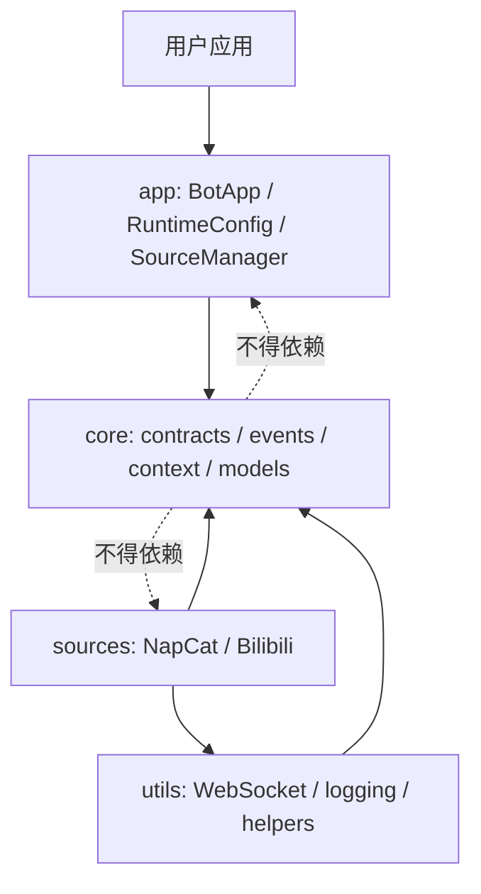

# ButterBot 全项目架构审查

> 审查基线：`dev_main` 分支，提交 `d2f8699`
> 审查日期：2026-07-27
> 证据等级：**代码证明**、**测试证明**、**文档声明**、**审查推断**、
> **无法确认**

## 1. 执行摘要

ButterBot 当前是一个边界基本清楚的 asyncio 模块化单体，而不是插件平台或通用
自动化运行时。`core` 定义事件、数据、类型、过滤器、Source/API 契约和上下文；
`app` 负责组合与生命周期；`sources` 提供 NapCat、Bilibili 适配；`utils` 提供日志
和 WebSocket 基础设施。代码中没有 Plugin、Router、PolicyEngine、CLI 或统一
healthcheck 抽象。

项目的常规路径成熟度高于候选任务列表所暗示的水平：

- Source 启停、失败回滚、动态增删和订阅清理已有集中实现与测试；
- EventBus 保存 Handler task 强引用、消费异常，并在正常关闭时限时排空；
- BotApp 明确按“停止生产者 → 排空 Handler → 关闭 API”顺序关闭；
- CI 覆盖 Python 3.12、3.13、3.14，并执行测试、覆盖率、lint、类型检查、构建和
  文档门禁；
- 本次在 Python 3.12 上实际执行 372 项测试，全部通过，总覆盖率 73%。

但审查发现了比“正式插件协议”“RBAC”更紧急的核心可靠性问题：

1. **EventBus 关闭可被取消后锁死。** `EventBus.close()` 在排空前设置
   `_closed=True`，若等待过程被取消，后续 `close()` 会因幂等快速路径直接返回。
   本次最小复现证明 pending callback 会保留。
2. **SourceManager 启动取消不回滚已启动 Source。** `start()` 只捕获
   `Exception`，而 `asyncio.CancelledError` 继承 `BaseException`。
3. **动态移除取消会跳过退订和摘除。** `remove_source()` 对 `source.stop()` 也只
   捕获 `Exception`。
4. **关闭链不是全程 best-effort。** `BotApp.close()` 能在 manager 失败时进入
   `finally`，但若 `bus.close()` 失败或被取消，`ApiRegistry.aclose_all()` 不会执行；
   API 批量关闭本身也会因一个 `CancelledError` 中止剩余实例。
5. **EventBus 确实没有容量上限。** 每个匹配 Handler 都立即创建独立 task。
   10,000 次阻塞回调的合成验证产生 10,000 个 pending task 和约 11.5 MiB
   `tracemalloc` 占用。现有关闭回收有效，但不能防止运行期资源增长。
6. **Pydantic 私有元类是明确升级风险。**
   `BaseDataModel` 直接继承
   `pydantic._internal._model_construction.ModelMetaclass`，同时项目依赖只有下界
   `pydantic>=2.13.4`，没有主版本上界。

结论：当前最合理的方向是先修复取消安全、消除私有 API、建立可重复负载基线和
发布 wheel smoke，再推进配置/CLI、有限可观测性和可选调度容量。插件、RBAC、
桥接器和生态治理都不应是当前 P0。

## 2. 审查范围和方法

### 2.1 已阅读范围

- 构建与发布：`pyproject.toml`、`uv.lock`、`package.json`、
  `.github/workflows/ci.yml`、`.github/workflows/release-on-version.yml`
- 应用层：`butterbot/app/`
- 核心契约：`butterbot/core/`
- 内置集成：`butterbot/sources/bilibili/`、`butterbot/sources/napcat/`
- 基础设施：`butterbot/utils/`
- 测试：`tests/`
- 示例与配置：`examples/`
- 架构、概念、API、扩展和排障文档：`docs/`
- 最近 20 条提交、版本标签、公开导出和包元数据

仓库约有 17,404 行 Python、Markdown、YAML/YML 文件。审查没有以 README
替代代码，也没有调用真实 NapCat 或 Bilibili 外部服务。

### 2.2 验证方法

- 静态搜索所有 task、queue、timeout、cancel、publish、close、配置构建器、
  Pydantic 私有 API、metrics、plugin、policy 和 CLI 入口；
- 沿调用链阅读实现和对应测试；
- 执行完整测试、覆盖率、lint、格式、类型、构建、文档和 wheel smoke；
- 用不提交仓库的短脚本复现 EventBus 无界 pending task 和关闭取消缺陷；
- 区分正常关闭行为与外部取消、单个资源关闭失败等异常路径。

## 3. 当前项目架构

### 3.1 模块边界



**代码证明：**

- `butterbot/core/` 的运行时 import 只指向 core 内部；
- `AppContext` 依赖 `ConfigProvider` Protocol，而不是 `RuntimeConfig`
  （`butterbot/core/context/config_provider.py:6`）；
- `app` 依赖 core；Source 实现依赖 core 和 utils；
- `butterbot/app/config.py:149-152` 的 NapCat builder 会延迟 import 具体 Source
  配置类型。这没有违反“core 不反向依赖”的约束，但使 app 配置层知道内置集成。

**审查判断：** 当前依赖方向总体正确，适合继续保持模块化单体。没有证据支持把
Router、Worker、Metrics 或 Registry 拆为独立服务。

### 3.2 事实上的扩展模型

当前扩展不是统一 Plugin，而是以下契约的组合：

| 契约 | 作用 | 证据 |
| --- | --- | --- |
| `BaseSource` | 输入、生命周期、事件发布 | `core/source/base_source.py:10` |
| `BaseApi` | 外部动作/API 工厂和 `aclose()` | `core/api/base_api.py:8` |
| `BaseDataMixin` / `BaseDataModel` | 事件数据和自动分发 | `core/data/` |
| `BaseType` | 状态命名、层级和正则匹配 | `core/types/base_type.py:8` |
| `BaseFilter` | 同步内容过滤和组合 | `core/filter/base_filter.py:11` |
| `ConfigProvider` | core 所需最小配置读取接口 | `core/context/config_provider.py:6` |
| `AppContext` | 向 Source 注入 bus、API registry、config | `core/context/app_context.py:9` |

`docs/extensions/README.md:15-16` 也明确说明完整适配通常由 Source、API、Data、
Type、可选 Filter 组成，并通过普通 Python 包导出。该描述与代码一致。

## 4. 公共 API 和内部边界

### 4.1 面向应用用户的稳定入口

`butterbot/app/__init__.py:21-40` 导出：

- `BotApp`
- `Event`
- `RuntimeConfig`、`register_builder`
- `BaseFilter`、`AndFilter`、`OrFilter`
- 框架异常层级

`butterbot/__init__.py` 只公开 `__version__`。README 和模块文档建议普通用户从
`butterbot.app` 导入。

### 4.2 面向扩展作者的接口

扩展作者必须直接从 `butterbot.core.*` 和 `butterbot.sources.*` 导入契约。
`core/__init__.py` 也汇总导出主要类型。虽然这些符号实际公开并有文档，但仓库
没有明确的 API 稳定性政策、弃用周期或兼容矩阵。

`Subscriber` 和 `SubscriberGroup` 被 `core.event.__all__` 导出，但其派发表结构
明显属于 EventBus 实现细节。将其视为稳定公共 API 会限制后续调度重构。

### 4.3 内部接口

以下名称虽可被 Python 访问，但应视为内部：

- `EventBus._background_tasks`、`_subscriber_group`
- `SubscriberGroup._dispatch_table`
- `BaseDataModel._registry`、`MetaDataModel`
- `RuntimeConfig._configs`、全局 `_CONFIG_BUILDERS`
- WebSocket 客户端内部 task、listener 和发送队列

部分测试直接访问这些成员，例如
`tests/core/event/test_event_bus_close.py:61` 和
`tests/core/event/test_event_bus.py:326`。这些是白盒回归测试，不应自动升级为
第三方兼容承诺。

## 5. 生命周期与任务所有权

### 5.1 BotApp 生命周期

`BotApp` 构造配置和 `AppContext`，再创建 `SourceManager`
（`butterbot/app/bot_app.py:40-67`）。它提供三种入口：

- `await app.start()/close()`
- `async with app`
- `app.run()`，内部使用 `asyncio.run()` 并处理 SIGINT/SIGTERM

正常关闭顺序由 `BotApp.close()` 固定为：

1. `SourceManager.close()`
2. `EventBus.close(timeout)`
3. `ApiRegistry.aclose_all()`

证据：`butterbot/app/bot_app.py:296-313`；顺序测试：
`tests/app/test_bot_app.py:260-270`。

### 5.2 Source 生命周期

`BaseSource.start()` 在调用 `on_start()` 前设置 `running=True`，并用
`except BaseException` 保证包括取消在内的启动失败会回滚状态
（`core/source/base_source.py:64-84`）。

`BaseSource.stop()` 先设置 `running=False` 再调用 `on_stop()`
（`core/source/base_source.py:86-95`）。因此子类即使清理失败，状态也表示“不再
正常运行”，但资源是否真正释放仍取决于子类实现。

`SourceManager.start()` 按注册顺序串行启动，普通异常会聚合并回滚已启动 Source
（`app/source_manager.py:256-305`）。`stop()` 尽力停止所有 Source，记录普通
异常，并在清完后重新抛出观察到的取消
（`app/source_manager.py:310-348`）。

动态接入顺序是 `add_source → subscribe → start_source`，避免 Source 在订阅前
产生事件（`app/source_manager.py:71-114`）。移除顺序是停止、退订、摘除
（`app/source_manager.py:116-147`）。

### 5.3 任务所有权

| 任务 | 创建者 | 正常回收者 |
| --- | --- | --- |
| Handler task | `EventBus.publish()` | done callback / `EventBus.close()` |
| Bilibili 轮询 task | `BasePollingSource.on_start()` | `on_stop()` |
| NapCat 消息 task | `NapcatClient.start()` | `NapcatClient.stop()` |
| WebSocket 主 task | `AsyncWebSocketClient.start()` | client `stop()` |
| WebSocket send/receive task | WebSocket 主循环 | 主循环 finally/gather |
| Bilibili 弹幕连接任务 | `BiliDanmakuSource` | Source 停止流程 |

该所有权原则由代码和 `docs/architecture/control-flow.md:42-50` 同时支持。

### 5.4 取消和关闭缺陷

#### ARCH-ASYNC-001：EventBus 关闭取消后不可恢复

`EventBus.close()` 在 `event_bus.py:179-181` 先设置 `_closed=True`，然后在
`:197` 等待 pending task。若当前 close task 此时被取消，`:205` 的清理不会执行。
再次调用时 `:179-180` 直接返回。

本次复现结果：

```text
after_cancel closed=True pending=1
after_second_close closed=True pending=1
```

现有测试覆盖正常排空、超时取消、内部回调调用 close 和重复关闭，但没有覆盖
“close 自身被取消后重试”：`tests/core/event/test_event_bus_close.py`。

#### ARCH-ASYNC-002：SourceManager 启动取消不回滚

`SourceManager.start()` 在 `source_manager.py:290-296` 只捕获 `Exception`。
启动第二个 Source 时若收到 `CancelledError`，此前加入 `started` 的 Source 不会
执行 `stop()`。`BaseSource` 只能回滚当前 Source 的 `running`，无法回滚其他源。

#### ARCH-ASYNC-003：动态移除取消不完成退订

`remove_source()` 在 `source_manager.py:134-140` 只捕获普通异常。停止过程中取消
会跳过 `remove_subscribers()` 和 `_sources.pop()`。文档所称“完整移除序列”对取消
并不成立。

#### ARCH-ASYNC-004：关闭链后半段可能被跳过

`BotApp.close()` 使用一个 `finally` 包含两个连续 await。manager 失败时能执行
bus 和 API 关闭，但 bus 关闭抛出异常或取消时，API 关闭不会执行。

`ApiRegistry.aclose_all()` 在清空 registry 后逐个关闭实例，只捕获 `Exception`
（`core/context/api_registry.py:77-98`）。一个 API 抛 `CancelledError` 会跳过后续
实例，且 registry 已无引用可供重试。

这些问题应作为核心可靠性 P0 独立于候选模块修复。

## 6. EventBus 当前并发模型

### 6.1 注册与路由

`SubscriberGroup.add()` 在注册期依据 Source 的 `supported_types` 将规则展开为
`UUID → 具体 BaseType → callback list`；无匹配直接抛 `SubscriptionError`。
`publish()` 因而只做 O(1) 查表并取得不可变 callback 快照。

这已经承担了 Router 的核心逻辑。新增独立 `RouteSpec` 若只是表达 source、status、
filter、callback，会与 `Subscriber`、`SubscriberGroup` 和 `BaseType` 重复。

### 6.2 发布语义

`EventBus.publish()`：

1. closed 时记录警告并丢弃；
2. 查找匹配 callback；
3. 对每个 callback 立即 `asyncio.create_task(callback(event))`；
4. 将 task 放入 `_background_tasks` 强引用集合；
5. done callback 移除引用并记录 Handler 异常；
6. `publish()` 不等待 Handler 完成。

证据：`core/event/event_bus.py:239-276`。

所以：

- fan-out 和跨事件并发均无上限；
- 同一 Handler 对同一/不同事件可并发重入；
- Handler 异常不会传播回 `publish()`，而是记录日志；
- Filter 包装在 callback 内，在新 task 开始执行后同步检查
  （`event_bus.py:42-79`）；
- 慢 Handler 不直接阻塞其他 Handler，但会持续占用 task 和内存；
- 没有 Queue、Semaphore、TaskGroup 或 worker。

### 6.3 正常关闭语义

EventBus 保存 task 强引用，因此“task 会因没有引用被 GC”不是当前缺陷。
`close(timeout)` 会停止接收、等待 pending、超时后 cancel 并 gather，完成后清空
集合。对应测试覆盖正常排空、超时、无 pending、幂等、回调内部关闭和关闭后发布。

### 6.4 合成负载证据

一个永远等待 gate 的 Handler，连续发布同一 Event 10,000 次：

```text
published=10000 pending=10000 elapsed=0.123s
current=11.49MiB peak=11.49MiB
after_close pending=0
```

这是资源上界缺失的证据，不是生产吞吐结论。它不能证明固定 worker pool 或全局
Queue 是最佳方案。更小的候选方案是：

- 给 in-flight task 设置总容量，并在 `publish()` 获取容量时背压；
- 保留当前 callback task 模型，不先引入 `HandlerJob` 和 worker；
- 初期容量显式配置、默认保持兼容；采集 pending、拒绝/等待时间和执行延迟；
- 若真实负载证明慢 Handler 相互干扰，再增加每订阅者容量或独立队列。

全局固定 worker pool 会改变并发、顺序、Filter 执行时机、异常观测和关闭语义，
不能作为未经基线验证的 P0 直接实施。

## 7. 配置与部署现状

### 7.1 RuntimeConfig

`RuntimeConfig` 是任意键值容器，提供 `get_config()` 和 `from_yaml()`。
YAML 顶层键可通过全局 `register_builder()` 转换为类型对象
（`app/config.py:11-137`）。内置 builder 支持 Bilibili `Credential` 和
`NapcatConfig`。

当前没有：

- 环境变量到嵌套配置的统一映射；
- 多配置来源合并和优先级；
- 配置 schema 或统一验证；
- secret 类型和统一脱敏；
- builder 冲突、注销或作用域管理。

`docs/configuration/environment.md:7-10` 明确声明不会自动读取环境变量，这与代码
一致。日志模块独立读取 `LOG_LEVEL` 等环境变量，不等于 RuntimeConfig 映射。

`NapcatConfig` 是普通 dataclass，`token` 默认会出现在 dataclass repr。当前
`RuntimeConfig` 没有自定义 repr，实例本身不直接展开 `_configs`，但其中的配置
对象仍可能在异常、调试器或用户日志中泄露 secret。

### 7.2 CLI 和部署

`pyproject.toml` 没有 `[project.scripts]`，仓库无 argparse、Click、Typer 或 CLI
入口。`BotApp.run()` 只是 Python API，不提供应用发现。

仓库没有 Dockerfile、Compose、systemd unit 或应用工厂约定。现有示例通过直接
Python 文件构造 BotApp。CLI 不依赖插件系统；它只需要确定的
`module:object/factory` 入口和配置来源规范。

## 8. 可观测性现状

### 8.1 日志

项目有集中日志配置、控制台/文件 handler、重定向规则和环境变量，生命周期、连接、
发布和异常均有日志。Handler 异常由 EventBus 消费并记录。

问题包括：

- 日志字段主要以格式化文本表达，没有统一结构化上下文；
- `NapcatSource._process_messages()` 在解析失败时记录完整原始消息
  （`sources/napcat/source/napcat_source.py:49-50`），可能包含隐私内容；
- 没有跨 Event/Handler/API 的 correlation 上下文。

### 8.2 Metrics

并非完全没有 metrics：

- `AioHttpWebSocketConnection.metrics` 记录连接、消息、字节和错误计数
  （`utils/websocket.py:320-330`）；
- `AsyncWebSocketClient.get_metrics()` 返回连接状态、队列和运行状态；
- `NapcatApi.get_metrics()` 透传该结果
  （`sources/napcat/api/napcat_api.py:296-298`）；
- `EventBus.pending_callbacks` 提供单个当前值。

没有统一 MetricSink/快照协议、指标命名和标签规范，也没有 Bilibili 轮询成功率、
持续失败、最后成功时间或 EventBus 延迟/背压指标。

### 8.3 Health

WebSocket 有内部 `WebSocketState`，Source 有 `running`，Manager/Bus 有状态，但
没有统一 health 接口，也没有 HTTP 健康端点。当前更适合先定义进程内
`HealthSnapshot`：

- live：进程和事件循环可运行；
- ready：所需 Source/API 已就绪并可处理；
- degraded：部分可选 Source 失败或持续重连；
- unhealthy：必需依赖不可用或生命周期失败。

HTTP 暴露属于部署适配器，不应进入 core health 模型。

### 8.4 事件标识和追踪

`Event` 只有随机 `id`、`data`、`status`（`core/event/event.py:9-24`）。

- `Event.id`：当前事件实例唯一标识；
- `correlation_id`：一条业务流程中多个事件共享的关联标识；
- `causation_id`：直接导致当前事件的父 Event/消息标识；
- `trace_id`：分布式追踪系统定义的 trace，上下文存在时才应设置。

四者不能合并为一个 `trace_id`。当前没有证据支持立即引入完整 OpenTelemetry；
应先增加可选 Event metadata 和日志上下文。

## 9. 数据模型与 Pydantic 风险

唯一的 `pydantic._internal` 依赖位于
`butterbot/core/data/base_model.py:4`。`MetaDataModel` 继承私有
`ModelMetaclass`，在类创建时：

- 查找最近的 discriminator root；
- 将 `discriminator_value` 注册到 root `_registry`；
- 新 root 定义 `discriminator_field` 时创建独立 registry；
- 支持多值和多层 discriminator。

NapCat 的 event/segment 模型广泛依赖该行为；Bilibili DTO 也继承
`BaseDataModel`。测试覆盖单层、多值、间接继承、普通 DTO 不污染全局 registry 和
自动列表分发（`tests/core/data/test_base_model.py`）。

本次用 Pydantic 2.13.4 验证：公开的
`BaseModel.__pydantic_init_subclass__()` 可以在模型基本初始化后完成相同注册，
包括间接继承，不需要私有元类。它比普通 `__init_subclass__` 更符合 Pydantic 的
类构造时序，且对现有 API 影响最小。官方 discriminated union 无法直接覆盖当前
动态 registry、多层分发和 `from_type(raw=False)` 语义，直接迁移会扩大改动。

建议：

1. 用 `__pydantic_init_subclass__` 替代 `MetaDataModel`；
2. 保留 `from_dict()`、`from_type()`、`_registry` 行为；
3. 增加重复 discriminator、root 隔离、多层未知值和真实 NapCat payload 回归；
4. 将依赖约束至少限制为 `pydantic>=2.13.4,<3`，主版本升级单独验证。

## 10. 测试、CI 和发布成熟度

### 10.1 测试

测试使用 pytest 和 pytest-asyncio strict mode，布局与生产模块对应。核心覆盖率高：

- EventBus 99%
- Subscriber 100%
- SourceManager 98%
- BotApp 93%
- BaseSource 91%

低覆盖区域集中在真实 I/O：

- `BilibiliApi` 35%
- 三类 Bilibili Source 约 30%-45%
- `NapcatApi` 57%
- WebSocket 59%

因此总覆盖率 73% 达标，但不能等价于外部集成已充分验证。

### 10.2 CI

`.github/workflows/ci.yml`：

- Python 3.12、3.13、3.14 矩阵；
- 3.12 执行 Ruff、format、Pyright、覆盖率 70% 门禁和 build；
- 其他版本执行测试；
- 独立文档 job 执行 VuePress build、Markdown lint、内部链接检查。

本地只安装 Python 3.12.3，因此本次没有重跑 3.13/3.14。

### 10.3 发布

tag 发布 workflow 会验证包名、版本、分支和 stable/dev 版本格式，执行完整 Python
门禁，构建后直接发布 PyPI 和 GitHub Release。

缺口：

- 没有从构建 wheel 创建干净环境、安装并导入/运行的 smoke gate；
- publish 在 smoke 之前，构建产物错误只能发布后发现；
- 没有外部扩展 contract test；
- 没有性能回归基线；
- package dependencies 中 `pillow`、`requests`、`tqdm` 未被 ButterBot 代码直接
  import，可能只是 Bilibili 依赖的重复声明，应单独清理而非混入架构任务。

## 11. 当前真实痛点

按紧急程度排序：

1. 取消可能破坏 EventBus、SourceManager 和 ApiRegistry 的最终清理；
2. Pydantic 私有元类配合无主版本上界，升级风险明确；
3. EventBus 无运行期容量边界，慢 Handler 可造成 task 和内存线性增长；
4. 发布流程缺少构建产物安装 smoke；
5. I/O 集成测试覆盖薄弱，尤其 Bilibili；
6. 配置来源、secret 脱敏和部署入口缺失；
7. 可观测性是若干局部状态和字典，没有统一契约；
8. 公共 API 稳定性、弃用和外部扩展兼容政策未定义。

## 12. 主要架构风险

| 风险 | 概率 | 影响 | 处理 |
| --- | --- | --- | --- |
| 关闭取消后悬挂 task/连接 | 高 | 高 | P0 修复并加取消回归 |
| Pydantic 内部实现变更 | 中高 | 高 | P0 替换公开 hook，限制主版本 |
| Handler task 无界增长 | 中 | 高 | P0 基线，P1 可配置背压 |
| 全局 Queue 改变事件语义 | 中 | 高 | 不直接上 worker pool |
| secret 进入 repr/错误日志 | 中 | 高 | 配置脱敏与日志审计 |
| 外部集成上游 API 变化 | 高 | 中高 | contract tests、版本策略 |
| 过早稳定插件协议 | 高 | 高 | provisional + 外部验证 |
| 桥接外部框架形成兼容负担 | 高 | 中 | 独立包、需求驱动 |

## 13. 过度设计风险

- `PluginContext` 直接复制 `AppContext` 会产生两个依赖注入容器；
- `RouteSpec` 复制现有 Subscriber/Type/Filter 会固化重复路由协议；
- 全局 worker pool/Queue 可能制造不必要的 head-of-line blocking；
- 没有 subject/resource/action/tenant 时设计 RBAC 只会发明不存在的领域模型；
- Python distribution 默认拥有进程权限，manifest 签名不等于运行时安全；
- 插件评分需要审核、反滥用和争议处理，不是一个纯技术功能；
- 双向 NoneBot2/NcatBot 桥接会把两个生命周期、事件语义和版本矩阵带入长期维护；
- 当前没有控制面或多进程需求，拆独立 Policy/Metrics/Registry 服务没有收益。

## 14. 关键证据索引

| 结论 | 代码 | 测试/文档 |
| --- | --- | --- |
| core 不依赖 app/source | `butterbot/core/` imports | `test_app_context.py` 最小 provider |
| 启动失败普通异常回滚 | `source_manager.py:256-305` | `test_source_manager.py:252-322` |
| stop 取消后继续清理 | `source_manager.py:310-348` | `test_source_manager.py:325-366` |
| Handler 独立 create_task | `event_bus.py:239-270` | `test_event_bus.py:310-357` |
| 正常关闭排空/取消 | `event_bus.py:161-205` | `test_event_bus_close.py:27-145` |
| Filter 在 callback 内 | `event_bus.py:42-79` | `test_event_bus.py:385-558` |
| 注册期编译路由 | `subscriber.py:34-125` | `test_subscriber.py` |
| API 单例关闭 | `api_registry.py:31-98` | `test_api_registry.py` |
| 无环境变量映射 | `app/config.py` | `docs/configuration/environment.md` |
| NapCat 已有 metrics | `napcat_api.py:296-298` | `test_websocket.py:361-373` |
| 私有 Pydantic 元类 | `base_model.py:4-52` | `test_base_model.py` |
| 无 CLI | `pyproject.toml` | `docs/guide/introduction.md:44-45` |
| 发布无 wheel smoke | `release-on-version.yml:82-106` | 本次隔离 smoke |

## 15. 无法确认的事项

- 真实生产吞吐、峰值 fan-out、平均/尾部 Handler 延迟；
- 当前活跃用户、外部扩展作者、插件或桥接器需求量；
- 是否有多租户、业务主体、资源和动作模型；
- 是否要求 Kubernetes、systemd 或单机脚本中的哪一种部署形态；
- NapCat/Bilibili 线上错误率、SLO 和告警渠道；
- Python 3.13/3.14 在本地环境的实际结果，本次仅确认 CI 配置；
- NcatBot/NoneBot2 当前版本的具体兼容范围；
- 未来插件是否被视为不可信代码；
- 是否有维护插件目录、签名密钥、撤销和安全公告的运营人员。

这些未知项不应被默认填充为复杂架构。应以负载数据、真实外部扩展和维护者明确的
产品边界作为后续稳定公共协议的准入条件。
