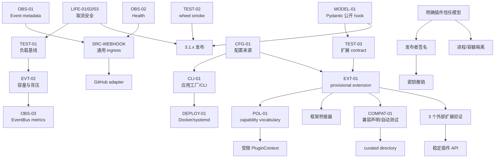

# ButterBot 分阶段实施路线

## 实施状态（2026-07-27）

本路线的第一批工作已在审查后实施：

| ID | 状态 | 实施结果 |
| --- | --- | --- |
| LIFE-01 | 已完成 | EventBus close 被取消时继续回收，未完成时可重试 |
| LIFE-02 | 已完成 | Source 启动取消回滚；动态移除取消仍退订和摘除 |
| LIFE-03 | 已完成 | BotApp 嵌套 finally；ApiRegistry 清完其余实例再传播取消 |
| MODEL-01 | 已完成 | 改用 `__pydantic_init_subclass__`，依赖限制为 Pydantic 2.x |
| TEST-01 | 已完成首版 | 新增 `scripts/benchmark_event_bus.py` 合成基线 |
| TEST-02 | 已完成 | 普通 CI 和 tag 发布均在 publish 前执行干净 wheel smoke |
| EVT-02 | 已完成兼容首版 | 可选全局容量，默认 unlimited，容量满时背压 |

CFG-01、CLI-01、Event metadata、health、metrics 和 extension contract 尚未开始。
EventBus 每订阅者隔离、drop/raise overflow 和固定 worker pool 仍不在本批范围。

## 1. 重新排序后的任务清单

### P0：近期发布和核心可靠性

| ID | 任务 | 退出结果 |
| --- | --- | --- |
| LIFE-01 | 修复 EventBus 关闭取消后的可重试清理 | 无 pending Handler，重复 close 可完成 |
| LIFE-02 | 补齐 SourceManager 启动/移除取消回滚 | 无半启动 Source 和残留订阅 |
| LIFE-03 | 关闭链 best-effort 和取消传播 | bus/API 均尝试释放，最终再传播取消 |
| MODEL-01 | 去除 Pydantic 私有 ModelMetaclass | 现有 discriminator API/行为不变 |
| TEST-01 | EventBus 负载与语义基线 | 获得容量决策数据 |
| TEST-02 | 发布前 wheel smoke | 发布产物可安装、导入、运行和关闭 |

### P1：近期里程碑能力

| ID | 任务 | 退出结果 |
| --- | --- | --- |
| EVT-02 | EventBus 可选容量和背压 | pending 有上限，默认不丢事件 |
| CFG-01 | 配置来源合并和 secret 脱敏 | 显式 env/YAML/CLI 优先级 |
| CLI-01 | 应用工厂和最小 CLI | 标准运行、校验和版本入口 |
| OBS-01 | Event metadata 和日志上下文 | correlation/causation 可传播 |
| OBS-02 | 统一 health snapshot | app/source/API 状态可聚合 |
| OBS-03 | 统一 metrics snapshot | EventBus 和内置 Source 可观测 |
| TEST-03 | 外部扩展 contract tests | 可安装第三方包验证契约 |

### P2：平台化试验

| ID | 任务 | 进入条件 |
| --- | --- | --- |
| EXT-01 | provisional extension contract | CLI/config 稳定，至少一个外部原型 |
| POL-01 | capability vocabulary | 明确扩展需要受限上下文 |
| DEPLOY-01 | Docker/systemd 示例 | CLI 和应用工厂已发布 |
| SRC-CRON | Cron 独立扩展 | contract suite 可复用 |
| SRC-WEBHOOK | Webhook ingress 独立扩展 | Event metadata、health 已有 |
| COMPAT-01 | manifest 兼容声明/自动测试 | provisional manifest 已验证 |

### P3：条件触发

- 稳定插件 API：至少 3 个独立外部 distribution、3 种能力形态、跨两个小版本；
- GitHub adapter：通用 Webhook ingress 稳定后；
- Mail Source：有明确服务商、认证方式和用户；
- NcatBot/NoneBot2 单向桥接：有维护者和目标版本矩阵；
- OpenTelemetry adapter：有跨进程 trace 需求；
- curated directory/安全公告：至少约 10 个活跃扩展和明确运营责任人。

### Reject 或合并

- 完整 RBAC：Reject，直到存在 tenant/subject/resource/action/control plane；
- 固定 EventBus worker pool：Reject 当前预设方案，合并到负载驱动的调度决策；
- RouteSpec：Merge 到未来 provisional SubscriptionSpec，禁止第二套路由器；
- PluginContext：Merge 到 capability policy，当前复用 AppContext；
- 自建完整性、发布者签名、撤销、插件评分：当前 Reject/Defer。

## 2. 有向依赖图



## 3. 分阶段里程碑

## M0：3.1.x 可靠性补丁

### 内容

- LIFE-01、LIFE-02、LIFE-03；
- MODEL-01；
- TEST-01、TEST-02；
- 同步修正文档中对取消和关闭的过度承诺。

### 退出条件

- EventBus close task 在排空期间被取消后，可再次 close 并清完 task；
- SourceManager 启动取消会停止此前已启动 Source；
- remove_source 取消后仍完成退订/摘除，再传播取消；
- BotApp 和 ApiRegistry 对所有资源进行 best-effort 关闭，取消最终传播；
- 所有新测试在 pytest-asyncio strict mode 下无 unfinished task；
- Pydantic registry 所有现有测试及真实 NapCat 样例通过；
- wheel smoke 在 publish step 之前；
- 完整 CI 门禁通过。

## M1：3.2 配置、运行入口和受控并发

### 内容

- CFG-01、CLI-01；
- EVT-02；
- OBS-01、OBS-02、OBS-03；
- TEST-03。

### 退出条件

- 旧 `RuntimeConfig()`、`from_yaml()`、`BotApp(config=None)` 行为兼容；
- env 读取显式触发，CLI > env > YAML > default 有测试；
- token/cookie 不出现在 repr、配置错误或默认日志；
- CLI 从 wheel 安装后可加载对象和工厂，SIGTERM 走完整关闭；
- EventBus 配置容量时 pending 不越界，容量满默认背压、不静默丢弃；
- unlimited 默认模式通过现有语义回归；
- health/metrics 是进程内协议，不要求启动独立服务；
- Event 新增字段均有默认值，旧位置参数构造仍可用。

## M2：3.x provisional 扩展验证

### 内容

- EXT-01、POL-01；
- DEPLOY-01；
- SRC-CRON、SRC-WEBHOOK；
- COMPAT-01。

### 退出条件

- extension API 明确标记 provisional，不从稳定顶层命名空间导出；
- 三类外部样例可在干净环境发现、注册、失败隔离和关闭；
- manifest 只包含发现和兼容所需最小字段；
- 普通 Python 扩展明确标记为可信同进程代码；
- capability 只定义词汇和受限 facade，不声称沙箱；
- Cron/Webhook 位于独立 distribution 或 optional extra，不扩大 core 依赖；
- Docker/systemd 模板使用 CLI，SIGTERM smoke 通过。

## M3：4.0 候选和生态条件任务

### 内容

- 根据外部验证决定稳定扩展 API；
- 决定是否将有限 EventBus 容量设为新默认；
- 按真实需求选择 GitHub、Mail 或桥接器；
- 达到运营阈值后再评估目录、安全公告和签名。

### 退出条件

- 至少 3 个独立维护外部扩展跨两个小版本；
- 有升级和弃用数据，而非仅有内部样例；
- 4.0 migration guide 明确所有默认语义变化；
- 任何签名方案先完成威胁模型、信任根、轮换和撤销方案；
- 不宣称 exactly-once 或安全的同进程 Python 插件沙箱。

## 4. 可并行任务

M0 内：

- LIFE-01/02/03 可以按不同文件分 PR，但最终必须做组合关闭测试；
- MODEL-01 与生命周期修复独立；
- TEST-02 可与上述实现并行；
- TEST-01 应在 EVT-02 设计前完成。

M1 内：

- CFG-01 与 OBS-01 可并行；
- EVT-02 与 health 模型可并行；
- CLI-01 必须等待 CFG-01 接口定稿；
- EventBus metrics 等待 EVT-02 指标名称稳定；
- contract tests 可先覆盖现有 Source/API，再扩展 CLI 安装场景。

M2 内：

- Cron 与 Docker/systemd 可并行；
- Webhook 等待 Event metadata/health；
- capability vocabulary 可与外部扩展原型迭代，但受限 PluginContext 不能先行稳定。

## 5. 关键路径

近期发布关键路径：

```text
取消安全回归 → 生命周期实现修复 → 完整测试
Pydantic 回归 → 公开 hook 替换 → 依赖范围验证
build → 干净 wheel smoke → publish
```

受控并发关键路径：

```text
负载基线 → 选择容量模型 → 可选背压实现 → 指标 → 生产数据 → 默认值决策
```

部署关键路径：

```text
配置来源规范 → 应用工厂 → CLI → wheel smoke → Docker/systemd
```

插件关键路径：

```text
contract tests → provisional extension → 外部包验证 → 兼容声明 → 稳定 API
```

## 6. 公共 API 兼容策略

### 生命周期

取消后更完整地清理资源属于错误修复。仍保留“完成必要清理后传播
`CancelledError`”的外部语义，不吞取消。

### EventBus

- 3.x 新增 `max_pending_callbacks: int | None = None`，默认 `None`；
- 不改变 `publish(uuid, event) -> None` 签名和 Handler 异常不传播语义；
- 容量满默认 await，drop/raise 必须显式配置；
- 不公开 HandlerJob、worker 或内部 queue；
- 若 4.0 设置有限默认值，提前一个小版本发出弃用/迁移提示。

### Event

- 新 metadata 字段只追加在 dataclass 尾部并提供默认值；
- 保留 `data, status, id` 的现有构造顺序；
- 不把 correlation、causation 和 trace 混成同一字段；
- metadata schema 先保持小而稳定，避免任意遥测 SDK 类型进入 core。

### 配置

- 保留 `RuntimeConfig(**configs)`、`get_config()`、`from_yaml()`；
- 新来源合并为显式 API；
- builder 仍在合并完成后按顶层键执行；
- 环境变量解析错误使用 `ConfigError`，不输出 secret 值。

### 扩展

- provisional API 使用明确命名空间和文档警告；
- 稳定前可在小版本调整，但必须提供 changelog；
- `SubscriberGroup` 和 registry 内部结构不纳入稳定承诺；
- 稳定后采用至少一个小版本弃用窗口。

## 7. 迁移与回滚策略

| 变更 | 迁移 | 回滚 |
| --- | --- | --- |
| 生命周期取消修复 | 无用户迁移 | 回退实现；测试保留用于暴露风险 |
| Pydantic hook | 无模型声明迁移 | pin 已知版本并恢复旧元类 |
| wheel smoke | 无运行时迁移 | 临时移除门禁，但不得跳过人工 smoke |
| EventBus capacity | 默认关闭；按应用显式启用 | 设置 `None` |
| Event metadata | 新字段可选 | 停止填充新字段 |
| env 配置 | 用户显式启用 | 继续仅 YAML/Python |
| CLI | 原 Python 入口继续可用 | 直接运行应用模块 |
| provisional extension | 普通 Python 组装始终保留 | 禁用 discovery/entry point |
| Docker/systemd | 模板版本化 | 回退到 Python/CLI 直接运行 |

所有调度和配置改动都不需要数据迁移。插件 manifest 若进入试验阶段必须带
`schema_version`，loader 对未知主 schema 明确拒绝，不猜测解析。

## 8. 建议版本发布边界

- **3.1.x：** 只含取消安全、Pydantic、测试/发布门禁等兼容修复；
- **3.2：** 配置来源、CLI、可选 Event metadata、health/metrics、可选背压；
- **3.3+：** provisional extension 和独立 Cron/Webhook 原型；
- **4.0：** 只有需要改变 EventBus 默认容量或稳定插件 API 时才使用主版本；
- 生态目录、签名、RBAC 不绑定任何近期版本。

## 9. 建议 PR 拆分顺序

1. `test(core): 增加关闭取消和启动取消回归`
2. `fix(core): 修复事件总线取消后的可重试关闭`
3. `fix(app): 完善 Source 和 API 的取消安全清理`
4. `test(core): 扩充分发模型注册回归`
5. `refactor(core): 使用 Pydantic 公开子类 hook`
6. `ci(release): 增加 wheel 安装 smoke`
7. `test(event): 建立 EventBus 负载和语义基线`
8. `feat(config): 增加显式配置来源合并和密钥脱敏`
9. `feat(cli): 增加应用工厂和最小运行入口`
10. `feat(event): 增加可选回调容量和背压`
11. `feat(observability): 增加 Event metadata 和 health`
12. `feat(observability): 增加统一 metrics 快照`
13. `test(extension): 发布外部扩展契约测试`
14. `feat(extension): 试验 provisional 扩展发现`
15. `docs(deploy): 增加 Docker 和 systemd 模板`

每个 PR 都必须包含对应测试和文档；不得把 Plugin、Policy、Worker Runtime 或多个
通用 Source 合并成一次大规模架构改写。
