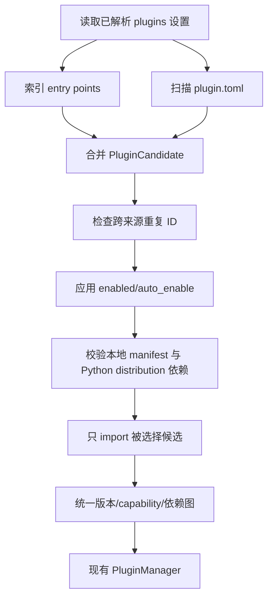

# ButterBot 本地目录与完整插件系统可行性及实施复核

> 审议日期：2026-07-31
>
> Git 基线：`dev_main`，`HEAD=8375474`
>
> P0 与 L1D/L1H 已按 feat、test、examples、docs 职责拆分提交；本轮
> `ButterPlugin` 统一命名、`contracts/discovery/runtime` 结构调整和生命周期补强
> 也已拆为功能与文档提交，本报告继续单独提交。
>
> 本报告所说的“本地目录插件”是指：用户把一个不含 `pyproject.toml`、不构建
> wheel、也不安装为 Python distribution 的插件目录复制到项目
> `./plugins/`，框架在启动期发现、校验并注册它。

## 0. L1D/L1H 实施后复核

### 0.1 当前结论

**当前 `dev_main` 已达到 L1D 和 L1H 的实验版实现线，可以称为“完整的、可信代码、
启动期 ButterBot 混合插件系统实验版”。本轮结构调整不改变该能力边界。**

这里的“完整”严格限定为：

- distribution entry point 与本地目录自动索引；
- `enabled` 显式选择与本地 `auto_enable` 显式整体授权；
- Source provider、Handler consumer、Combined、builder/factory 和 close callback；
- 统一 plugin ID、兼容、依赖、capability、owner、状态和逆序关闭；
- 私有只读配置与本地资源根；
- 配置检查、前台/后台新进程启动和 restart 的相同 bootstrap 语义；
- 插件目录可以复制，不需要 `pyproject.toml`、wheel、editable install 或
  `PYTHONPATH`。

它仍不表示：

- 不可信代码沙箱；
- 运行期 install/uninstall/reload；
- 自动 pip/uv 安装；
- 任意后台 task 托管；
- 插件市场、签名或远程获取；
- 已经冻结的稳定插件 API。

因此当前准入判断是：

| 目标 | 复核结果 |
| --- | --- |
| L1E：entry-point distribution | 已由 P0 提交并通过外部 wheel contract |
| L1D：便携本地目录 | 已实现并提交 |
| L1H：两种来源统一控制面 | 已实现并提交 |
| 稳定插件 API | 未准入；`butterbot.plugin` 仍是 provisional API |
| L2 动态插件 | 未准入，也不属于本轮 |

### 0.2 提交事实

P0 已按职责拆成四个可独立审查和回退的提交：

| 提交 | 边界 |
| --- | --- |
| `b3f3117 feat(app)` | owner-aware builder/factory、SourceCatalog 和基础测试 |
| `fa3cf8b feat(plugin)` | experimental bootstrap、manager、registrar 和 CLI 接线 |
| `0319d37 test(plugin)` | 三个外部 wheel fixture、smoke 和 CI |
| `ab19658 docs(plugin)` | provisional API、配置、CLI 和 P0 审议文档 |
| `8e6f12d feat(plugin)` | 统一插件公共包、目录自动发现与混合控制面 |
| `71a0e5d test(plugin)` | 本地目录与多 Python 版本合约验证 |
| `2053bd5 feat(examples)` | 将 manager 示例迁移为便携目录插件 |
| `1bf2c59 docs(plugin)` | 更新目录插件指南与本审议报告 |
| `8336956 feat(plugin)` | 统一插件契约、内部结构和生命周期回调 |
| `8375474 docs(plugin)` | 更新插件契约、生命周期与实例指南 |

本地目录与混合来源代码没有混入 P0 四个提交，后续也继续按功能、测试、示例和文档
拆分，符合“先稳定 P0，再单独审查 L1D/L1H”的原准入要求。

### 0.3 已实现控制点

| 原缺口 | 实现证据 | 结果 |
| --- | --- | --- |
| 来源模型 | `plugin/discovery/origin.py` | 两种来源可诊断 |
| 统一候选 | `plugin/discovery/catalog.py` 的 `PluginCandidate` | 同一 selection/catalog |
| manifest | `plugin/discovery/manifest.py` 的 schema 1 parser | import 前静态失败 |
| 目录索引 | `plugin/discovery/directory.py:index_local_manifests()` | 直接子目录、稳定排序 |
| 路径边界 | manifest/entry/root symlink 与 containment 检查 | 无目录逃逸 |
| 模块隔离 | `_butterbot_local.p_<hash>` 合成 package | 不修改 `sys.path` |
| 相对 import | package `__path__` + file spec | `.helpers` 可用 |
| 自动类发现 | entry 模块唯一 `ButterPlugin` 子类 | 无需 factory 或全局 registry |
| import 回滚 | 只清本轮合成 namespace | 失败不污染其他候选 |
| 混合依赖 | 统一 `PluginCatalog` 拓扑 | 支持两个方向依赖 |
| 配置 | `plugins.config.<id>` | registrar 只读 owner namespace |
| 资源 | `registrar.resource_root` | 不依赖 cwd |
| Python 依赖 | `packaging.Requirement` + metadata | 只诊断、不安装 |
| 状态 | origin kind/location/fingerprint | 不保存配置值 |
| CLI | `plugins list/check/init` | 发现、验证、模板闭环 |
| 复制目录合约 | `scripts/smoke_local_plugins.py` | 仓库外 clean wheel 运行 |

### 0.4 选择与安全语义

当前设置固定为：

```yaml
plugins:
  enabled:
    - local.hello
    - installed.provider
  local:
    path: "./plugins"
    auto_enable: false
  config:
    local.hello:
      greeting: hello
```

实现行为与原审议决定一致：

1. 相对目录以 `config.yaml` 父目录为基准；
2. 自动索引不等于执行；
3. disabled 本地候选不 import；
4. `auto_enable` 默认关闭，与 `enabled` 取并集；
5. 有 manifest 的无效候选即使 disabled 也使 check/run 失败；
6. directory/distribution 同 ID 全局拒绝，不做隐式覆盖；
7. 本地入口限于根目录直接 `.py` 文件，且必须定义唯一 `ButterPlugin` 子类；
8. 不修改 `sys.path`，不跟随 symlink；
9. 本地 Python distribution 依赖只检查，不安装；
10. 文件变化只保证 restart 后新进程生效。

### 0.5 自动类发现复审

本地插件不再要求：

```python
def create_plugin():
    ...
```

`plugin.toml` 只写：

```toml
entry = "plugin.py"
```

loader 导入已授权的 entry 后，只考虑同时满足以下条件的类：

1. 是 `ButterPlugin` 的具体子类；
2. 不是 `ButterPlugin` 基类本身；
3. `__module__` 等于 entry 模块，排除 helper import；
4. 全模块去重后恰好一个；
5. 可以零参数实例化。

零个或多个候选都以 discovery error 失败。该方案比“扫描第一个结构相似的类”更
确定，也不需要 decorator 写入进程级 pending registry。manifest 仍是身份、兼容和
依赖唯一事实来源，自动类发现只改变本地 hook 实例的获得方式，不改变显式授权、
来源冲突或 PluginManager 生命周期。

### 0.6 公共插件包边界复核

插件系统实现已统一迁入 `butterbot/plugin/`，并按依赖稳定性拆为三层：

```text
butterbot/plugin/
├── contracts/       # ButterPlugin、PluginDescriptor、SourceRef、SubscriptionSpec
├── discovery/       # catalog、目录加载、manifest、来源与设置
├── runtime/         # bootstrap、registrar、manager 与事务生命周期
├── errors.py
└── __init__.py      # 面向插件作者的公共门面与控制面延迟导出
```

`contracts/descriptor.py` 只保留 `PluginDescriptor`；标识符校验、统一基类与路由
声明不再堆叠在 descriptor 模块。旧 `LocalPlugin` 和 `PluginBase` 名称被移除，
本地目录和 distribution 统一继承 `ButterPlugin`。原
`butterbot/app/extensions/` 不再保留插件实现。

`SourceRef` 也从 `butterbot/core/source/` 移入插件包。普通 Handler 插件现在只需：

```python
from butterbot.plugin import (
    Event,
    ButterPlugin,
    PluginRegistrar,
    SourceRef,
    SubscriptionSpec,
)
```

`manager_example`、本地 Handler fixture 和外部 Handler-only wheel fixture 均不再
导入 `butterbot.core`。只有 Source-only/Combined 事件源适配实现继续从 core 导入
`BaseSource`、数据和状态基类。core 自身不导入 plugin；`BotApp` 只依赖轻量
`plugin.contracts.routing`，根门面延迟导入 runtime 和 discovery 控制面，避免
运行时循环导入。插件作者仍只使用 `butterbot.plugin`，不依赖内部分类路径。

### 0.7 验证结果

本轮实现后的仓库门禁：

```text
539 passed
coverage 77.62%（门槛 70%）
ruff check: passed
pyright: 0 errors, 0 warnings
```

clean-wheel 复制目录合约在以下解释器通过：

| Python | 场景 | 结果 |
| --- | --- | --- |
| 3.12.3 | 两个随机绝对工作区、4 类本地插件、混合 provider | passed |
| 3.13.12 | 同上 | passed |
| 3.14.3 | 同上 | passed |

合约环境只安装 ButterBot wheel 与 distribution provider wheel；本地 fixture
没有 `pyproject.toml`，运行目录不含源码仓库，不设置 `PYTHONPATH`。验证覆盖：

- Local Source-only；
- Local Handler-only；
- Local Combined；
- Local Handler → installed Source；
- disabled 本地插件顶层哨兵不执行；
- 两个不同绝对路径使用同名目录和入口；
- 路由完成后关闭无 Source、Handler 或 asyncio task 残留。

### 0.8 尚未满足的稳定化条件

L1H experimental 已完成，但不能据此冻结稳定 API。仍需后续版本积累：

- manifest schema 至少跨两个核心小版本的兼容证据；
- plugin dependency 是否引入版本约束的最终决定；
- Windows clean-workspace 路径合约；
- 至少三个真实外部用户插件反馈；
- 若要支持任意后台活动，另行设计 owner-aware `PluginTaskGroup`；
- 若要支持动态启停，另行设计模块旧引用、dependent 卸载和失败回退。

这些不阻塞本轮 L1D/L1H 实验版，但阻塞“稳定、通用或动态插件系统”的产品声明。

## 1. 实施前执行结论（历史基线）

> 本节及第 2 至 24 节保留实现前的审议证据和设计取舍。当前实施结果以第 0 节为准。

### 1.1 一句话判断

**以实施前工作区为基线，ButterBot 已具备实现“distribution entry point +
`./plugins` 本地目录”混合插件系统的工程资本；但当时代码还没有本地目录发现、
清单、受控导入和便携配置，因此当时不能宣称已经具备完整插件系统。**

还必须区分两个事实：

1. **技术工作区判断：可以开始实现。** 现有 descriptor、两阶段 bootstrap、
   PluginManager、owner-aware registrar、SourceCatalog 和回滚事务可以直接复用；
2. **当时的可复现仓库判断：尚不能继续叠加发布承诺。** 这些 P0 改动当时仍未进入
   `HEAD=265ec6b`，干净克隆和当时的 `v3.1.0.dev2` 标签都不包含它们。

因此推荐顺序不是直接增加一个 `for path in Path("./plugins").iterdir()`，而是：

```text
先提交并稳定当前 P0
-> 抽象统一 PluginCandidate/PluginOrigin
-> 定义本地 manifest 和路径边界
-> 实现独立模块命名空间加载
-> 接入同一个 PluginCatalog/PluginManager
-> 补插件配置、资源和 CLI 诊断
-> 用“只复制目录”的 clean-workspace 合约验收
-> 发布 startup-only directory plugin experimental
```

### 1.2 当前能力等级

| 等级 | 定义 | 当前工作区判断 |
| --- | --- | --- |
| L0 | `app.py` 显式导入 Source/Handler | 已具备 |
| L1E | 显式启用、启动期加载的 entry-point distribution 插件 | 实施前：P0 已实现，尚未提交 |
| L1D | 从 `./plugins` 加载的便携目录插件 | 实施前：有实现资本，尚未实现 |
| L1H | entry point 与目录来源统一发现、统一依赖、统一注册 | 实施前：有清晰实现路径，尚未实现 |
| L2 | 运行期启停、单插件卸载、文件监听和热重载 | 不具备，不应与本轮合并 |
| L3 | 不可信插件隔离、签名、市场和远程安装 | 不具备，也不是目录加载的自然结果 |

本报告建议把目标限定为 **L1H：完整的启动期混合插件系统**。这里的“完整”表示：

- 自动索引已安装 entry point 和本地目录候选；
- 默认只加载显式启用的候选；
- 可显式选择“自动启用本地目录中的全部合法候选”；
- 两种来源使用同一身份、兼容、依赖、注册和关闭语义；
- 本地插件无需 Python 包元数据，可以随项目目录复制；
- 配置检查、前台运行、后台运行和 restart 行为一致；
- 普通异常、取消和 Source 启动失败都能完整回滚；
- 文件变化在下一次新进程启动时生效。

它不表示：

- 可以安全执行不可信代码；
- 可以在运行进程中可靠卸载 Python 代码；
- 可以自动安装 pip 依赖；
- 可以保证热重载后不存在旧类、旧模块或旧引用；
- 已经拥有插件市场、签名、评分或远程下载。

### 1.3 是否具备实现资本

具备，主要资本如下：

| 已有资本 | 对目录插件的作用 |
| --- | --- |
| `PluginDescriptor` | 本地 manifest 可复用相同 ID、版本、核心兼容和依赖语义 |
| `PluginCatalog` | 目录候选加载后可以进入同一冲突检查和拓扑排序 |
| `PluginBootstrap` | 本地 Source 插件仍能在配置解析前注册 builder/factory |
| `PluginManager` | 不需要为目录插件建立第二套生命周期 |
| owner-aware registrar | 本地用户代码失败时可撤销 builder、factory、Source 和 Handler |
| `SourceRef`/`SourceCatalog` | Handler-only 本地插件无需导入 Source 实现类 |
| CLI `check`/`run` | 可以共用同一目录候选快照和注册路径 |
| 外部 wheel contract | 已证明控制面不依赖主仓库 import 路径 |

真正缺失的不是新的 EventBus、SourceManager 或 Router，而是**代码来源控制面**：

```text
目录根
-> 静态 manifest
-> PluginCandidate
-> 显式选择
-> 路径约束
-> 独立模块命名空间
-> Plugin hooks
-> 现有 PluginManager
```

## 2. 审议范围与验证

### 2.1 审议范围

本次复核覆盖：

- 当前未提交的 `butterbot/app/extensions/experimental/`；
- `PluginDescriptor`、`PluginCatalog`、`PluginBootstrap` 和 `PluginManager`；
- builder/factory/Source/Handler 的 owner 与收据；
- `PluginSettings` 和 CLI `check/run`；
- 外部 distribution fixture 与 Python 版本矩阵；
- 旧架构审查、实施路线、backlog、插件就绪度和 P0 复审；
- Git 从 `c0f5d11` 到 `265ec6b` 的演进；
- 仓库内 `dev/NcatBot-main/` 的 manifest/indexer/importer 作为目录插件对照。

本次不把以下问题扩展为实现任务：

- 远程插件仓库；
- WebUI 管理；
- 在线安装或升级；
- 数字签名；
- 恶意代码沙箱；
- 运行期热重载；
- 插件评分和生态治理。

### 2.2 Git 和工作区事实

当前 Git 历史的相关节点：

| 提交 | 作用 |
| --- | --- |
| `c0f5d11` | 确立“生命周期和契约先于插件平台”的路线 |
| `ba14af1` | 建立命名配置和 `config_key` |
| `6d3babe` | 建立 CLI、进程管理和标准启动入口 |
| `10ef4d6` | 加入 SourceRef、Handler owner、句柄和手工 registrar |
| `dbf5281` | 加入 Source factory 与 YAML 自动实例化 |
| `2c75a01` | 对齐 YAML Source 文档 |
| `265ec6b` | 把项目版本更新为 `3.1.0.dev2` |

但实施前 experimental Plugin P0 文件仍是未跟踪或未提交修改。由此得到一个发布前硬
要求：

> 本地目录插件工作必须建立在已提交、可从干净克隆复现的 P0 上。否则目录 loader、
> P0 控制面和文档会混在一个超大变更中，无法独立回归、回滚或判断兼容影响。

### 2.3 当前验证结果

当前工作区最近一次完整验证：

```bash
uv sync --locked --dev
uv run pytest --cov=butterbot --cov-report=term-missing --cov-fail-under=70
uv run ruff check .
uv run ruff format --check .
uv run pyright
npm run docs:check
```

结果：

- 实施前 493 项 ButterBot 测试通过；
- 实施前总覆盖率 76.39%，超过 70% 门槛；
- Ruff lint 和 format check 通过；
- Pyright 0 error、0 warning；
- VuePress 构建、Markdown lint 和内部链接检查通过。

外部 wheel 合约已在本地 Python 3.12.3、3.13.12、3.14.3 clean venv 中通过。
Source-only、Handler-only、Combined 三个 distribution 可以被发现、跨包路由，
并通过 import、register、Source start 失败回滚。

本次还重新执行仓库内 NcatBot 目录插件对照测试：

```bash
uv run --directory dev/NcatBot-main --frozen --extra test pytest \
  tests/integration/test_plugin_lifecycle.py \
  tests/unit/plugin/test_plugin_loader.py -q
```

结果为 `13 passed in 0.48s`。它用于确认 manifest、目录索引、依赖顺序和插件撤销
参考行为，不代表其路径、安全或热重载方案应被直接复制。

## 3. 当前 P0 对目录插件已经解决了什么

### 3.1 身份和兼容模型已经存在

`PluginDescriptor` 已包含：

```text
plugin_id
version
requires_core
requires_plugins
provides
schema_version
```

并验证：

- 稳定小写 ID；
- PEP 440 版本；
- ButterBot 版本范围；
- 重复和自身依赖；
- capability 标识。

证据位于
`butterbot/app/extensions/experimental/descriptor.py:20-76`。

本地目录不需要再发明 `LocalPluginId`、另一套 version parser 或另一张依赖图。
manifest 应转换成同一个 `PluginDescriptor`。

### 3.2 注册和回滚控制面可以直接复用

`PluginManager` 已负责：

- 依赖顺序配置；
- 应用绑定；
- 运行阶段注册；
- Source 启动失败处理；
- 逆依赖关闭；
- `failed` 和 `blocked` 诊断；
- 配置和运行 registrar 的统一回滚。

`PluginRegistrar` 已拥有：

- owner 注入；
- Source 创建或配置 Source 接管；
- `SourceRef` 订阅；
- close callback；
- Source、Subscription 和 cleanup 收据。

因此目录插件加载成功后，只需被规范化成现有 `LoadedPlugin` 的等价对象。不能为
`./plugins` 再写一个“调用 on_load 并直接向 EventBus 注册”的旁路。

### 3.3 两阶段配置顺序已经正确

当前顺序是：

```text
读取 plugins.enabled
-> entry point discovery
-> register_config
-> RuntimeConfig
-> 配置 Source 实例化
-> register
-> Source start
```

证据位于
`butterbot/app/extensions/experimental/bootstrap.py:59-96`。

目录 Source 插件同样必须在 RuntimeConfig 构建前出现。目录扫描不能放进
`BotApp.start()`，否则 builder 和 factory 注册已经太晚。

### 3.4 distribution 合约已经证明控制面可跨包工作

三个 fixture wheel 已经证明：

- provider 和 consumer 不需要互相 import；
- `SourceRef` 能跨 distribution 绑定；
- entry point 安装元数据有效；
- 回滚不依赖测试仓库 cwd；
- 关闭后没有 pending task。

这说明目录插件新增测试应聚焦目录边界，而不是重新验证一套事件运行时。

## 4. 当前距离本地目录插件还缺什么

### 4.1 缺口总表

| 缺口 | 当前证据 | 严重度 | 是否为 L1D 硬前置 |
| --- | --- | --- | --- |
| 目录设置模型 | `PluginSettings` 只允许 `enabled` | 高 | 是 |
| 本地 manifest schema | 仓库没有 `plugin.toml` parser | 高 | 是 |
| 统一来源模型 | `LoadedPlugin` 强绑定 `entry_point` | 高 | 是 |
| 路径约束 | 没有插件根、逃逸和 symlink 规则 | 高 | 是 |
| 独立模块加载器 | 没有 `spec_from_file_location` 或合成 package | 高 | 是 |
| 来源冲突策略 | 没有 directory 与 distribution 同 ID 规则 | 高 | 是 |
| 插件级配置 | `plugins` 未提供 `config` namespace | 高 | 是 |
| 资源和状态目录 | registrar 没有资源根或数据根 | 中 | 便携体验需要 |
| 来源诊断 | `PluginStatus` 没有 kind/path/fingerprint | 中 | 是 |
| CLI 插件视图 | 没有 `plugins list/doctor/init` | 中 | 完整体验需要 |
| Python 依赖诊断 | 本地目录没有 distribution metadata | 中 | 是 |
| 任意后台 task 所有权 | 当前明确禁止 registrar 外建 task | 中 | 通用插件需要 |
| API/service owner | registrar 只覆盖 Source/Handler/cleanup | 中 | 视“完整”范围 |
| P0 Git 落地 | 实施前 P0 尚未提交 | 高 | 发布前是 |

### 4.2 `PluginSettings` 无法表达目录来源

当前 `PluginSettings` 只有：

```python
enabled: tuple[str, ...]
```

并拒绝除 `enabled` 外的所有字段：
`butterbot/app/extensions/experimental/settings.py:10-43`。

所以当前配置无法表达：

- 插件根目录；
- 是否启用目录发现；
- 是否自动启用全部本地插件；
- 插件私有配置；
- 严格扫描策略；
- 本地插件状态目录。

这不是 YAML 文档缺口，而是 bootstrap 输入模型缺口。

### 4.3 discovery 被写死为 entry point

当前 `PluginCatalog.discover()` 只调用：

```python
metadata.entry_points(group="butterbot.plugins")
```

`LoadedPlugin` 也直接保存 `entry_point`：
`butterbot/app/extensions/experimental/discovery.py:19-37,56-121`。

测试可以注入假的 `PluginEntryPoint`，说明做一个“目录 entry point 适配器”在技术上
可行；但把目录路径伪装成 entry point 会留下问题：

- 状态无法区分 distribution 和 directory；
- 错误只能打印 `entry_point.value`；
- 无法携带 manifest 路径、资源根和 fingerprint；
- 同 ID 跨来源冲突无法给出完整诊断；
- 未来 CLI 无法列出 origin。

正确抽象应是 `PluginCandidate + PluginOrigin`，entry point 只是其中一种来源。

### 4.4 当前没有“扫描但不执行”的静态边界

entry point discovery 先按 ID 找候选，再调用 `.load()` 获取 descriptor。对于本地
目录，如果直接扫描所有 `.py` 并 import：

- 仅仅执行 `butterbot check` 就会运行所有文件顶层代码；
- 禁用列表失去意义；
- 一个普通 helper 文件也可能被当插件执行；
- 在依赖、冲突和路径校验前已经产生不可回滚副作用。

本地目录必须先读取非代码 manifest，获得 ID 和入口，再决定是否 import。

### 4.5 当前没有插件私有配置

现有 registrar 能注册 builder、factory、Source、Handler 和 close callback，但
没有：

```text
registrar.settings
registrar.resource_root
registrar.state_root
registrar.logger
```

用户目录插件若需要一个简单字符串、阈值或文件路径，只能：

- 读取全局 RuntimeConfig；
- 自行读取另一个文件；
- 直接读取环境变量；
- 把配置伪装成 Source 配置。

这些方式都会破坏便携性和 `check/run` 一致性。插件级只读配置视图是 L1D 硬前置。

### 4.6 当前诊断没有来源信息

`PluginStatus` 目前只有：

```text
plugin_id
version
state
error
```

它不能回答：

- 插件来自哪个 distribution 或目录；
- 使用了哪个 manifest 和入口文件；
- 同 ID 冲突的两个来源分别是什么；
- 当前加载的代码是否与上次启动相同。

此外 `PluginManager._mark_failure()` 会把 `str(cause)` 放进 status。任意本地插件
异常消息可能包含 token、路径或配置值。完整诊断应保留异常类型和安全摘要，详细
traceback 只在 debug 日志中出现，并明确不自动打印插件配置。

### 4.7 当前 CLI 选择逻辑只看 `enabled`

`butterbot run` 当前通过：

```python
if bootstrap.settings.enabled:
    app = bootstrap.build(...)
else:
    app = load_app(...)
```

选择插件路径：
`butterbot/cli/main.py:120-126`。

如果未来配置：

```yaml
plugins:
  local:
    auto_enable: true
```

但 `enabled` 为空，现有 CLI 会错误进入旧路径。应改成：

```text
settings.requires_plugin_bootstrap
或
catalog.has_selected_plugins
```

且 `check`、前台 run、后台子进程和 restart 必须读取相同设置。

### 4.8 当前仍没有通用插件 task 所有权

当前规则要求：

- 长期任务放进 Source；
- Handler task 由 EventBus 管理；
- registrar 外不得 `asyncio.create_task()`。

对 Source/Handler 插件这是正确边界。但如果“完整插件系统”还要求用户插件运行：

- 定时任务；
- 消费非 Source 队列；
- 独立心跳；
- 本地文件监听；

则还缺 owner-aware task registration、启动时机、取消、排空和异常观察。

不能一边允许用户本地插件随意 `create_task()`，一边继续宣称插件关闭后无未管理
task。应在产品范围中二选一：

1. L1D 只支持 Source/Handler/cleanup，后台活动必须实现为 Source；
2. 增加 `PluginTaskGroup` 后再称为通用插件 runtime。

本报告推荐先采用第 1 项，并把 managed task 放入后续独立 PR。

## 5. “自动发现”与“自动执行”必须分开

### 5.1 推荐语义

自动发现应表示：

```text
框架自动扫描已配置来源
-> 读取候选元数据
-> 生成确定的 catalog
```

它不应默认表示：

```text
目录里出现一个 Python 文件
-> 下次启动自动执行
```

推荐三层状态：

| 状态 | 是否读 manifest | 是否 import | 是否 register |
| --- | --- | --- | --- |
| discovered | 是 | 否 | 否 |
| selected/enabled | 是 | 是 | 否 |
| registered/started | 是 | 是 | 是 |

### 5.2 默认授权策略

推荐默认：

```yaml
plugins:
  enabled: []
  local:
    path: "./plugins"
    auto_enable: false
```

行为：

- 自动索引目录下所有合法 manifest；
- 不 import 未出现在 `enabled` 的插件；
- 已安装但未启用的 entry point 仍不 import；
- `auto_enable: true` 是用户对本地目录整体执行的显式授权；
- `enabled` 与 `auto_enable` 选择结果取并集；
- 必需依赖仍必须进入选择集合，不静默执行未授权依赖。

### 5.3 为什么不建议默认“目录即授权”

`./plugins` 可能来自：

- 解压的项目模板；
- Git checkout；
- 容器 volume；
- 自动同步目录；
- IDE 或构建工具生成文件；
- 权限配置错误的共享目录。

“用户把文件放进去”有时可以代表意图，但不应成为框架默认的代码执行授权。
确实需要即插即用的用户可以显式设置 `auto_enable: true`。

## 6. 推荐的本地插件布局

### 6.1 第一版只支持一种规范布局

推荐：

```text
project/
├── config.yaml
├── app.py
└── plugins/
    └── hello/
        ├── plugin.toml
        ├── plugin.py
        ├── helpers.py
        └── assets/
            └── greeting.txt
```

它不是 Python distribution：

- 不需要 `pyproject.toml`；
- 不需要 wheel；
- 不需要 `pip install -e`；
- 不要求插件目录进入 `sys.path`；
- 不要求顶层 `__init__.py`；
- 整个 `hello/` 可以复制到另一个项目。

第一版不同时支持以下变体：

- `plugins/hello.py` 单文件隐式插件；
- 任意层级递归寻找第一个 `.py`；
- zip 插件；
- `.pyc` only 插件；
- Git URL；
- 自动下载压缩包；
- 一个目录中多个 plugin ID。

格式越少，路径、错误和兼容语义越容易稳定。单文件语法糖可以在目录协议成熟后
映射到同一 manifest 模型。

### 6.2 推荐 `plugin.toml`

建议 manifest 是目录插件 descriptor 的唯一事实来源：

```toml
schema_version = 1
plugin_id = "local.hello"
version = "0.1.0"
requires_core = ">=3.1.0.dev2,<4"
entry = "plugin.py"
requires_plugins = []
provides = ["local.hello.handler"]
requires_distributions = []
```

字段：

| 字段 | 必填 | 含义 |
| --- | --- | --- |
| `schema_version` | 是 | manifest schema，不等于插件版本 |
| `plugin_id` | 是 | 全局稳定 owner 和依赖 ID |
| `version` | 是 | 本地插件自身版本 |
| `requires_core` | 是 | ButterBot 兼容范围 |
| `entry` | 是 | 根目录内 Python 文件；自动发现唯一 `ButterPlugin` 子类 |
| `requires_plugins` | 否 | 必需插件 ID |
| `provides` | 否 | capability 声明 |
| `requires_distributions` | 否 | 只诊断、不自动安装的 Python distribution 要求 |

不建议第一版加入：

- author 评分；
- 下载 URL；
- 安装脚本；
- shell hook；
- 权限宣称；
- 签名字段；
- reload 策略；
- 任意 Python 表达式入口；
- 插件自定义 manifest 字段透传。

### 6.3 manifest 与代码 descriptor 不应重复维护

当前 distribution 插件由 Python 对象提供 `descriptor`。目录插件若同时在
`plugin.toml` 和 `plugin.py` 重复写版本、依赖和 capability，很容易漂移。

最终实现不再额外公开一层 `PluginHooks` 协议，而是让两种来源共享唯一基类：

```python
@dataclass(frozen=True)
class LoadedPlugin:
    descriptor: PluginDescriptor
    hooks: ButterPlugin
    origin: PluginOrigin
```

对 distribution：

```text
entry point 返回 ButterPlugin
-> 读取子类的 PluginDescriptor
-> ButterPlugin 实例作为 hooks
```

对 directory：

```text
plugin.toml 转为 PluginDescriptor
-> entry 模块唯一 ButterPlugin 子类作为 hooks
-> loader 组合为 LoadedPlugin
```

这样本地作者只在 manifest 写一次身份和兼容信息。

### 6.4 入口格式必须窄化

`entry` 第一版建议只接受：

```text
插件根直接子文件.py
```

例如：

```text
plugin.py
```

校验：

- 文件必须是插件根的直接子文件；
- 禁止绝对路径；
- 禁止 `..`；
- 禁止 `/`、反斜杠和空路径段；
- 文件必须以 `.py` 结尾；
- resolve 后仍位于插件根；
- entry 模块必须且只能定义一个具体 `ButterPlugin` 子类；
- 只看 `__module__` 等于 entry 模块的类，不扫描 imported helper class；
- 自动零参数实例化，不扫描“第一个结构相似的类”。

入口代码仍可用 `from .helpers import ...` 引用同目录 helper。嵌套入口需要额外定义
父 package 和 `__init__.py` 语义，应在真实需求出现后单独扩展。

## 7. 插件根目录与路径边界

### 7.1 默认根应相对 config，而不是隐式全局 cwd

用户目标是 `./plugins`。CLI 默认从当前目录读取 `config.yaml` 时：

```text
Path(config.yaml).parent / "plugins"
```

与 `Path.cwd() / "plugins"` 相同。

但实现应把相对目录解析到**配置文件父目录**，原因是：

- `PluginBootstrap("/srv/bot/config.yaml")` 可能从其他 cwd 调用；
- systemd、容器和测试 runner 可能改变 cwd；
- `butterbot check` 与 `run` 必须解析到同一个目录；
- 错误信息可以稳定显示 config-relative 路径。

因此文档可以称 `./plugins`，代码不能把 `Path.cwd()` 散落到 discovery 内部。

### 7.2 建议路径策略

目录索引只扫描 plugin root 的直接子目录：

```text
plugins/<candidate>/plugin.toml
```

规则：

- root 不存在：没有启用本地插件时视为空目录；
- 配置显式启用了本地 ID 但 root 不存在：配置错误；
- root 存在但不是目录：配置错误；
- candidate 按稳定名称排序；
- 跳过 `.` 开头目录和 `__pycache__`；
- 缺少 `plugin.toml` 的子目录默认跳过并在 debug 中说明；
- manifest 存在但无效：`check` 和 `run` 都失败；
- 默认拒绝 root 或 candidate symlink；
- 入口 resolve 后必须 `is_relative_to(candidate_root)`；
- 不递归扫描嵌套插件；
- 不跟随指向 root 外的资源 symlink。

“可信插件”不代表路径解析可以宽松。路径规则主要防止误配置、目录逃逸和不可复现，
不是恶意代码沙箱。

### 7.3 缺失目录是否自动创建

不建议 `check` 或 discovery 自动创建 `./plugins`：

- `check` 应尽量只读；
- 只读容器会失败；
- 拼错路径时自动创建空目录会掩盖错误。

只有显式 `butterbot plugins init` 可以创建目录和模板。

## 8. 本地模块加载器设计

### 8.1 不修改 `sys.path`

最直接但不推荐的实现是：

```python
sys.path.insert(0, str(plugin_root))
import hello.plugin
```

风险：

- `plugins/json.py`、`plugins/logging.py` 等名称可能遮蔽标准库或依赖；
- 两个工作区的同名目录共享进程时冲突；
- 测试顺序依赖全局 `sys.path`；
- 目录插件可以偶然 import 另一个插件实现；
- 清理后仍难证明 import 环境恢复。

即使使用 `append()` 降低优先级，也不能消除模块名碰撞和跨插件耦合。

### 8.2 使用合成 package namespace

推荐内部模块名：

```text
_butterbot_local.p_<origin_hash>
_butterbot_local.p_<origin_hash>.entry
_butterbot_local.p_<origin_hash>.helpers
```

其中 `origin_hash` 来自规范化插件根和 plugin ID，仅用于内部模块唯一性，不作为
安全签名。

加载流程：

1. 建立合成 namespace package；
2. 设置 package `__path__` 为该插件目录；
3. 用 `importlib.util.spec_from_file_location()` 创建入口 spec；
4. 在执行前把 package 和入口放入 `sys.modules`，支持相对 import；
5. 执行入口；
6. 找出 entry 模块直接定义的唯一具体 `ButterPlugin` 子类；
7. 零参数实例化，并与 manifest descriptor 组合；
8. 失败时只移除本轮创建的 namespace 子模块；
9. 不触碰其他插件和应用模块。

插件内可以写：

```python
from .helpers import format_message
```

但不应通过内部 `_butterbot_local.*` 名称跨插件 import。跨插件关系应使用
`requires_plugins`、SourceRef 和公开事件数据契约。

### 8.3 模块名字不等于卸载能力

把模块名从 `sys.modules` 删除不等于代码已卸载：

- Handler 可能仍持有函数；
- class registry 可能仍持有类型；
- task 可能仍运行；
- traceback、closure 和用户对象可能持有 module globals；
- C 扩展状态不会因此复原。

L1D 只承诺：

```text
进程启动时加载一次
-> 进程关闭时释放框架拥有的资源
-> 文件变更通过 restart 新进程生效
```

不提供 `reload_plugin()`，也不建立文件 watcher。

### 8.4 import 失败回滚的边界

框架可以清理：

- 本轮合成 module names；
- 尚未提交的 builder/factory；
- 已创建的 Source；
- 已登记的 Handler；
- close callback。

框架不能逆转插件 import 顶层代码已经执行的任意动作，例如：

- 写文件；
- 启动未登记线程；
- 修改全局第三方 registry；
- 发网络请求；
- 修改 `os.environ`。

所以文档必须要求本地插件模块顶层只定义对象，不产生外部副作用。真正的副作用放入
registrar hook、Source 生命周期或未来受管 task。

## 9. 统一候选、来源和 catalog

### 9.1 推荐模型

```python
@dataclass(frozen=True)
class DistributionOrigin:
    distribution: str
    entry_point_group: str
    entry_point_name: str
    entry_point_value: str


@dataclass(frozen=True)
class DirectoryOrigin:
    plugin_root: Path
    manifest_path: Path
    entry_path: Path
    fingerprint: str


PluginOrigin = DistributionOrigin | DirectoryOrigin


@dataclass(frozen=True)
class PluginCandidate:
    plugin_id: str
    origin: PluginOrigin
    descriptor: PluginDescriptor | None
    load: Callable[[], LoadedPlugin]
```

目录 candidate 在 import 前已有 descriptor；现有 distribution candidate 可能需要
加载 entry point 后取得 descriptor。两者最终都转换成：

```python
LoadedPlugin(descriptor, hooks, origin)
```

### 9.2 推荐发现顺序



关键性质：

- 未启用目录插件不 import；
- 未启用 distribution 插件不 `.load()`；
- 目录和 distribution 不因枚举顺序互相覆盖；
- 选择结果确定；
- PluginManager 不关心代码来源。

### 9.3 同 ID 冲突策略

第一版应全局拒绝：

```text
directory local.foo
distribution local.foo
```

错误应列出两个 origin。不要默认：

- 本地目录覆盖已安装 wheel；
- 最后扫描者获胜；
- 版本更高者获胜；
- folder 名与 distribution 名决定优先级。

隐式 override 会使开发环境和生产环境加载不同代码。若未来确有 override 需求，应
增加明确配置：

```yaml
plugins:
  origins:
    local.foo: directory
```

但不应进入第一版。

### 9.4 capability 和 Source 冲突继续沿用现有规则

目录插件仍使用：

- `provides` capability 全局冲突检查；
- SourceCatalog 的 `(source_kind, config_key)` 唯一性；
- builder/factory registry 的 owner 和句柄；
- SourceRef 的缺失与歧义错误。

不能因为代码来自 `./plugins` 就允许其静默覆盖内置或 distribution provider。

## 10. 插件配置、资源和数据目录

### 10.1 推荐 YAML

```yaml
plugins:
  enabled:
    - local.hello
    - example.installed

  local:
    path: "./plugins"
    auto_enable: false

  config:
    local.hello:
      greeting: "${HELLO_GREETING:-hello}"
      target: "primary"
```

建议 `PluginSettings` 变成：

```text
enabled
local.path
local.auto_enable
config_by_plugin
```

暂不开放 `follow_symlinks`、任意 import path 和 install dependencies 等高风险开关。

### 10.2 插件配置必须是只读且按 owner 隔离

`ConfigRegistrar` 和 `PluginRegistrar` 都应提供：

```python
registrar.settings  # Mapping[str, object]
```

要求：

- 只返回当前 plugin ID 的 namespace；
- 使用与 RuntimeConfig 相同的 YAML/env 解析结果；
- 不让插件改写 bootstrap 总配置；
- 未声明配置时返回空映射；
- plugin ID 不存在时在 `check` 阶段报告；
- status、receipt 和默认日志不包含配置值；
- 插件自己的 validator 异常包装为含 plugin ID 的配置错误。

`register_config` 必须能读取设置，因为 builder/factory 注册发生在 RuntimeConfig
构建前。

### 10.3 资源根

目录插件应能稳定得到：

```python
registrar.resource_root
```

它指向包含 `plugin.toml` 的目录，供读取只读模板和静态资源。distribution 插件可
把该值设为 `None`，继续使用 `importlib.resources`。

插件不应依赖：

- 当前进程 cwd；
- `plugins/` 的相对字符串；
- folder name 等于 plugin ID；
- 代码目录可写。

### 10.4 可写状态目录

若需要持久状态，建议使用：

```text
<config-root>/.butterbot/plugin-data/<safe-plugin-id>/
```

但它不应在 discovery 或 `check` 中自动创建。只有运行阶段显式请求 storage 时创建。

必须定义：

- plugin ID 到安全目录名的映射；
- 路径不能逃逸 data root；
- 删除插件不自动删除数据；
- `close` 不删除持久数据；
- Secret 不写入默认状态快照；
- 多进程同时使用同一目录不保证安全，除非插件自行加锁。

第一版也可以不提供 state root，但必须文档明确“插件代码目录视为只读”。

## 11. 自动注册与生命周期

### 11.1 推荐完整顺序

```text
解析 config 路径
-> 读取 plugins 最小设置
-> 索引 distribution 和 directory metadata
-> 合并候选并检查 origin 冲突
-> 应用 enabled/auto_enable
-> 校验 manifest、核心版本、Python distribution 要求
-> 只 import 选中候选
-> 校验 hooks、依赖和 capability
-> 按拓扑 register_config
-> 构建 RuntimeConfig
-> 构建 BotApp 和配置 Source
-> 按拓扑 register
-> 启动 Source
-> 按拓扑 on_start
-> 运行
-> 逆拓扑 on_stop
-> 逆拓扑撤销插件注册
-> 关闭其余 Source、EventBus、ApiRegistry
```

目录 loader 只负责把文件变成 hooks。它不应该直接调用注册 hook。

### 11.2 自动注册的授权

自动注册发生在候选已经 selected 后：

- `enabled` 明确列出；
- 或本地 `auto_enable=true`；
- 或未来由受控 profile 选择。

“发现成功”不能直接把状态改成 `registered`。

### 11.3 失败语义

应覆盖：

| 阶段 | 失败结果 |
| --- | --- |
| manifest parse | 不 import；错误含 manifest path |
| path validation | 不 import；错误含被拒路径和 root |
| dependency distribution check | 不 import 插件代码 |
| module import | 清理本轮合成 modules；无 registrar 副作用 |
| ButterPlugin 子类校验 | 清理本轮 modules；标记 discovery failure |
| `register_config` | 撤销本轮和整体 bootstrap config 注册 |
| RuntimeConfig/app factory | 撤销 builder/factory 和未启动 Source |
| `register` | 逆序撤销全部本轮插件 |
| Source start | 撤销插件 Source、Handler、registry |
| `on_start` | 逆序调用已进入启动阶段插件的 `on_stop`，再整体回滚 |
| `on_stop` | 普通异常记录后继续清理；取消在清理完成后传播 |
| close callback | 记录后继续关闭；取消最终传播 |

现有 PluginManager 已覆盖表格后半部分。目录实现主要补前五行。

### 11.4 disabled 插件的错误处理

建议：

- 所有 manifest 都做结构和路径校验；
- disabled 插件不 import；
- 无效 manifest 使 `butterbot check` 失败；
- `run` 默认也失败，避免 check/run 分歧；
- 缺少 manifest 的普通目录仅 debug 跳过；
- 不提供“吞掉全部目录错误继续运行”的默认模式。

用户可以把未完成代码放在 plugin root 之外，或使用合法 manifest 但不启用。

## 12. Python 和插件依赖

### 12.1 插件依赖应统一到 plugin ID

目录与 distribution 之间应允许：

```text
directory consumer -> distribution provider
distribution consumer -> directory provider
directory consumer -> directory provider
```

三种关系进入同一拓扑图。consumer 不应 import provider 的目录实现；优先通过：

- SourceRef；
- capability；
- 公开、已安装的共享数据契约 distribution。

### 12.2 当前还没有插件版本约束

现有 `requires_plugins` 只有 plugin ID，没有依赖版本范围。`PluginDescriptor.version`
主要用于身份和状态展示。

L1D 第一版可以继续只校验直接 ID，但在称为稳定完整插件 API 前，应考虑：

```python
PluginRequirement(
    plugin_id="example.provider",
    version=">=1,<2",
)
```

目录 manifest 和 distribution descriptor 必须使用同一模型，不能只有目录插件支持
版本约束。

### 12.3 Python distribution 依赖只检查，不安装

本地插件没有 wheel metadata，因此可选
`requires_distributions` 用于启动前诊断：

```toml
requires_distributions = [
  "httpx>=0.28,<1",
]
```

loader 可以用 `packaging.Requirement` 和 `importlib.metadata.version()` 检查。

不应：

- 在 Bot 进程启动时调用 pip/uv；
- 修改当前虚拟环境；
- 自动选择依赖版本；
- 下载远程代码；
- 把 import name 当 distribution name；
- 在检查失败后继续尝试 import。

错误应建议用户在项目环境执行显式 `uv add` 或安装命令，由 lockfile 记录结果。

### 12.4 “便携”的准确含义

本报告中的便携表示：

- 插件自身代码、manifest 和 assets 可整目录复制；
- 不要求构建或安装插件 wheel；
- 不依赖原项目绝对路径；
- 在支持的 Python 版本和满足依赖的环境中可运行。

它不表示第三方依赖被自动打包进目录，也不表示同一插件无需兼容声明即可跨任意
ButterBot/Python 版本运行。

## 13. 信任和安全边界

### 13.1 本地目录不是沙箱

目录插件和 `app.py`、entry-point 插件一样，是同进程可信 Python 代码。它可以：

- 读取全部环境变量；
- 读写进程有权限访问的文件；
- 建立网络连接；
- import 任意已安装模块；
- 访问和修改 Python 全局状态；
- 绕过 registrar 调用公开 API；
- 使用反射读取私有对象。

manifest capability、只读 config view 和路径限制只能减少误用，不能限制恶意代码。

### 13.2 目录加载特有风险

| 风险 | 建议控制 |
| --- | --- |
| 工作目录被低权限用户写入 | 部署时把代码和 plugin root 挂载为只读 |
| symlink 逃逸 | 默认拒绝 root/candidate/entry symlink |
| `../` 或绝对入口 | resolve 后做 root containment |
| 模块名遮蔽 | 不修改 `sys.path`，使用合成 namespace |
| 同 ID 替换 wheel | 跨来源冲突直接失败 |
| 隐式执行 helper | 只执行 manifest 的显式 entry |
| 顶层 import 副作用 | 未启用不 import，文档禁止顶层外部副作用 |
| 运行期 pip 安装 | 明确禁止，只做依赖诊断 |
| Secret 出现在状态 | status 不保存 config；异常摘要脱敏 |
| 文件启动中被替换 | 读取 manifest/entry fingerprint 并在状态展示 |
| 热重载残留旧对象 | L1D 不支持热重载，只用 restart |

### 13.3 fingerprint 的边界

可以记录 SHA-256：

```text
manifest bytes
+ entry bytes
+ 可选插件目录文件清单
```

用于：

- 启动日志；
- 状态诊断；
- 判断 restart 后代码是否变化；
- contract test。

它不是发布者签名，不证明代码可信，也不能阻止有写权限的用户同时替换代码和
fingerprint 输入。

### 13.4 配置错误不能泄漏 Secret

当前 status 保存 `str(cause)`。目录插件的 validator 可能把完整输入放进异常。
建议：

- status 默认只存 `ExceptionType` 和安全阶段文本；
- CLI 非 debug 输出不显示任意 cause message；
- debug traceback 明确可能包含插件自定义内容；
- framework 不 repr plugin settings；
- 测试用 token/cookie canary 验证 stdout、stderr、status 和日志均不出现。

## 14. 用户开发体验

### 14.1 最小目录插件代码

在 manifest 作为 descriptor 唯一来源后，代码可以保持很小：

```python
from butterbot.plugin import (
    PluginRegistrar,
    SubscriptionSpec,
)
from butterbot.plugin import SourceRef


from butterbot.plugin import ButterPlugin


class HelloPlugin(ButterPlugin):
    def register_config(self, registrar) -> None:
        pass

    async def register(self, registrar: PluginRegistrar) -> None:
        self.greeting = str(registrar.settings.get("greeting", "hello"))

        registrar.add_subscription(
            SubscriptionSpec(
                source=SourceRef("napcat.events", "primary"),
                status="message.*",
                callback=self.handle_message,
            )
        )

    async def on_start(self) -> None:
        print("plugin started")

    async def on_stop(self) -> None:
        print("plugin stopping")

    async def handle_message(self, event) -> None:
        print(self.greeting, event)
```

不需要：

- `pyproject.toml`；
- entry point；
- wheel；
- 安装命令；
- 修改 `app.py` 导入插件。

### 14.2 CLI 最小闭环

建议增加：

```text
butterbot plugins list
butterbot plugins check
butterbot plugins init <plugin-id>
```

`list` 至少显示：

```text
ID
version
origin kind
origin location/distribution
selected
compatibility
dependency result
fingerprint（本地）
```

`check`：

- 只读扫描；
- import 被启用插件；
- 使用与 run 相同 bootstrap；
- 注册后完整关闭；
- 不启动外部 Source；
- 不创建持久数据目录。

`init`：

- 创建规范目录；
- 写最小 `plugin.toml` 和 `plugin.py`；
- 不修改全局 Python 环境；
- 不自动把 `auto_enable` 改为 true；
- 若 ID 已存在则拒绝覆盖。

### 14.3 是否还需要 `app.py`

当前 `butterbot run` 必须提供 entry point。要让“复制目录 + 配置”形成真正便携体验，
可以支持：

```bash
butterbot run
```

在没有自定义 app entry 时使用内部：

```python
BotApp(config=config, source_factory_registry=registry)
```

但这是 UX 增强，不是目录 loader 正确性的硬前置。第一版可以继续要求一个最小
factory：

```python
def create_app(*, config, source_factory_registry):
    return BotApp(
        config=config,
        source_factory_registry=source_factory_registry,
    )
```

文档必须明确两种路径，避免用户在模块顶层提前构造 `BotApp`。

## 15. “完整插件系统”需要限定能力范围

### 15.1 对 ButterBot 当前领域完整

若完整定义为：

- Source provider；
- Handler consumer；
- builder/factory；
- close callback；
- 配置；
- 资源文件；
- dependency/capability；
- 自动发现和注册；

那么完成本报告的 D0-D6 后，可以称为：

> 完整的、可信的、启动期 ButterBot 插件系统实验版。

### 15.2 对任意应用扩展并不完整

若完整还包括：

- 任意后台 task；
- 新 API/service 的 owner-aware 生命周期；
- CLI command；
- 数据库迁移；
- WebUI 页面；
- 动态启停；
- 插件间 RPC；
- 运行期升级；

则当前 registrar 和 AppContext 仍不足。

尤其是后台 task 必须增加：

```text
owner
start phase
exception observation
cancel
drain timeout
receipt
close order
```

API/service 必须定义共享实例与插件独占实例的关闭语义。不能用“Plugin 可以直接访问
Python 对象”替代生命周期所有权。

### 15.3 推荐产品声明

第一版名称建议：

```text
experimental startup plugins
experimental local directory plugins
```

避免：

```text
hot-pluggable
sandboxed
secure plugins
runtime installable
fully isolated
```

## 16. 推荐实施阶段

### D0：先落地当前 P0

内容：

- 把 experimental namespace、PluginManager、registrar、SourceCatalog 提交；
- 把 P0 单元测试、三个 wheel fixture、CI 和文档提交；
- 确保干净克隆复现实施前的 493 tests 和 wheel contract；
- 根据发布策略使用新开发版本，不移动已有标签。

退出条件：

- `git status` 不再依赖未跟踪 P0 文件；
- CI 中可从提交构建同样 wheel；
- directory work 可以单独 revert。

### D1：候选、来源、manifest 和设置

内容：

- `PluginOrigin`；
- `PluginCandidate`；
- `ButterPlugin` 统一基类；
- `LocalPluginManifest`；
- 扩展 `PluginSettings`；
- entry point adapter；
- directory metadata indexer；
- 跨来源重复 ID。

非目标：

- 不 import 本地代码；
- 不注册；
- 不加热重载；
- 不改 EventBus。

退出条件：

- 给定目录可得到确定 candidate snapshot；
- disabled candidate 零 import；
- 所有 manifest/path 错误结构化。

### D2：受控本地模块加载器

内容：

- 合成 package namespace；
- entry 模块唯一 `ButterPlugin` 子类发现；
- 相对 import；
- import 失败 module cleanup；
- fingerprint；
- 不修改 `sys.path`。

退出条件：

- 两个插件都有 `plugin.py` 和 `helpers.py` 时不冲突；
- 同一进程可从两个不同 workspace 加载同 folder 名；
- import 失败不污染其他 candidate；
- disabled 插件顶层哨兵不执行。

### D3：统一 catalog 和 bootstrap

内容：

- 合并 directory/distribution candidate；
- 统一 selection、兼容、依赖、capability；
- 复用现有 PluginManager；
- CLI 不再只看 `settings.enabled`；
- check/run/restart 使用同一 snapshot 语义。

退出条件：

- 两种来源可以互相声明 plugin dependency；
- 关闭顺序只由依赖图决定，不由来源决定；
- 目录插件失败触发现有跨阶段回滚。

### D4：插件配置、资源和安全诊断

内容：

- `plugins.config.<id>`；
- registrar 只读 settings；
- directory `resource_root`；
- safe error summary；
- origin/fingerprint status；
- Python distribution dependency check；
- Secret canary test。

退出条件：

- 目录插件不读取 cwd 也能访问资源；
- 配置环境覆盖与 check/run 一致；
- status 不泄漏插件配置。

### D5：CLI 和模板

内容：

- `plugins list/check/init`；
- 最小目录模板；
- manifest 参考；
- 迁移、禁用和 restart 文档；
- 可选无 entrypoint 默认 BotApp UX。

退出条件：

- 新用户不写 `pyproject.toml` 即可创建 Handler-only 插件；
- 错误能指出 plugin ID、origin、manifest 和 phase；
- init 不覆盖已有文件。

### D6：复制目录 contract

建立至少四个无 Python 包元数据 fixture：

1. Local Source-only；
2. Local Handler-only；
3. Local Combined；
4. Local consumer + installed distribution provider 的混合场景。

在仓库外临时 workspace：

```text
安装 ButterBot wheel
安装 distribution fixture wheel
复制 local plugins/
复制 config.yaml
不设置 PYTHONPATH
不把 plugin root 加 sys.path
运行 check
运行 app
发布事件
确认 Handler
关闭
确认无 task
```

退出条件：

- Python 3.12、3.13、3.14 通过；
- 至少 Linux 通过；若宣称跨平台便携，增加 Windows 路径 CI；
- 源码仓库不存在也能运行；
- 复制到不同绝对路径仍能运行。

## 17. 测试矩阵

### 17.1 manifest

- 缺文件；
- TOML 语法错误；
- 未知 schema；
- 未知字段；
- 缺 plugin ID/version/core/entry；
- 非法 ID；
- 非法 PEP 440；
- 非法 requirement；
- 重复 dependency/capability；
- entry 绝对路径；
- entry 含 `..`；
- entry 不存在；
- entry 不是 `.py`；
- entry attribute 不存在；
- manifest/descriptor 转换确定。

### 17.2 目录索引

- root 不存在；
- root 是文件；
- 空 root；
- 隐藏目录；
- 无 manifest 普通目录；
- 直接子目录排序；
- 不递归嵌套；
- candidate symlink；
- entry symlink；
- resolve 后逃逸；
- 无权限读取；
- 扫描过程中目录变化；
- 两个 manifest 重复 ID；
- directory/distribution 重复 ID。

### 17.3 import

- disabled 不执行顶层哨兵；
- enabled 只执行一次；
- 恰好一个 entry-local `ButterPlugin` 子类；
- 零个或多个候选均失败；
- imported helper 子类不参与候选；
- 同名 `plugin.py` 不冲突；
- 同名 helper 不冲突；
- 相对 import；
- import 不修改 `sys.path`；
- import 抛普通异常；
- import 抛 `KeyboardInterrupt/SystemExit`；
- module 部分创建后失败清理；
- 另一个插件 module 不受影响；
- code path 和 fingerprint 进入诊断。

### 17.4 配置和资源

- 插件无配置；
- 插件配置映射；
- 配置不是映射；
- 未安装/未发现 ID 有配置；
- environment override；
- Secret canary；
- resource root；
- folder rename 后 resource 仍工作；
- config 路径与 cwd 不同时仍解析正确；
- check 不创建 state 目录；
- code root 只读。

### 17.5 混合依赖

- directory -> directory；
- directory -> distribution；
- distribution -> directory；
- 缺失依赖；
- 循环跨来源；
- capability 冲突跨来源；
- builder/factory 冲突跨来源；
- SourceRef 跨来源；
- provider 失败后所有下游 blocked；
- 逆拓扑关闭与来源无关。

### 17.6 生命周期和回滚

- 第一个/中间/最后一个 config hook 失败；
- 第一个/中间/最后一个 runtime hook 失败；
- 第一个/中间/最后一个 `on_start` 失败及逆序 `on_stop`；
- 重复 start/stop 时 register 只执行一次，生命周期 hook 成对执行；
- `on_stop` 普通异常和取消都不跳过后续清理；
- `CancelledError`；
- Source constructor 失败；
- Source start 失败；
- cleanup callback 失败；
- close 取消；
- 重复 close；
- module import 成功但 hook validation 失败；
- rollback 后 builder/factory/catalog/Source/Handler/task 恢复；
- disabled discovery 后旧 app API 行为不变。

### 17.7 portability contract

- 只有 core wheel；
- 插件没有 `pyproject.toml`；
- 仓库外 cwd；
- 不设置 `PYTHONPATH`；
- 插件目录复制到随机绝对路径；
- plugin root 不可写；
- Python 3.12/3.13/3.14；
- Windows path 测试（若文档承诺 Windows）；
- CLI check/run/restart；
- 关闭后 `asyncio.all_tasks()` 无额外任务。

## 18. 准入线

### 18.1 可以开始实现目录 loader

当前工作区已经满足：

- [x] descriptor 和 plugin ID；
- [x] 显式启用列表；
- [x] 两阶段 bootstrap；
- [x] owner-aware 注册事务；
- [x] SourceRef 和 SourceCatalog；
- [x] 依赖图和状态机；
- [x] check/run 插件路径；
- [x] distribution wheel contract。

但开始 D1 前还应：

- [ ] 把上述 P0 提交到 Git；
- [ ] 确保干净克隆 CI 通过；
- [ ] 固定 L1D 仍是 trusted/startup-only。

### 18.2 可以发布 experimental local directory plugins

以下全部满足后：

- [ ] 规范 `plugins/<folder>/plugin.toml`；
- [ ] manifest 在 import 前完成结构和路径校验；
- [ ] disabled 本地插件不 import；
- [ ] `auto_enable` 默认关闭；
- [ ] 不修改 `sys.path`；
- [ ] 合成 namespace 支持相对 import；
- [ ] entry 永远限制在 candidate root；
- [ ] directory/distribution 同 ID 明确报错；
- [ ] 两种来源进入同一依赖图和 PluginManager；
- [ ] 本地插件有只读 settings 和 resource root；
- [ ] status 包含 origin，但不包含配置或 Secret；
- [ ] check/run/restart 使用同一目录和选择语义；
- [ ] 普通异常、取消和 start 失败通过全回滚；
- [ ] 四类复制目录 contract 通过；
- [ ] Python 3.12、3.13、3.14 通过；
- [ ] 文档明确无 sandbox、无 pip install、无 hot reload。

### 18.3 可以称为完整启动期混合插件系统

在 18.2 上再满足：

- [ ] distribution 与 directory 双向依赖有测试；
- [ ] 插件级配置和资源 API 经真实用户插件验证；
- [ ] 至少三个非核心实现的本地插件；
- [ ] Source-only、Handler-only、Combined 都有本地真实案例；
- [ ] CLI 能列出 origin、版本、选择和兼容结果；
- [ ] manifest/schema 有升级和弃用规则；
- [ ] 目录协议跨至少两个核心小版本；
- [ ] plugin dependency version 需求有明确决定；
- [ ] “完整”范围明确限定为 Source/Handler 启动期插件。

### 18.4 通用或动态插件系统的额外准入线

若还要运行期任务、卸载或热重载，则另需：

- [ ] owner-aware PluginTaskGroup；
- [ ] task 启动阶段和失败策略；
- [ ] API/service lease 与 subset close；
- [ ] dependent 在线卸载检查；
- [ ] 运行期新增 Source 的 Handler 延迟绑定；
- [ ] module 旧引用语义；
- [ ] reload 失败回退策略；
- [ ] 文件 watcher 稳定性；
- [ ] 多次 reload 内存和 task 泄漏测试；
- [ ] 文档明确 Python 模块不能真正卸载。

这些不应与 L1D 合并。

## 19. 不建议的实现路径

### 19.1 扫描所有 `.py`

拒绝。无法静态识别身份、依赖和入口，也会执行 helper。

### 19.2 目录存在即默认启用

拒绝作为默认。可以由 `auto_enable: true` 显式开启。

### 19.3 把 plugin root 加入 `sys.path`

拒绝。全局污染、模块遮蔽和测试顺序风险高。

### 19.4 扫描第一个看起来像插件的类

拒绝。当前只接受 entry 模块直接定义的具体 `ButterPlugin` 子类，并要求去重后
恰好一个；不会按遍历顺序取第一个，也不会把 import 进来的 helper 类算作候选。

### 19.5 为目录插件复制 PluginManager

拒绝。会产生两套 owner、状态、依赖和关闭语义。

### 19.6 运行期自动 pip install

拒绝。会修改正在运行的环境、破坏 lockfile 并引入供应链风险。

### 19.7 首版支持热重载

拒绝。当前 restart 已提供更可靠的新进程重建边界。

### 19.8 本地目录自动覆盖 distribution

拒绝。开发和生产可能因此加载不同实现。

### 19.9 用 capability 宣称权限隔离

拒绝。同进程可信代码可以绕过 facade。

## 20. NcatBot 对照后的取舍

### 20.1 可借鉴

仓库内 NcatBot 提供了这些有用证据：

- `PluginIndexer` 先扫描 manifest；
- manifest 保存入口、版本和依赖；
- `DependencyResolver` 做缺失和循环检查；
- 模块 loader 为相对 import 建立 package；
- CLI 模板让用户不必自己创建完整 distribution。

这些证明“目录 + manifest + loader”能提供良好用户体验。

### 20.2 不应复制

不建议复制：

1. 把 plugin root 加到全局 `sys.path`；
2. 自动扫描 `BasePlugin` 子类；
3. 运行期安装 pip 依赖；
4. 删除 `sys.modules` 后宣称卸载；
5. unload 后固定 sleep 再 reload；
6. import 期间用全局 pending registry 收集并随后 flush；
7. 加载失败只清 pending Handler，不执行跨资源事务回滚。

ButterBot 当前 P0 的优势正是 registrar 收据、Source 所有权和 owner task drain。
目录 loader 应适配这些优势，而不是为了获得相似表面体验退回全局可变注册。

## 21. 需要维护者固定的产品决策

以下决定建议采用表中默认值：

| 决策 | 推荐默认 |
| --- | --- |
| 默认目录 | config 文件父目录下 `plugins/` |
| 目录不存在 | 未选本地插件时视为空；选中本地插件时报错 |
| 自动发现 | 开启，仅读 manifest |
| 自动启用 | 默认关闭，显式 `auto_enable: true` |
| manifest 名 | `plugin.toml` |
| 目录层级 | 只扫描直接子目录 |
| symlink | 第一版全部拒绝 |
| entry | `relative.py` + entry 模块唯一 `ButterPlugin` 子类 |
| descriptor 来源 | 目录 manifest |
| folder 与 plugin ID | 不要求一致 |
| 同 ID 跨来源 | 直接失败 |
| 相对路径基准 | config 文件父目录 |
| module import | 合成 namespace，不改 `sys.path` |
| 跨插件代码 import | 不支持；依赖共享 contract distribution |
| Python 依赖 | 只诊断，不安装 |
| 文件更新 | restart 新进程生效 |
| 本地插件信任 | 与 app.py 相同的可信代码 |
| 通用 task | L1D 不支持，后续 PluginTaskGroup |
| 插件代码目录 | 视为只读 |

若维护者选择不同值，必须在编码前修改 manifest、配置和 contract；这些不是可以留给
实现偶然决定的细节。

## 22. 风险排序

| 风险 | 概率 | 影响 | 当前建议 |
| --- | --- | --- | --- |
| P0 未提交就继续叠加 | 高 | 高 | 先完成 D0 |
| `sys.path` 污染 | 中 | 高 | 合成 namespace |
| 默认执行目录代码 | 中 | 高 | allow-list/显式 auto-enable |
| 路径逃逸和 symlink | 中 | 高 | strict resolve/containment |
| 双来源同 ID | 中 | 高 | 拒绝，无隐式 override |
| 插件配置泄漏 | 中 | 高 | 安全 status 和 Secret canary |
| 用户自行创建 task | 高 | 中 | L1D 禁止或增加 TaskGroup |
| 本地依赖不可复现 | 高 | 中 | requirements 诊断 + 项目 lock |
| manifest/code 漂移 | 中 | 中 | manifest 为目录 descriptor 单一来源 |
| 热重载旧对象泄漏 | 高 | 高 | 不做热重载 |
| 目录格式过多 | 中 | 中 | 第一版只支持一个布局 |
| “完整”范围无限扩张 | 高 | 高 | 明确 Source/Handler startup scope |

## 23. 推荐最短实现路线

最短且正确的路线是：

```text
D0 提交 P0
-> D1 Origin/Candidate/Manifest/Settings
-> D2 IsolatedDirectoryLoader
-> D3 UnifiedCatalog/Bootstrap
-> D4 PluginSettingsView/ResourceRoot/Diagnostics
-> D5 CLI/List/Init/Docs
-> D6 Copy-only Contract Matrix
```

不在关键路径上的能力：

```text
市场
签名
远程安装
WebUI
热重载
动态卸载
运行期 pip
RBAC
独立 worker runtime
```

## 24. 实施前最终结论（历史基线）

ButterBot 当前工作区已经拥有：

```text
稳定的 Source/EventBus 生命周期
+ SourceRef 和 SourceCatalog
+ Handler/Source owner
+ builder/factory registration receipt
+ PluginDescriptor
+ allow-list entry-point discovery
+ 两阶段 bootstrap
+ PluginManager 依赖和状态机
+ 跨阶段回滚
+ 外部 wheel contract
```

这些资本足以实现 `./plugins` 目录插件，而且目录插件应当是**新增代码来源**，不是
第二套插件 runtime。

当前仍缺：

```text
本地 manifest
+ PluginOrigin/PluginCandidate
+ 路径和 symlink 边界
+ 合成 module namespace
+ 插件私有配置
+ resource root
+ 跨来源冲突
+ 来源诊断
+ copy-only contract
```

因此最终判断分三层：

1. **当时可以开始实现。** 技术底座已经足够，不需要先建设市场、沙箱或热重载；
2. **当时还不能称完整。** 直接扫描并 import `./plugins` 会缺少身份、授权、路径、
   配置和诊断契约；
3. **完成 D0-D6 后可以称为完整的启动期混合插件系统实验版。** 稳定 API、通用
   task、动态卸载和安全隔离仍需各自独立准入。

最重要的工程约束是：

> 自动发现不等于自动执行；本地目录不等于安全边界；便携不等于无依赖；删除模块名
> 不等于卸载。只要保持这四条边界，现有 P0 控制面足以支撑一个可预测、可回滚、
> 可诊断的本地目录插件系统。
