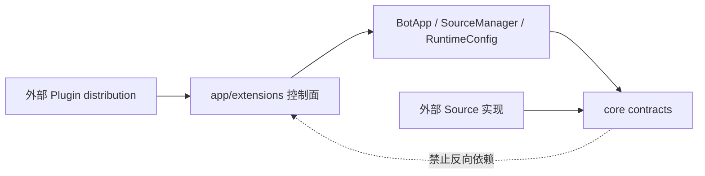

# ButterBot 插件系统引入资本与准入复审

> 审查基线：`dev_main`，提交 `2c75a01`（2026-07-30）
>
> 本文复核
> `docs/review/plugin-system-readiness-review.md`、全项目架构审查和实施路线，
> 并对照后续 Git 提交、当前代码和自动化验证重新判断。
>
> “引入插件系统”在本文中特指：由独立 Python distribution 提供能力，框架能按
> 明确配置发现、校验、注册和关闭它们。普通 Python 包的手工导入不算插件系统。
>
> 实施复核：2026-07-30 已按本文完成 P0-1 至 P0-7。第 3 至第 7 节保留实施前的
> 基线证据和设计理由；实施结果以第 1.3、8.2 和 14 节为准。
>
> 后续结构复核：插件控制面已从 `butterbot/app/extensions/experimental/` 迁至
> 顶层 `butterbot/plugin/`，`SourceRef` 同步移入插件契约；普通插件不再需要导入
> `core`。当前实现进一步按 `contracts/`、`discovery/`、`runtime/` 分类，并以
> `ButterPlugin` 作为两种来源的唯一基类。第 3 至第 7 节中的旧路径作为实施前
> 历史证据保留。

## 1. 执行结论

### 1.1 一句话判断

**ButterBot 已补齐 P0 控制面和外部 distribution 合约，具备引入“可信、显式启用、
启动期加载”的 experimental L1 插件系统的资本与实现基础。**

更准确地说：

- 核心运行时、生命周期、逻辑 Source 引用、Handler 所有权和事务仍被直接复用；
- discovery、两阶段 bootstrap、插件身份与依赖、跨阶段回滚和外部 wheel 合约均已
  实现；
- 当前可以命名为 experimental/provisional L1，不能宣称稳定插件 API 或完整生态；
- 动态卸载、热重载、不可信代码隔离和插件市场不应成为本轮前置。

当前等级判断如下：

| 等级 | 定义 | 当前判断 |
| --- | --- | --- |
| L0 | 应用显式导入并组装第三方 Source/Handler | 已具备 |
| L0.5 | 手工 registrar 验证 provider/consumer 解耦和定向撤销 | 已具备 |
| L1 | 可信、显式启用、启动期发现的 provisional 插件 | P0 已完成，可实验性引入 |
| L2 | 运行期启停、依赖感知卸载、失败隔离 | 尚未具备，不是当前前置 |
| L3 | 不可信插件隔离、签名、市场和生态治理 | 不具备，当前不应建设 |

所以答案不是“先补完整平台再碰插件”，也不是“加一个 entry point 循环就完成”。
正确边界是：

```text
现有可靠运行时
-> 补齐最小插件控制面
-> 通过外部 distribution 合约
-> 发布 experimental L1
-> 用真实生态数据决定是否稳定和是否建设 L2
```

### 1.2 是否具备“资本”

具备，原因有五项：

1. `core` 不反向依赖 `app`、`plugin` 或具体 Source；插件控制面可以位于独立顶层包，
   不需要污染事件源适配契约；
2. Source、EventBus 和 API 已有明确生命周期和取消安全，插件层可以复用，不需要
   再造运行时；
3. `SourceRef`、`SubscriptionHandle`、`owner_id` 和 `ExtensionRegistrar`
   已验证 Source provider 与 Handler consumer 的基本解耦；
4. 配置 builder 已能隔离和撤销，YAML 已保留 Source 定义并能通过 factory 自动创建
   Source；
5. 项目有多 Python 版本 CI、覆盖率门槛、wheel smoke、静态检查和文档门禁，具备
   承载跨 distribution 合约的工程基础。

这里的“资本”现在同时包含可靠运行时和最小插件控制面，但不等于稳定生态。

### 1.3 P0 实施结果

| P0 | 已实现结果 | 主要证据 |
| --- | --- | --- |
| P0-1 | 独立 provisional 插件包；可信代码、启动期和非沙箱边界 | `butterbot/plugin/`、`docs/extensions/plugins.md` |
| P0-2 | descriptor、固定 entry point group、allow-list、版本/依赖/capability 校验 | `plugin/contracts/descriptor.py`、`plugin/discovery/catalog.py` |
| P0-3 | 配置与运行共用两阶段 `PluginBootstrap`；CLI 支持应用 factory | `plugin/runtime/bootstrap.py`、`butterbot/cli/main.py` |
| P0-4 | owner-aware builder/factory receipt、稳定 factory ID 和 `SourceCatalog` | `config.py`、`source_factory.py`、`source_catalog.py` |
| P0-5 | 配置与运行 registrar、统一收据、close callback、普通异常和取消回滚 | `plugin/runtime/registrar.py`、`plugin/runtime/manager.py` |
| P0-6 | 确定性拓扑、`failed/blocked/closed` 状态和无 secret 诊断快照 | `plugin/runtime/manager.py`、`tests/plugin/` |
| P0-7 | Source-only、Handler-only、Combined 三个独立 wheel；clean-venv 冒烟 | `tests/fixtures/plugins/`、`scripts/smoke_plugins.py`、CI Python 矩阵 |

实现保留了旧路径：禁用插件时不会导入已安装 entry point，原有 `BotApp` 对象、
手工组装和零参数应用 factory 继续可用。插件模式则明确要求可接收 `config` 和
`source_factory_registry` 的同步应用 factory。

## 2. 审查方法与验证结果

### 2.1 审查范围

本次复核覆盖：

- 旧审查：`docs/review/` 下架构、路线、backlog、验证和插件就绪度文档；
- 扩展说明：`docs/extensions/`；
- 应用控制面：`butterbot/app/` 和 `butterbot/cli/`；
- 核心契约：Source、EventBus、Subscriber、AppContext、ApiRegistry；
- 内置 Bilibili、NapCat Source 的逻辑 kind 和生命周期；
- 配置、扩展 registrar、Source factory、打包和 CLI 测试；
- 从 `c0f5d11` 到 `2c75a01` 的相关 Git 演进。

### 2.2 本地验证

在 Python 3.12.3 上实际执行：

```bash
uv run pytest --cov=butterbot --cov-report=term-missing --cov-fail-under=70
uv run ruff check .
uv run ruff format --check .
uv run pyright
```

结果：

- 493 项测试全部通过；
- 总覆盖率 76.39%，达到 70% 门槛；
- Ruff lint 通过；
- Ruff format check 通过；
- Pyright 为 0 error、0 warning。

CI 配置了 Python 3.12、3.13、3.14 测试，并在每个版本构建核心 wheel 和三个插件
fixture wheel。Python 3.12 还执行核心 wheel CLI smoke。

P0 实施后又在本地 clean venv 实测 Python 3.12.3、3.13.12 和 3.14.3：三个版本
都能从 wheel 发现 Source-only、Handler-only、Combined 插件，完成跨 distribution
路由，并通过 import、register、Source start 失败回滚和无 pending task 断言。

## 3. Git 演进复核

旧审查之后，项目确实沿着正确顺序补了一批前置能力。

| 提交 | 变化 | 对插件系统的实际影响 |
| --- | --- | --- |
| `c0f5d11` | 增加全项目架构审查、路线和 backlog | 确立“先可靠性和契约，后插件平台” |
| `ba14af1` | 命名 Source 配置和环境变量 | 建立多实例 `config_key` 和配置入口 |
| `6d3babe` | CLI、进程管理和 wheel smoke | 建立标准运行入口，但仍只加载 `BotApp` 对象 |
| `10ef4d6` | Plugin 前置基础设施 | 加入 SourceRef、owner、句柄、builder registry 和手工 registrar |
| `dbf5281` | YAML 自动注册 Source | 加入 SourceFactoryRegistry 和 `kwarg` 驱动的 Source 实例化 |
| `2c75a01` | 补齐 YAML Source 文档 | 对齐配置、示例和当前自动实例化行为 |

### 3.1 `10ef4d6` 已解决的旧问题

该提交不是空的“Plugin”命名，而是补了真正影响正确性的基础：

- `Subscriber` 保存 owner 和 registration ID；
- EventBus 返回 `SubscriptionHandle`，支持精确和按 owner 撤销；
- EventBus 能按 owner 排空或取消已开始的 Handler task；
- `SourceRef(source_kind, config_key)` 在注册期解析到运行时 UUID；
- `ConfigBuilderRegistry` 默认拒绝冲突，并返回可撤销句柄；
- `ExtensionRegistrar` 记录 Source 和订阅并支持失败回滚。

对应测试已经覆盖跨 provider/consumer 路由、两个 owner 隔离、歧义 SourceRef、
注册失败回滚和定向 task drain：
`tests/app/test_extension_registrar.py`、
`tests/core/event/test_event_bus.py`。

### 3.2 `dbf5281` 带来的增量

该提交让 YAML 不仅能构建配置，还能显式选择 Source factory：

- `SourceDefinition` 保存 `kwarg`；
- `SourceFactoryRegistry` 按 `source_name + factory_name` 查找工厂；
- `BotApp` 构造时可以把 YAML 声明实例化到 `SourceManager`；
- 内置 Bilibili 和 NapCat Source 有默认 factory。

这使“Source provider 插件”更接近可行，但它仍是配置便利层，不是插件 provider
控制面。当前 factory 注册没有 owner、撤销句柄、provider ID 或跨阶段收据：
`butterbot/app/source_factory.py:11-62`。

## 4. 现有可复用资本

### 4.1 模块边界正确（实施前方案）

插件控制面最适合位于 `app` 层：



`SourceRef`、Event、BaseSource 等运行时契约继续留在 `core`；发现、依赖、启用列表和
注册事务属于应用组合职责，应留在 `app/extensions`。不需要把 entry point 或
PluginManifest 放进 `core`。

后续结构复核修订了“必须留在 app/extensions”的位置判断：`SourceRef` 是
Handler 插件的逻辑路由契约，和 `PluginDescriptor`、registrar 一并放入
`butterbot.plugin` 更能形成单一用户入口。`BaseSource`、EventBus、数据和状态基类仍
留在 `core`；core 不导入 plugin。`BotApp` 只依赖轻量
`plugin.contracts.routing`，根门面再延迟导入 runtime 控制面，模块级导入图保持
无环。

### 4.2 生命周期足够可靠

插件系统最容易失败的地方通常不是 import，而是半启动和半关闭。当前项目已有：

- `BaseSource.start()` 失败时回滚 `running`；
- `SourceManager.start()` 在失败或取消时逆序停止已启动 Source；
- `remove_source()` 即使停止失败也会退订并摘除；
- EventBus 关闭时排空 Handler，超时后取消；
- EventBus 能按 owner 排空指定插件回调；
- `BotApp.close()` 固定执行 Source → Handler → API 的关闭链。

证据分别见：

- `butterbot/core/source/base_source.py:64-87`；
- `butterbot/app/source_manager.py:307-370`；
- `butterbot/core/event/event_bus.py:221-263,273-351`；
- `butterbot/app/bot_app.py:380-399`。

这意味着插件层只需编排所有权和顺序，不应再建立第二套 Source runtime 或
Event runtime。

### 4.3 Handler 所有权已基本完成

EventBus 当前能：

- 返回不透明订阅句柄；
- 精确删除一次订阅；
- 按 owner 删除全部订阅；
- 按 owner 观察、排空和取消 Handler task；
- 保留其他 owner 在同一 Source 上的订阅和任务。

证据见 `butterbot/core/event/event_bus.py:114-263,415-440`。

旧审查把它列为硬阻塞项；当前应标记为“已完成”，不需要为插件另写 Handler
Registry。

### 4.4 逻辑 Source 路由已有可用原型

当前 `SourceRef` 只包含 `source_kind` 和 `config_key`，运行时仍以 UUID 路由：
`butterbot/core/source/source_ref.py:4-27`。

内置 kind 已按具体事件能力划分：

- `bilibili.dynamic`；
- `bilibili.live`；
- `bilibili.danmaku`；
- `napcat.events`。

`ExtensionRegistrar` 在注册时把 SourceRef 编译为现有 Source UUID，不修改
EventBus 派发表模型：`butterbot/app/extensions/registrar.py:100-137`。

这个方向正确。缺的是全局 catalog、命名权和 provider 所有权，不是 SourceRef
概念本身。

### 4.5 配置已经具备两阶段改造所需接口

`RuntimeConfig.from_yaml()` 可以接收隔离的 `ConfigBuilderRegistry`：
`butterbot/app/config.py:165-231`。builder registry 又能冲突检测、复制和按句柄
撤销：`butterbot/app/config.py:50-123`。

因此不需要重写 YAML 解析器，只需在调用它之前加入显式 bootstrap 阶段。

### 4.6 打包和质量基础可承接外部合约

核心 wheel 已有构建、安装和 CLI smoke，项目也支持 Python 3.12+。下一步可以直接
在现有 CI 上增加独立插件 wheel fixture，而不必先重建发布流水线。

## 5. 对旧审查硬前置的逐项复核（实施前基线）

| 旧审查硬前置 | 当前状态 | 复核结论 |
| --- | --- | --- |
| 明确 L1 范围、信任和 provisional 政策 | 部分完成 | 文档有声明，运行入口和公共命名空间尚未固化 |
| Subscriber handle/owner | 已完成 | 可直接复用 |
| SourceRef、catalog、延迟绑定 | 部分完成 | SourceRef 已有；catalog、唯一性和运行期延迟绑定没有 |
| builder registry 隔离、冲突和撤销 | 已完成 | bootstrap 尚未使用统一隔离实例 |
| 事务式 registrar | 部分完成 | 只覆盖 Source 和订阅，未跨 builder/factory/config 阶段 |
| entry point、兼容、依赖和状态机 | 未实现 | 当前无插件发现代码和打包元数据 |
| 外部 wheel contract | 未实现 | 只有核心 wheel smoke |

旧审查提出的顺序依然成立，但当前起点已经从“补事件所有权”前进到“建设插件
控制面”。不应重复实现已完成的 owner、SourceRef 或 EventBus 能力。

## 6. 引入 experimental L1 前的 P0 基础设施（实施前差距）

以下七项是发布“可信、启动期、provisional 插件系统”前的 P0。每项都给出缺什么、
为什么需要和建议实现方式。

### 6.1 P0-1：明确 provisional 公共边界和信任模型

#### 当前缺口

`butterbot/app/extensions/__init__.py:1-4` 明确说当前只是手工原型，不包含发现、
加载或 Manifest；但 `ExtensionRegistrar`、`SubscriptionSpec` 和
`SourceFactoryRegistry` 已从 `butterbot.app` 门面导出：
`butterbot/app/__init__.py:18-42`。

这会让“原型 API”和“常规稳定应用 API”在导入路径上没有边界。

#### 为什么必须先处理

插件协议需要通过外部包验证后迭代。如果现在的类型被默认视为稳定公共 API，
后续补 owner receipt、provider ID 或 bootstrap phase 时会被兼容包袱锁住。

同进程 Python 插件还能直接访问文件、网络、环境变量和任意对象。窄化 registrar
只能减少误用，不能构成安全沙箱。

#### 建议实现

- 第一阶段只支持可信插件、启动期加载、随整个进程关闭；
- 新 API 放在明确的 provisional 命名空间，例如
  `butterbot.plugin`；
- 文档和异常明确“不支持运行期 install/reload，不隔离恶意代码”；
- 保留现有显式 `BotApp.add_source()` 和 `subscribe()` 路径；
- 在 3.1 正式稳定前决定当前门面导出的原型符号是迁移、保留还是标注实验性。

#### 完成标准

用户能从导入路径和文档区分稳定应用 API 与实验插件 API；关闭 discovery 后，现有
手工组装行为完全不变。

### 6.2 P0-2：Plugin 身份、描述模型和显式发现

#### 当前缺口

仓库没有：

- `PluginDescriptor` 或 plugin ID；
- 插件 entry point group；
- core 版本约束；
- plugin 直接依赖；
- enabled/disabled 列表；
- 重复 ID 和重复能力诊断。

`pyproject.toml` 只有 ButterBot CLI 的 `[project.scripts]`，没有插件入口：
`pyproject.toml:19-20`。

#### 为什么必须实现

owner、日志、依赖、失败状态和回滚都需要稳定 plugin ID。只扫描模块或调用
`entry_points()` 而不建立身份模型，无法判断冲突、兼容和加载顺序。

“安装即自动执行”也不合适：安装 distribution 不应等于授权它在 Bot 进程中运行。

#### 建议实现

定义最小且 provisional 的描述模型：

```python
@dataclass(frozen=True)
class PluginDescriptor:
    schema_version: int
    plugin_id: str
    version: str
    requires_core: str
    requires_plugins: tuple[str, ...] = ()
    provides: tuple[str, ...] = ()
```

约束：

- `plugin_id` 使用稳定、全局可区分的命名，例如反向域名或发布者 namespace；
- `requires_core` 使用标准版本约束；
- v1 只支持必需的直接依赖，不先设计 optional/conflicts 的完整求解器；
- 使用固定 entry point group，例如 `butterbot.plugins`；
- entry point 返回 plugin factory 或 spec，不扫描任意工作目录；
- discovery 只建立 catalog，只有显式 allow-list 中的插件才 `.load()` 并注册；
- 发现结果按 plugin ID 排序，不能依赖安装遍历顺序。

#### 完成标准

无入口、重复 ID、重复 entry point、核心版本不兼容、缺失依赖和依赖循环都有稳定、
指向具体插件的错误。

### 6.3 P0-3：统一两阶段 bootstrap

#### 当前缺口

`BotApp.__init__()` 在没有显式 config 时立即调用 `RuntimeConfig.from_yaml()`，随后
立即实例化 YAML Source：`butterbot/app/bot_app.py:42-81`。

第三方配置 builder 必须在 YAML 解析前注册；第三方 factory 必须在 Source
实例化前注册。当前没有一个入口能保证该顺序。

CLI 也存在两条不同路径：

- `run` 导入并要求目标已经是 `BotApp` 实例：
  `butterbot/cli/loader.py:13-36`；
- `check` 直接调用 `RuntimeConfig.from_yaml()`：
  `butterbot/cli/main.py:88-93`。

因此第三方配置可能在 `run` 中因用户预先 import 而可用，却在 `check` 中报未知
builder。

#### 为什么必须实现

插件注册发生在配置之后会太晚；把隐式 import 塞进 YAML 解析器又会使纯配置检查
变成不可见的代码执行。只有显式 bootstrap 能让顺序、信任和失败语义可测试。

#### 建议实现

固定以下流程：


建议增加独立 `PluginBootstrap` 或 `bootstrap_app()`，而不是让
`RuntimeConfig.from_yaml()` 自己发现插件。CLI 的 `check` 和 `run` 必须复用同一个
bootstrap，只在“是否启动 Source”上不同。

CLI 还应接受应用 factory，而不只接受已经构造完成的 `BotApp` 对象。旧对象模式继续
保留给无插件或手工组装应用。

#### 完成标准

- 插件 builder 总在配置解析前可用；
- 插件 factory 总在 Source 实例化前可用；
- `check` 和 `run` 对同一配置、同一插件集合给出一致结果；
- discovery 关闭时不改变当前构造和 CLI 行为。

### 6.4 P0-4：有所有权的 Source provider registry 和 Source catalog

#### 当前缺口

`SourceFactoryRegistry.register()` 返回 `None`，也没有 owner 或 unregister：
`butterbot/app/source_factory.py:17-39`。

`SourceRef` 的解析则直接遍历 `SourceManager._sources`，按字符串比较：
`butterbot/app/source_manager.py:216-228`。当前没有：

- `source_kind` 命名权；
- provider owner；
- `(source_kind, config_key)` 重复注册检查；
- factory 稳定 ID 与实现类名的区分；
- Source capability/contract 版本。

YAML 当前使用 `kwarg.<SourceClassName>`。实现虽然允许显式 `factory_name` 别名，
文档和内置默认值仍以类名为主。类重命名会不必要地改变用户配置。

#### 为什么必须实现

Handler-only 插件依赖的是逻辑事件能力，不应依赖 Python class。没有 catalog 时，
两个插件可以无意提供同一 `source_kind + config_key`，直到订阅时才得到歧义。

没有 factory 注册收据，插件注册失败后也无法证明 registry 恢复到加载前状态。

#### 建议实现

- 让 `SourceFactoryRegistry.register()` 返回 `FactoryRegistration`；
- registration 记录 `plugin_id`、`source_name`、稳定 `factory_id` 和 token；
- 默认拒绝大小写归一后的冲突，支持按句柄撤销；
- 建立 `SourceCatalog`，在 Source 加入 manager 时记录
  `source_kind + config_key + provider_id + UUID`；
- 第一阶段把 `source_kind` 定义为全局命名空间，并由 descriptor 声明；
- 保持 `SourceRef(source_kind, config_key)` 两字段不变，避免把 provider 实现耦合回
  consumer；
- 默认拒绝相同 `(source_kind, config_key)` 的重复实例；确需多实现时再增加显式策略；
- 新插件使用稳定 `factory_id`，不要把 Python 类名当配置协议。

运行期新增 Source 的延迟自动绑定不是 L1 必需：L1 可通过“先注册全部 provider
Source，再注册全部 consumer Handler”解决。它只在 L2 动态加载时成为硬前置。

#### 完成标准

provider/consumer 不互相 import；冲突在启动前报告；factory 和 Source 都能追溯到
plugin ID 并按收据撤销。

### 6.5 P0-5：跨阶段统一注册事务

#### 当前缺口

`ExtensionRegistrar` 当前只记录：

- Source UUID；
- SubscriptionHandle。

证据见 `butterbot/app/extensions/registrar.py:52-58,88-179`。

它不记录：

- builder registration；
- factory registration；
- catalog entry；
- 插件 close callback；
- bootstrap 阶段；
- 插件状态和失败原因。

`BotApp._add_configured_sources()` 会先解析全部 factory，再逐个构造 Source；后一个
构造失败时，前面已经加入 manager 的实例没有通过统一收据回滚：
`butterbot/app/bot_app.py:83-132`。

SourceManager 能回滚“已经启动”的 Source，但不会替插件撤销注册期的 builder、
factory 和 Handler。

#### 为什么必须实现

插件注册是跨多个现有组件的复合操作。任意一步失败后若只清一部分，会留下：

- 占用名称的 builder/factory；
- 强引用旧代码的 Handler；
- 无主 Source；
- 下次加载时出现的伪重复；
- 被错误标记为 loaded 的依赖。

#### 建议实现

把现有 registrar 扩展为统一 `PluginRegistrar`，内部维护
`RegistrationReceipt` 或清理栈：

```text
register_builder -> BuilderRegistration
register_factory -> FactoryRegistration
add_source       -> OwnedSourceHandle
subscribe        -> SubscriptionHandle
on_close         -> CleanupRegistration
```

规则：

- owner ID 由 PluginManager 注入，插件不能自行伪造；
- 每个成功动作立即压入逆操作；
- `commit()` 前任意异常或取消都逆序清理；
- 一个插件提交成功后，下游失败不撤销无关插件；
- 整体 bootstrap 失败时按依赖逆序撤销所有本轮已提交插件；
- L1 暂不允许 registrar 外创建后台 task；Source 内任务由 Source 生命周期管理，
  Handler task 由 EventBus 管理。

可使用 `contextlib.AsyncExitStack` 实现清理栈，但对外仍返回领域收据，避免把清理细节
变成公共 API。

#### 完成标准

对第 1、2、N 个动作以及 Source 启动阶段注入普通异常和 `CancelledError`，最终
builder、factory、catalog、Source、Handler 和 pending task 都恢复到加载前状态。

### 6.6 P0-6：依赖图、状态机和结构化诊断

#### 当前缺口

现有 SourceManager 只管理 Source 集合；ExtensionRegistrar 只知道单个 owner。
没有 PluginManager，也没有 plugin 状态、依赖顺序或下游阻断语义。

#### 为什么必须实现

provider 必须先于 consumer 注册，关闭时则反向。若 provider 失败，下游不能继续
注册，更不能被标为 loaded。单纯按 entry point 枚举顺序加载会产生环境相关行为。

#### 建议实现

最小状态集合即可：

```text
discovered -> validated -> configuring -> registered -> started
                                   \-> failed
started -> closed
```

PluginManager 负责：

- 对必需依赖做确定性拓扑排序；
- 检测缺失依赖和循环；
- provider 失败时把下游标记为 blocked，并保留根因链；
- bootstrap 整体失败时逆拓扑回滚；
- 正常关闭时逆拓扑调用 registrar 清理；
- 生成不含 secret 的诊断快照。

v1 不需要 SAT solver、可选依赖、冲突包自动选择或跨进程调度。

#### 完成标准

依赖顺序与安装顺序无关；失败插件、根因和所有被阻断下游均可从异常或诊断结果中
确认；重复 close 幂等。

### 6.7 P0-7：外部 distribution contract test

#### 当前缺口

`scripts/smoke_wheel.py` 只验证 ButterBot 自身 wheel 能安装、导入、运行 CLI 和关闭。
测试里的 provider/consumer 都在主仓库中，不能发现：

- wheel 漏包；
- entry point 元数据错误；
- 插件误用仓库 cwd 或私有 import；
- 核心与插件依赖声明不兼容；
- clean venv 中的发现和跨包路由问题。

#### 为什么必须实现

插件系统的关键边界就是 distribution。只在单仓库 import 测试通过，不能证明用户
安装插件 wheel 后能工作。

#### 建议实现

建立三个最小外部 fixture：

1. Source-only：提供 builder、factory、Source 和 source kind；
2. Handler-only：只通过 SourceRef 订阅 Source-only 插件；
3. Combined：同一插件同时提供 Source 和 Handler。

在临时 clean venv 中：

- 构建并安装核心 wheel 和插件 wheel；
- 验证 entry point discovery 和 allow-list；
- 加载第三方配置；
- 发布一条事件并验证跨 distribution Handler 收到；
- 注入 import、register、start 失败并验证回滚；
- 关闭后断言没有 pending asyncio task；
- 至少覆盖 Python 3.12、3.13、3.14。

#### 完成标准

上述三类 wheel 全部通过，且插件只 import 明确的 provisional 公共接口，不依赖
仓库路径、测试 helper 或私有成员。

## 7. 推荐的最小插件架构

### 7.1 模块位置

建议在现有 `app/extensions` 上演进：

```text
butterbot/app/extensions/
├── descriptor.py       # PluginDescriptor、依赖和能力声明
├── discovery.py        # importlib.metadata entry point catalog
├── registries.py       # owner-aware factory/source catalog
├── registrar.py        # 统一注册收据与事务
├── manager.py          # 依赖图、状态和逆序关闭
└── bootstrap.py        # 配置前后两阶段编排
```

不建议：

- 在 `core` 中加入 discovery 或 manifest；
- 新建第二套 Event Router；
- 让每种插件能力都有独立生命周期框架；
- 让 YAML parser 隐式扫描并 import 所有已安装包。

### 7.2 最小插件协议

第一版可以很窄：

```python
class Plugin(Protocol):
    descriptor: PluginDescriptor

    def register_config(self, registrar: ConfigRegistrar) -> None: ...

    async def register(self, registrar: PluginRegistrar) -> None: ...
```

含义：

- `register_config()` 只能登记无运行时副作用的 builder 和 factory；
- `register()` 在 RuntimeConfig 和 BotApp 已存在后登记 Source、Handler；
- 插件不直接接收完整 BotApp 或可写 AppContext；
- registrar 是正确性边界，不是恶意代码安全边界；
- L1 不提供运行期 reload/unload。

如果实际外部原型证明两个 hook 可以安全合并，再简化；不应先为了表面简洁破坏配置
顺序。

### 7.3 `source_name`、`factory_id` 和 `source_kind` 的职责

三者必须保持分离：

| 标识 | 含义 | 示例 |
| --- | --- | --- |
| `source_name` | 选择配置 builder/schema | `bilibili` |
| `factory_id` | 选择如何构造一个具体 Source | `danmaku` |
| `source_kind` | Handler 消费的逻辑事件能力 | `bilibili.danmaku` |

当前 YAML 的 `BiliDanmakuSource` 可以作为兼容别名，但新的插件协议应优先使用稳定
`factory_id`。否则类重命名会变成用户配置破坏性变更。

## 8. 做到什么程度后可以引入

“开始实现”“对用户开放实验功能”和“稳定发布”需要分开。

### 8.1 现在：可以开始实现

当前已经越过原型开工线：

- 核心生命周期可靠；
- owner-aware Handler 已完成；
- SourceRef 和 registrar 有测试；
- 配置和 Source factory 已能注入；
- 核心 wheel 和 CI 可用。

因此可以直接进入 P0-1 至 P0-7，不需要先做 health、metrics、RBAC、市场或 worker
pool。

### 8.2 experimental L1 准入线

以下条件全部满足后，可以在 3.x 开发版本中引入
“experimental/provisional plugin system”：

- [x] 明确只支持可信、显式启用、启动期插件；
- [x] provisional API 有独立命名空间和兼容声明；
- [x] 固定 entry point group，并默认使用 allow-list；
- [x] Plugin ID、核心版本、直接依赖和能力冲突可校验；
- [x] `check` 与 `run` 共用两阶段 bootstrap；
- [x] builder、factory、Source、Handler 都有 owner 和撤销收据；
- [x] provider 先于 consumer，失败和关闭按依赖逆序；
- [x] SourceRef 冲突、缺失和歧义在启动前报告；
- [x] 普通异常和取消都通过跨阶段回滚测试；
- [x] Source-only、Handler-only、Combined 三个外部 wheel 通过；
- [x] Python 3.12、3.13、3.14 clean-venv 合约通过；
- [x] 关闭后无未管理 task，禁用 discovery 时旧 API 行为不变。

这条准入线达到后，可以称为“插件系统实验版”，但仍不能承诺稳定插件 API、
运行期卸载或安全隔离。

### 8.3 稳定插件 API 准入线

在 experimental L1 之上，还应满足：

- 至少三个真正独立的外部 distribution；
- 至少 Source-only、Handler-only、Combined 三种能力形态；
- 至少跨两个核心小版本持续通过；
- 最好有两个以上维护主体，避免全部样例由核心仓库自证；
- 有升级、弃用和失败诊断反馈；
- descriptor 和 registrar 经外部使用后不再频繁改形。

达到这些条件后再评估稳定命名空间或 4.0 API。真实外部验证比增加 Manifest 字段更
重要。

### 8.4 L2 动态卸载的额外准入线

只有出现真实运行期启停需求后，再补：

- 任意插件后台 task 的托管和按 owner 取消；
- API 实例的按 owner/lease 关闭；
- 运行期新增 Source 的延迟订阅绑定；
- provider 卸载前的 dependent 检查；
- 卸载后 Python 模块仍在 `sys.modules` 的明确语义；
- 禁止把 reload 描述成可靠的代码级热替换。

这些都不是 experimental L1 的前置。

## 9. 推荐实施顺序

### PR 1：收敛原型公共边界和 registry 所有权

- 明确 provisional namespace；
- 为 SourceFactoryRegistry 增加 registration handle、owner 和稳定 factory ID；
- 建立 SourceCatalog 和冲突检查；
- 保留现有手工组装兼容路径。

退出条件：现有 owner、SourceRef 和 factory 能组成统一、可撤销的控制面原语。

### PR 2：PluginDescriptor 与 discovery catalog

- 定义最小 descriptor；
- 增加 entry point group；
- 实现 allow-list、重复、版本和依赖校验；
- 只建立 catalog，不自动启动应用。

退出条件：发现结果确定，安装不等于启用，所有静态错误在 import/注册前尽量暴露。

### PR 3：两阶段 bootstrap 与 CLI 统一入口

- 阶段 1 注册 builder/factory；
- 构建 RuntimeConfig；
- 构建 BotApp 和配置 Source；
- 阶段 2 注册 Handler；
- `check` 和 `run` 复用同一流程；
- loader 支持应用 factory，同时保留 `app:app`。

退出条件：第三方 Source 配置在 check/run 中行为一致。

### PR 4：PluginManager 和跨阶段事务

- owner 由 manager 注入；
- 统一 registration receipt；
- 依赖拓扑、状态机、失败阻断；
- 普通异常和取消的逆序回滚；
- 结构化且不泄漏 secret 的诊断。

退出条件：第 N 步失败后进程内状态与加载前一致。

### PR 5：外部 wheel contract 与 provisional 文档

- 三类独立 fixture distribution；
- clean-venv 和 Python 矩阵；
- 信任、生命周期、兼容、迁移和禁用说明；
- 回滚到显式 Python 组装的路径。

退出条件：满足 8.2 的全部 experimental L1 准入项。

## 10. 为什么这些基础设施值得实现

| 基础设施 | 解决的问题 | 不实现的直接后果 |
| --- | --- | --- |
| Plugin ID/descriptor | 身份、版本、依赖和诊断 | owner 不稳定、冲突无法定位 |
| 显式 discovery/allow-list | 安装与授权分离 | 安装第三方包即执行代码 |
| 两阶段 bootstrap | builder/factory 必须早于配置和实例化 | check/run 不一致，第三方配置不可用 |
| Source catalog | 逻辑能力到运行时实例的唯一映射 | consumer 绑定歧义或耦合实现类 |
| 注册收据和事务 | 跨 registry 的原子性 | 失败留下 Handler、Source 或名称占用 |
| 依赖图和状态机 | 确定启动、阻断和关闭顺序 | 行为依赖安装顺序，下游被误标成功 |
| 外部 wheel contract | 验证真实安装边界 | 仓库内测试通过、用户安装后失败 |

这些能力都围绕“可预测、可撤销、可诊断”展开。插件数量即使很少也需要它们；
市场、评分和签名则只有形成生态后才有收益。

## 11. 当前不应作为前置的事项

| 事项 | 当前处理 |
| --- | --- |
| 新 Event Router | 不做，继续把 SourceRef 编译到 EventBus UUID 路由 |
| 固定 worker pool | 不做，现有可选背压与插件控制面无直接依赖 |
| 运行期 pip install/update | 不做，交给 uv/pip 和部署流程 |
| 热重载 | 延后，当前 CLI restart 的新进程边界更可靠 |
| 插件市场、评分 | 延后，属于生态和运营能力 |
| 发布者签名 | 延后，先明确威胁模型、信任根和撤销 |
| 进程内 Python 沙箱 | 不宣称，同进程无法可靠隔离恶意代码 |
| RBAC/PolicyEngine | 不做，当前没有主体、租户和控制面资源模型 |
| 动态卸载 | 延后到真实需求出现，并先补 task/API 所有权 |

## 12. 已固定的 experimental L1 产品决策

P0 实现采用以下边界：

1. 启用列表来自 YAML 保留段 `plugins.enabled`，分层环境变量可覆盖；
2. plugin ID、capability 和 source kind 使用小写稳定 namespace；
3. 缺失或歧义 SourceRef 使注册失败，下游保留 `blocked` 诊断，整体启动失败；
4. entry point 与 plugin ID 一一对应；一个 distribution 可声明多个 entry point；
5. 内置 `kwarg.<ClassName>` 保持兼容，新插件使用稳定 factory ID；
6. 插件协议只从 `butterbot.plugin` 导出；
7. L1 不支持运行期卸载，以进程 restart 作为完整重建边界；
8. 暂不自动安装依赖，继续交给 uv/pip 和部署系统。

仍需真实生态回答的问题是：是否存在仓库 fixture 之外的外部维护者、当前协议能否跨
两个核心小版本保持、以及是否出现必须运行期卸载的产品需求。这些不阻塞
experimental L1，但阻塞稳定 API。

## 13. 风险提示

### 13.1 当前 owner 是正确性标签，不是权限

`owner_id` 目前是调用者可传入的字符串。未来 PluginManager 必须自己注入 owner，
但可信插件仍可绕过 registrar 直接调用公开 BotApp/EventBus。受限 facade 能减少
误用，不能阻止恶意代码。

### 13.2 Source catalog 只保证注册期唯一性

插件拥有的 `(source_kind, config_key)` 现在会在注册期拒绝重复；手工无 owner 的
旧路径为兼容仍允许重复。L1 不支持运行期新增 Source 后自动为既有插件补绑定。

### 13.3 Source 构造函数的外部副作用仍由实现者负责

框架能撤销已登记的 Source、catalog、Handler、builder 和 factory，但不能逆转
自定义 Source 在 `__init__()` 中自行产生的任意外部副作用。Source 仍应把连接和
任务放在 `on_start()`，并在 `on_stop()` 中释放。

### 13.4 experimental 不是稳定承诺

项目仍是 `3.1.0.dev2`。插件协议已移到独立 experimental 命名空间，真实外部插件
跨版本数据不足；在稳定准入线达成前允许调整 descriptor 和 registrar。

## 14. 最终结论

ButterBot 当前最有价值的资产不是某个名为 Plugin 的类，而是：

```text
清楚的 core/app 边界
+ 可靠的异步生命周期
+ owner-aware EventBus
+ SourceRef 逻辑路由
+ 可隔离配置 builder
+ 手工注册事务
+ YAML Source factory
+ wheel/CI 质量门禁
```

这些能力已经足以支撑插件系统建设，说明项目**具备引入资本**。

真正缺失的是把现有原语组织成一个确定的控制面：

```text
显式启用
-> 发现
-> 身份与兼容校验
-> 两阶段配置
-> provider/source 注册
-> consumer/handler 注册
-> 跨阶段事务
-> 依赖感知启动和关闭
-> 外部 wheel 验证
```

P0-1 至 P0-7 已完成，项目可以引入可信、启动期、provisional 的 experimental L1
插件系统。下一阶段应让真实独立插件跨至少两个核心小版本验证协议；此前不得改称
稳定插件 API，也不应通过增加目录扫描、市场或热重载提前宣称形成完整生态。
