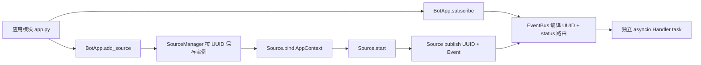
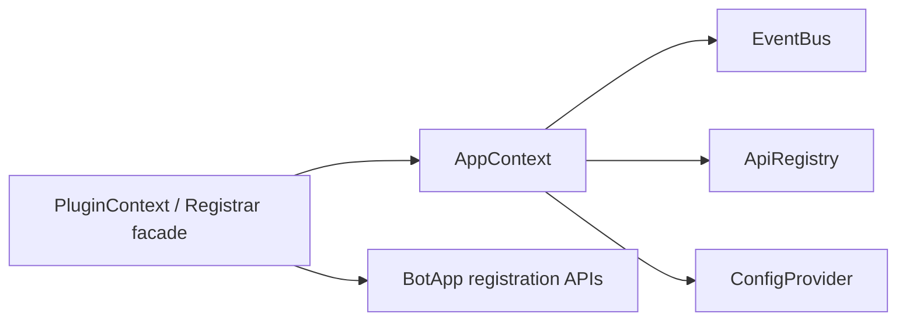
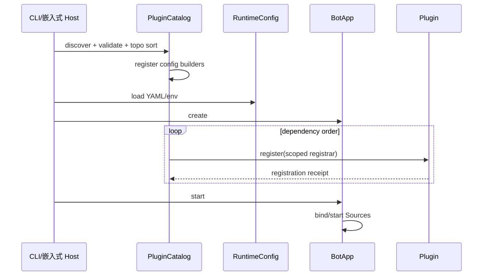

# ButterBot 插件系统就绪度审查

> 审查基线：`dev_main`，提交 `6d3babe`（2026-07-27）
>
> 本报告只评价当前代码是否足以实现插件系统，以及缺失项的必要性和顺序。
> 它不把目标设计当作当前实现，也不建议在本阶段实现不可信 Python 代码沙箱、
> 插件市场或热重载。

## 1. 执行结论

### 1.1 一句话判断

**当前架构已经实现 Source 与 Handler 的运行时调用解耦，但尚不具备完整插件系统
所需的发现、逻辑路由、注册所有权、事务回滚和生命周期编排。**

现状可以支持：

- 在应用代码中显式导入第三方 Python 包；
- 第三方包定义 `BaseSource`、`BaseApi`、`BaseType`、Data 和 `BaseFilter`；
- 应用先 `add_source()`，取得运行时 UUID，再用该 UUID 注册 Handler；
- 应用整体关闭时停止全部 Source、排空 Handler、关闭全部 API。

现状不能可靠支持：

- 安装 distribution 后自动发现并注册；
- Handler-only 插件按稳定逻辑标识绑定另一个插件提供的 Source；
- 注册失败后自动撤销该插件已经产生的部分修改；
- 只卸载一个 Handler 插件而不删除同一 Source 的其他订阅；
- 只关闭或撤销某个插件拥有的 Source、API、builder 和后台任务；
- 在解析第三方 `source_name` 配置前保证其 builder 已被加载；
- 校验插件 ID、能力、核心版本和插件依赖；
- 声明或提供不可信插件的进程内安全隔离。

因此就绪度分级如下：

| 能力级别 | 当前状态 | 结论 |
| --- | --- | --- |
| L0：普通 Python 扩展，应用显式组装 | 已支持 | 可用于当前项目 |
| L1：可信、启动期、可安装和可发现插件 | 基础不足 | 补齐本文 P0 后可试验 |
| L2：运行期启停、卸载和失败隔离 | 不支持 | 需求成立后做 P1 |
| L3：不可信插件隔离、市场和签名治理 | 不支持 | 当前不应实施 |

### 1.2 是否“写不了插件系统”

如果“插件系统”只表示一个循环调用 `importlib.metadata.entry_points()`，现在可以写；
但它只能成为**加载脚本**，不能成为可维护的插件系统。以下五项若不先补齐，L1
也无法达到可接受的正确性：

1. **两阶段引导和实例化顺序**：先发现配置能力，再构建 `RuntimeConfig` 和应用；
2. **稳定 Source 逻辑标识与路由绑定**：Handler 不能把随机 UUID 写入静态声明；
3. **带所有者的注册收据**：每次 Source、Handler、builder 注册都必须可追踪和撤销；
4. **事务式注册与逆序回滚**：插件注册或 Source 启动失败不能留下半注册状态；
5. **provisional 插件契约和外部 wheel contract test**：不能直接承诺稳定公共 API。

若要求 L2 的动态卸载，还必须额外补齐按订阅句柄退订、插件任务所有权和按所有者
关闭 API。仅做启动期可信插件时，这三项可以延后，但必须明确“不支持卸载和热重载”。

## 2. 审查范围和证据等级

本次复核覆盖：

- `butterbot/core/`：Event、EventBus、Subscriber、Source、API、Context、Data、
  Type、Filter；
- `butterbot/app/`：BotApp、SourceManager、RuntimeConfig 和 builder；
- `butterbot/cli/`：对象入口导入和进程生命周期；
- `butterbot/sources/`：NapCat 与 Bilibili 的发布、连接和任务所有权；
- `tests/`：订阅、退订、动态 Source、关闭、配置 builder 和安装包测试；
- `docs/extensions/`、`docs/features/`、`docs/configuration/`；
- `pyproject.toml` 和 `.github/workflows/`。

本文使用以下证据标签：

- **代码事实**：当前实现直接证明；
- **测试事实**：已有自动化测试固定行为；
- **文档声明**：文档描述，但不单独视为实现；
- **推断**：从调用链或缺失接口推得；
- **建议**：目标设计，不代表已经存在。

## 3. 当前事实上的扩展模型

### 3.1 已存在的扩展契约

当前不是“没有扩展能力”，而是存在一组需要应用手动组装的契约：

| 契约 | 当前职责 | 证据 |
| --- | --- | --- |
| `BaseSource` | 生产事件，拥有 `start/stop` 生命周期 | `butterbot/core/source/base_source.py:10-20,64-109` |
| `BaseType` | 定义状态字符串及层级/正则匹配 | `butterbot/core/types/base_type.py:8-71` |
| `Event` | 携带 `data/status/id` | `butterbot/core/event/event.py:9-24` |
| `BaseDataModel` | Pydantic 数据验证和 discriminator 分发 | `butterbot/core/data/base_model.py:8-59,74-129` |
| `BaseFilter` | 同步内容过滤和组合 | `butterbot/core/filter/base_filter.py:11-74` |
| `BaseApi` / `ApiRegistry` | 按 API 类和配置键缓存连接能力 | `butterbot/core/context/api_registry.py:17-51` |
| `AppContext` | 向 Source 注入配置、API registry 和 EventBus | `butterbot/core/context/app_context.py:9-51` |
| `RuntimeConfig` builder | 把命名配置构建为平台配置对象 | `butterbot/app/config.py:119-207` |

`docs/extensions/README.md:15-16` 也明确声明当前没有通用 Plugin 注册器，完整适配
通过普通 Python 包导出。这一声明与代码一致。

### 3.2 当前组装链

当前应用的真实组装和运行链是：



代码证据：

- `BotApp.add_source()` 委托 `SourceManager.add_source()`：
  `butterbot/app/bot_app.py:114-134`；
- manager 立即实例化 Source 并按 `source.uuid` 保存：
  `butterbot/app/source_manager.py:71-114`；
- `BotApp.subscribe()` 必须先按 UUID 找到已注册 Source，再读取其
  `supported_types`：`butterbot/app/bot_app.py:212-248`；
- Source 通过 `self.ctx.bus.publish(self.uuid, event)` 发布，NapCat 的实际调用见
  `butterbot/sources/napcat/source/napcat_source.py:34-54`；
- EventBus 以 UUID 和状态查表并为每个 callback 创建 task：
  `butterbot/core/event/event_bus.py:299-349`。

### 3.3 已实现和未实现的解耦

| 解耦维度 | 状态 | 判断 |
| --- | --- | --- |
| Source 是否直接调用业务 Handler | 已解耦 | Source 只发布到 EventBus |
| Handler 执行是否阻塞 Source 业务结果 | 已解耦 | `publish()` 调度 task，不等待结果 |
| Handler 是否依赖 Source 运行时实例 | 未解耦 | 注册必须提供该实例的 UUID |
| Handler 插件是否能独立声明消费目标 | 未实现 | 没有逻辑 Source selector 或待绑定 route |
| Source 包和 Handler 包是否必须是同一包 | 不必须 | 普通 Python 可拆包，但需要应用居中组装 |
| 应用是否与具体 Source/Handler 组装解耦 | 未解耦 | `app.py` 必须显式导入、实例化、取得 UUID、订阅 |
| 插件生命周期是否彼此隔离 | 未实现 | 只有应用级和 Source 级清理 |

结论是：**数据流执行已解耦，组合根尚未解耦。** 插件系统首先需要解决组合根问题，
不需要重写 EventBus 或创建第二套 Router。

## 4. 阻塞完整插件系统的真实缺口

### 4.1 P0-A：缺少两阶段插件引导

#### 事实

`BotApp.__init__()` 未收到配置时立即执行 `RuntimeConfig.from_yaml()`：
`butterbot/app/bot_app.py:40-69`。配置加载最终按 `source_name` 查找进程级
`_CONFIG_BUILDERS`：`butterbot/app/config.py:58-114,167-189`。

CLI 的 `load_app()` 只是导入 `module:attribute`，并要求目标已经是 `BotApp`：
`butterbot/cli/loader.py:13-35`。典型模块顶层执行 `app = BotApp()`，文档也明确这会
在导入时读取配置：`docs/guide/cli.md:13-28`。

#### 后果

第三方插件若提供新的配置 builder，必须在 `BotApp()` 解析 YAML **之前**被导入。
仅在 `BotApp` 创建后运行 plugin entry point 已经太晚；`butterbot check` 又不导入
应用模块（`butterbot/cli/main.py:88-93`），因此也无法检查第三方配置。

#### 最小必须改动

在 `app` 层增加显式 bootstrap 协调器，顺序固定为：

1. 发现 entry point 和读取最小描述；
2. 校验重复 ID、核心版本和直接依赖；
3. 只注册配置 builder/schema；
4. 构建 `RuntimeConfig`；
5. 构建 `BotApp`；
6. 在注册事务中注册 Source 和 Handler；
7. 最后启动 Source。

CLI 可以调用该流程，但流程不能只存在于 CLI，否则嵌入式用法无法使用插件。

不建议让 `RuntimeConfig.from_yaml()` 隐式导入任意插件；这会把纯配置解析变成不可见
代码执行。更合理的 API 是显式 `PluginCatalog.discover()` 加
`BotApp.bootstrap(...)`，便捷 CLI 再封装它。当前 `app:app` 对象模式需要保留为
无插件或手动组装模式。

### 4.2 P0-B：缺少稳定的 Source 逻辑标识和延迟路由绑定

#### 事实

- `BaseSource` 默认使用 `uuid4()` 生成实例标识：
  `butterbot/core/source/base_source.py:46-62`；
- `SubscriberGroup` 的派发表形状是
  `uuid -> concrete_status -> callbacks`：
  `butterbot/core/event/subscriber.py:34-47,90-125`；
- `BotApp.subscribe()` 参数是 `source_id: UUID`：
  `butterbot/app/bot_app.py:212-248`；
- `SourceManager.get_source(type)` 在多实例时返回第一个，只有调用者同时知道 Python
  class 和 `config_key` 才能精确查找：
  `butterbot/app/source_manager.py:158-198`；
- `Event` 本身只含 `data/status/id`，发布者 UUID 作为 `publish()` 的独立参数传递：
  `butterbot/core/event/event.py:9-24` 和
  `butterbot/core/event/event_bus.py:299-321`。

#### 后果

Handler-only 插件无法静态声明“消费 `qq_account` 的 NapCat 群消息”。UUID 只有
Source 实例化后才出现，把它写入 manifest 没有意义。让 Handler 插件导入具体
Source class 再用 `get_source(class, config_key)` 虽可临时工作，但会形成对生产者
实现包的硬依赖，而且多实现、多实例和替换实现时不稳定。

#### 最小必须改动

增加逻辑 Source catalog 和轻量 `SourceRef`，建议至少包含：

```text
plugin_id + source_kind + instance_key
```

- `plugin_id`：能力提供者；
- `source_kind`：具体 Source 能力，而不是笼统平台名；
- `instance_key`：通常映射当前 `config_key`。

当前 YAML 的 `source_name` **不能直接当作具体 Source class 标识**。代码已经说明它
只选择配置 builder，且不会自动创建 Source：
`docs/configuration/yaml.md:42-52`。Bilibili 同一配置下还有 dynamic、live、
danmaku 等不同 Source，因此 `source_name: bilibili` 本身不足以实例化具体源。

未来 `SubscriptionSpec` 只表达 `SourceRef + status + callback/filter`，在 Source
实例化后编译为现有 UUID 订阅。它不应另建 Router，也不应改变 EventBus 的
UUID 快速派发表。

### 4.3 P0-C：订阅没有句柄和所有者

#### 事实

`EventBus.add_subscriber()` 返回 `None`：
`butterbot/core/event/event_bus.py:106-138`。`Subscriber` 只保存 callback、
status_filter 和 event_filter，没有 registration ID 或 owner：
`butterbot/core/event/subscriber.py:19-31`。

唯一退订能力是按 Source UUID 删除**全部**订阅：
`butterbot/core/event/event_bus.py:173-184` 和
`butterbot/core/event/subscriber.py:94-110`。公开 `BotApp.unsubscribe()` 继承了
同一语义：`butterbot/app/bot_app.py:277-286`。测试只证明按 Source 全删及不影响
其他 Source，没有按单个 Handler 或插件退订：
`tests/core/event/test_event_bus_close.py:204-258`。

#### 后果

如果插件 A 和插件 B 都订阅同一 Source，卸载 A 时：

- 调用现有 `unsubscribe(source_id)` 会把 B 一起删除；
- 不调用则 A 的 callback 继续被强引用并执行；
- 已开始执行的 A Handler task 也无法按 owner 查找、排空或取消。

这不是便利性缺失，而是插件卸载正确性的硬阻塞。

#### 最小必须改动

- `add_subscriber()` 返回不透明 `SubscriptionHandle`；
- Subscriber 和内部 callback task 记录 `owner_id`；
- 支持 `unsubscribe(handle)` 和 `unsubscribe_owner(owner_id)`；
- 保留现有 `remove_subscribers(source_id)` 兼容 Source 移除语义；
- 明确退订只阻止新派发，是否等待已开始 Handler 由单独的
  `drain_owner(owner_id, timeout)` 控制。

第一阶段可以保持现有公开 API 返回值兼容，把新句柄接口放入 provisional registrar，
而不是立即改变 `BotApp.subscribe()` 装饰器行为。

### 4.4 P0-D：注册操作没有所有权和事务回滚

#### 事实

当前注册入口彼此独立：

- Source 直接写入 `_sources[source.uuid]`：
  `butterbot/app/source_manager.py:98-114`；
- Handler 直接追加到派发表：
  `butterbot/core/event/subscriber.py:90-92`；
- builder 直接覆盖全局字典：
  `butterbot/app/config.py:119-147`；
- API 在首次 `get_api()` 时进入全局应用 registry：
  `butterbot/core/context/api_registry.py:32-51`。

没有对象记录“这些修改属于哪个插件”，也没有跨注册项的 transaction。配置测试必须
直接快照和恢复私有 `_CONFIG_BUILDERS`，证明当前 registry 是可泄漏的进程全局状态：
`tests/app/test_config.py:486-501`。

此外，`SourceManager.add_source()` 对相同 UUID 使用字典赋值，没有显式冲突检查：
`butterbot/app/source_manager.py:98-100`。插件失败时可能覆盖或遗留注册。

#### 后果

插件依次注册 builder、Source、两个 Handler，第二个 Handler 验证失败时，前三项
不会自动撤销。随后重试会遇到重复注册、回调重复或已存在 Source。

#### 最小必须改动

增加一个**受限注册器**，而不是复制 `AppContext`：

```text
PluginRegistrar
  register_builder(...) -> RegistrationHandle
  add_source(...) -> SourceHandle
  subscribe(...) -> SubscriptionHandle
  create_task(...) -> TaskHandle       # L2 前可暂不开放
  commit() -> PluginRegistration
  rollback()
```

`PluginRegistration` 保存所有句柄并按逆序关闭。注册阶段异常必须自动 rollback。
注册器内部可以调用现有 BotApp、SourceManager 和 EventBus；它属于 `app` 层，不能
让 `core` 反向依赖插件或具体 Source。

`PluginContext` 若采用该名称，应当只是 `AppContext` 的窄化 facade 加 registrar，
不应成为第二个资源容器。直接把完整 `AppContext` 稳定暴露给插件会让所有内部能力
永久成为兼容承诺，也无法实施最小权限。

### 4.5 P0-E：缺少插件生命周期状态机和依赖顺序

#### 事实

目前只有：

- Source 级 `start/stop`，由 Source 自己释放任务：
  `butterbot/core/source/base_source.py:64-109`；
- SourceManager 启动失败时回滚已经启动的 Source：
  `butterbot/app/source_manager.py:265-335`；
- 应用关闭顺序为 Source -> Handler -> API：
  `butterbot/app/bot_app.py:303-322`。

这些是可复用的可靠基础，但没有 `discovered/configured/registered/started/failed`
插件状态，也没有插件依赖图。SourceManager 的启动回滚只覆盖 Source，不覆盖注册期
添加的 Handler 或 builder。

#### 最小必须改动

L1 只支持进程启动期加载，状态至少为：

```text
discovered -> validated -> configured -> registered -> started -> closed
                               \-> failed + rollback
```

依赖必须在注册前做拓扑排序，并拒绝：

- 重复 plugin ID；
- 缺失依赖；
- 循环依赖；
- `requires_butterbot` 不兼容；
- 重复 source kind、逻辑实例 ID 或 builder 名称。

插件 Source 不应由独立 Worker/服务管理；继续交给现有 SourceManager。插件 manager
只拥有注册收据和顺序，不复制 Source 生命周期。

### 4.6 P0-F：缺少可验证的外部分发契约

#### 事实

`pyproject.toml:19-20` 只有 `console_scripts` 的 `butterbot` 入口，没有插件 entry
point group。`tests/test_package.py:34-42` 也只检查 CLI entry point。

CI 已覆盖 Python 3.12、3.13、3.14、lint、type、build 和 wheel smoke：
`.github/workflows/ci.yml:29-90`；但没有安装第三方扩展 wheel、发现 entry point、
核心版本不兼容或跨 distribution 路由测试。

#### 最小必须改动

第一版只能标记为 provisional/internal。建议 entry point group：

```toml
[project.entry-points."butterbot.plugins"]
my_plugin = "my_package.plugin:plugin"
```

至少用三个真实独立 wheel 形态验证：

1. Source-only：提供配置 builder、API、Data、Type 和 Source；
2. Handler-only：不创建 Source，按逻辑 `SourceRef` 消费第一个 wheel 的事件；
3. Combined：同一插件同时提供 Source 和 Handler，验证事务回滚与关闭。

“独立”应至少表示独立 distribution 和独立构建元数据，而不是仓库内三个类。稳定
发布前建议再满足：至少三个外部扩展、覆盖两个维护者或团队，并跨两个 ButterBot
小版本运行。否则无法知道协议是否只适配了内置 NapCat/Bilibili。

## 5. L2 动态卸载额外缺口

以下不阻塞“可信、启动期加载、随进程整体关闭”的 L1，但阻塞运行期卸载：

### 5.1 API 资源没有按插件关闭

`ApiRegistry` 只有 `aclose_all()` 和不关闭资源的 `clear()`：
`butterbot/core/context/api_registry.py:78-119`。若卸载插件时关闭全部 API，会影响
其他插件；只丢引用则泄漏连接。

需要按实例句柄或 owner 关闭。L1 可规定 API 生命周期等于 BotApp 生命周期并延后。

### 5.2 任意插件任务没有统一所有权

框架只明确拥有两类任务：

- Source 自己创建并在 `on_stop()` 释放，例如
  `butterbot/sources/bilibili/source/base_polling_source.py:39-54`；
- EventBus 保存 Handler task 强引用并在 close 时排空：
  `butterbot/core/event/event_bus.py:39-50,186-264`。

插件注册函数若自行 `asyncio.create_task()`，框架无法发现或清理。L1 应禁止注册函数
创建长期任务；长期活动必须放在 Source 生命周期中。L2 再提供 owner-aware task
supervisor。

### 5.3 Python 类型注册无法真正“卸载代码”

`BaseDataModel` 在类创建时把 subclass 写入类级 `_registry`：
`butterbot/core/data/base_model.py:27-59`。即使从 `sys.modules` 删除模块，类对象仍
可能被 registry、callback 或用户对象引用。

因此“卸载”只能定义为停止派发和释放受管资源，不能承诺从解释器中完整删除 Python
代码。CLI `restart` 已通过新进程完整重建，是需要代码重载时更可靠的边界：
`butterbot/cli/main.py:183-199`。

## 6. 建议的最小插件契约

### 6.1 Plugin 表示什么

建议区分三个概念：

| 概念 | 语义 |
| --- | --- |
| Python distribution | 安装、依赖解析和版本发布边界 |
| entry point | distribution 暴露插件定义的发现入口 |
| Plugin | 一组可注册能力及其生命周期所有权边界 |

Plugin 不应等同于单个 Source。一个 NapCat 适配需要 Source、API、Data、Type、Filter
和 builder；Handler-only 插件又可能没有 Source。第一版应把 Plugin 定义为能力
集合，一般让一个 entry point 对应一个 plugin ID；未来无需承诺一个 distribution
只能包含一个 Plugin。

### 6.2 最小描述字段

provisional `PluginDescriptor` 最少需要：

| 字段 | 必需 | 用途 |
| --- | --- | --- |
| `schema_version` | 是 | 描述格式演进 |
| `id` | 是 | 稳定、全局唯一的运行时 owner ID |
| `version` | 是 | 诊断和兼容判断 |
| `requires_butterbot` | 是 | 核心版本范围 |
| `capabilities` | 是 | 配置、source、handler 等声明 |
| `requires_plugins` | 否 | 直接插件依赖和拓扑排序 |

entry point 位置已经由 distribution metadata 表达，不必在返回对象中重复维护一份
可漂移的 `entrypoint` 字符串。作者、主页可从 distribution metadata 获取。评分、
签名、下载量、密钥和权限授予不属于第一版 descriptor。

### 6.3 PluginContext 与 AppContext

建议关系：



- `AppContext` 继续拥有真实基础设施；
- `PluginContext` 只暴露允许的注册操作、配置视图和 API 获取；
- 每个操作自动附加 plugin owner；
- 不继承 `AppContext`，不复制 EventBus、ApiRegistry 或 RuntimeConfig；
- v1 的 capability 是约束和审计词汇，不是安全沙箱。

所有同进程插件默认视为可信代码。它可以绕过 facade 访问文件、网络和环境变量。
未来若允许不可信插件，隔离边界必须是独立进程或容器、受限 IPC、Secret broker、
网络/文件权限和资源限额；签名只证明来源或完整性，不提供运行时隔离。

### 6.4 SubscriptionSpec 与现有路由

不建议公开一个并行 `RouteSpec/Router`。建议 provisional `SubscriptionSpec`：

```text
source: SourceRef
status: str | Pattern | BaseType
callback: async callable
filter: BaseFilter | None
```

它的职责只是延迟绑定和注册收据；最终仍调用当前 EventBus，把规则针对 Source 的
`supported_types` 编译为 UUID + concrete status 派发表。

类型化 Handler 可以显式依赖 Source 插件并导入其 `BaseType` 和 Data 类型；松耦合
Handler 可以使用稳定状态字符串和 `Event[Any]`。前者类型安全更好，后者包依赖更少，
两者都不需要序列化 callback 或自定义 Filter 到 manifest。

## 7. 推荐生命周期和失败语义

### 7.1 启动



关键约束：

- Source 必须先注册，Route 后绑定，最后才启动，延续现有动态接入契约
  `add_source -> subscribe -> start_source`：
  `butterbot/app/source_manager.py:79-82,220-225`；
- 一个插件注册失败时，只回滚该事务；依赖它且尚未注册的插件不得继续；
- Source 启动失败时，除现有 SourceManager 回滚外，还应撤销本轮 plugin
  registration receipts，避免重试重复注册；
- Handler 异常仍按当前 EventBus 语义记录，不反向判定插件注册失败。

### 7.2 关闭和卸载

L1 只要求随应用整体关闭，继续使用已经正确的全局顺序：

```text
停止 Source -> 排空 Handler -> 关闭 API
```

L2 单插件卸载建议：

1. 标记 plugin 为 stopping，拒绝新增注册；
2. 按 subscription handle 摘除该插件 Handler，阻止新派发；
3. 停止并移除该插件拥有的 Source；
4. 限时排空或取消该 owner 已开始的 Handler task；
5. 关闭该插件独占 API 和受管任务；
6. 逆序撤销 builder、source kind 和其他注册；
7. 标记 closed。

共享 API 的所有权需要引用计数或明确“应用级共享、不支持运行期释放”的规则，不能
在没有模型时猜测。

## 8. 实施顺序

### 8.1 重新排序

| 顺序 | 任务 | 优先级 | 是否为硬前置 |
| --- | --- | --- | --- |
| 1 | 明确 L1 范围、信任模型和 provisional 兼容政策 | P0 | 是 |
| 2 | 为 Subscriber 增加 registration handle/owner 内部模型 | P0 | 是 |
| 3 | 引入 SourceRef、source kind catalog 和延迟订阅绑定 | P0 | 是 |
| 4 | 把 builder registry 实例化并增加冲突检查、撤销句柄 | P0 | 是 |
| 5 | 实现两阶段 bootstrap 和事务式 PluginRegistrar | P0 | 是 |
| 6 | 实现 entry point discovery、版本/依赖校验和状态机 | P0 | 是 |
| 7 | 建立三个外部 wheel contract fixtures 和 clean-venv smoke | P0 | 是 |
| 8 | 发布 provisional L1 插件 API 和迁移文档 | P1 | 是 |
| 9 | 增加 Event source metadata / HandlerContext | P1 | 否，通用路由前需要 |
| 10 | owner-aware task drain 和 API subset close | P1 | 仅 L2 必需 |
| 11 | 运行期 disable/unload | P2 | 依赖 2、5、10 |
| 12 | 稳定插件 API | P3 | 依赖真实外部验证 |
| 13 | 市场、评分、签名和不可信隔离 | Reject/长期研究 | 当前否 |

### 为什么 manifest 不是第一步

先写稳定 `PluginManifest` 会把尚未解决的 Source 身份、能力粒度、配置阶段和卸载语义
固化为公共 API。描述模型应和 registrar 原型一起作为 provisional 迭代，而不是脱离
可运行外部插件先发布。

### 为什么 EventBus worker pool 不是前置

插件路由可以编译到当前 EventBus。当前 EventBus 已支持可选
`max_pending_callbacks` 背压：
`butterbot/core/event/event_bus.py:23-46,299-338`。worker pool、queue 或独立
Router 都不是插件发现和生命周期所有权的必要条件。

### 8.2 建议 PR 拆分

### PR 1：订阅句柄与所有者

- 目标：增加内部 `SubscriptionId/owner_id`，支持精确和按 owner 退订；
- 非目标：不改调度模型，不做插件 discovery；
- 兼容：保留现有 `BotApp.unsubscribe(source_id)`；
- 验收：两个 owner 订阅同一 Source，删除一个不影响另一个；退订和 publish 并发
  有确定快照语义。

### PR 2：Source catalog 与延迟绑定

- 目标：定义 provisional `SourceRef`、source kind 和 `SubscriptionSpec`；
- 非目标：不自动从 `source_name` 猜 Source class；
- 验收：Handler-only 测试模块不持有 UUID，可绑定指定实例；缺失和歧义均启动前报错。

### PR 3：配置 registry 隔离

- 目标：builder 重复注册报错、可撤销、测试不再直接恢复私有全局字典；
- 非目标：不改变当前 YAML 结构；
- 验收：内置 builder、用户 builder、插件 builder 可共存；失败回滚无全局泄漏；
  `butterbot check` 可接收已完成配置阶段的 catalog。

### PR 4：PluginRegistrar 事务

- 目标：所有注册项归 owner，异常逆序撤销；
- 非目标：不做动态代码卸载；
- 验收：在第 N 个注册动作注入异常，Source、Handler、builder 均恢复到注册前状态。

### PR 5：entry point discovery 与启动期状态机

- 目标：发现、重复检查、版本约束、依赖拓扑和启动期加载；
- 非目标：不做 install/update、签名、市场、reload；
- 验收：缺失依赖、循环、重复 ID、版本不兼容和单插件失败均有结构化诊断。

### PR 6：外部 wheel contract suite

- 目标：验证 Source-only、Handler-only、Combined 三种独立 distribution；
- 非目标：不以仓库内 mock 代替安装边界；
- 验收：clean venv 安装核心 wheel 和插件 wheel，发现、配置、跨插件路由、关闭成功，
  且无 pending asyncio task。

### PR 7：provisional 文档发布

- 目标：明确 API 不稳定、信任模型、配置顺序、生命周期和兼容策略；
- 验收：文档包含最小可运行外部插件、升级失败诊断和回滚到显式 Python 组装的方法。

## 9. 测试门槛

在称为 L1 插件系统前，至少需要以下自动化测试：

### 发现与兼容

- 无 entry point 时行为不变；
- 重复 plugin ID 和 entry point 名称；
- 核心版本满足/不满足；
- 缺失、循环和有序依赖；
- discovery 确定性，不依赖安装遍历顺序；
- 一个插件 import 失败不会产生半注册状态。

### 配置

- 插件 builder 在 YAML 类型构建前可用；
- `butterbot check` 和 `run` 使用相同 bootstrap 结果；
- builder 名称冲突不静默覆盖；
- 环境变量覆盖后再调用插件 builder；
- Secret 不出现在 descriptor、异常和 repr。

### 路由与所有权

- Handler-only 插件按 `SourceRef` 绑定另一个插件的 Source；
- 同一种 Source 多实例选择准确，缺失/歧义快速失败；
- 两个插件订阅同一 Source 时可以独立退订；
- 卸载/回滚不删除其他 owner 的订阅；
- status 无匹配继续抛 `SubscriptionError`；
- Filter 仍在 Handler task 内执行，异常语义不变。

### 生命周期

- 注册第 1、2、N 步失败的逆序回滚；
- Source 启动失败时回滚注册收据；
- bootstrap 被取消时仍清理已注册资源；
- 应用关闭顺序仍是 Source、Handler、API；
- 重复 close 幂等；
- L1 禁止或检测注册函数遗留的非受管任务。

### 分发

- 构建核心 wheel 和三个插件 wheel；
- 在 clean venv 中安装，不依赖仓库 cwd；
- entry point 可发现，distribution metadata 可读取；
- Python 3.12、3.13、3.14 合约测试；
- 插件依赖缺失时错误指向插件和约束，而不是深层 `ImportError`。

## 10. 不应作为当前前置的能力

| 能力 | 当前判断 | 原因 |
| --- | --- | --- |
| 插件市场/目录 | 延后 | 先有稳定 ID、兼容声明和真实插件 |
| 评分 | Reject | 属于社区治理和反滥用运营，不是运行时能力 |
| 发布者签名 | 延后 | 需信任根、轮换、撤销和威胁模型 |
| Python 进程内沙箱 | Reject | 无法可靠隔离文件、网络、环境和对象访问 |
| RBAC | 延后 | 当前没有主体、租户、资源和动作模型 |
| 独立 Plugin Runtime 服务 | Reject | 当前模块化单体足够，外进程只用于不可信隔离 |
| 新 Router | Reject | SubscriberGroup 已承担路由编译和派发 |
| EventBus worker pool | 非依赖 | 插件正确性依赖所有权，不依赖调度器形态 |
| CLI plugin install/update | 延后 | 首先用 pip/uv 和 entry point，避免复制包管理器 |
| 热重载 | 延后 | 当前 `restart` 新进程边界更可靠 |

## 11. 与现有公共 API 的兼容策略

1. 保留显式 Python 组装，`BotApp.add_source()`、`subscribe()` 和 `app:app` 不废弃；
2. 新插件 API 放在 provisional 命名空间，不从稳定 `butterbot.app` 门面导出；
3. `SubscriptionSpec` 编译到现有 EventBus，不改变
   `publish(uuid, event) -> None` 和 Handler 异常隔离语义；
4. 当前 UUID 继续作为运行时高效实例键，`SourceRef` 只是控制面逻辑键；
5. 当前 YAML `sources.<config_key>.source_name` 继续表示配置 builder 类型，不静默改成
   Source class；
6. descriptor schema 带独立版本，未知 major 直接拒绝；
7. 稳定前允许删除或改名 provisional API，但每个开发版本提供迁移说明；
8. 回滚插件功能时，用户仍可回到 app.py 显式导入和组装。

## 12. 当前架构中可直接复用的良好基础

虽然结论是“尚未就绪”，但无需推倒重建：

- core 不依赖 app 或具体 Source，当前依赖方向符合插件扩展基础；
- `BaseSource.start()` 对启动失败回滚 `running`：
  `butterbot/core/source/base_source.py:64-84`；
- SourceManager 已实现多 Source 启动失败回滚：
  `butterbot/app/source_manager.py:296-335`；
- 动态 Source 已遵循“注册、订阅、启动”避免启动窗口丢事件：
  `butterbot/app/source_manager.py:79-82,220-225`；
- Source 移除即使 stop 失败或被取消也会清订阅和摘除：
  `butterbot/app/source_manager.py:116-156`，对应测试
  `tests/app/test_source_manager.py:466-538`；
- EventBus 保存 Handler task 强引用、消费异常、关闭时限时排空：
  `butterbot/core/event/event_bus.py:39-50,186-297`；
- BotApp 关闭顺序已经适合模块化单体：
  `butterbot/app/bot_app.py:303-322`；
- CLI restart 使用新 Python 进程和重新导入，不冒充热重载：
  `butterbot/cli/main.py:183-199`。

插件基础建设应围绕这些能力增加“逻辑身份、所有权和编排”，而不是复制它们。

## 13. 最终建议

### Proceed Now

1. 设计并实现内部订阅句柄和 owner，保持现有公开退订 API；
2. 设计 provisional `SourceRef + SubscriptionSpec`，只做延迟绑定；
3. 隔离 builder registry，并增加冲突、撤销和加载阶段；
4. 在上述基础上实现事务式 `PluginRegistrar`；
5. 最后增加 entry point discovery 和三个外部 wheel contract fixture。

### Design Only

- 最小 `PluginDescriptor`；
- `PluginContext` 的窄化 facade；
- L2 的 task/API 所有权；
- Event source metadata 或 HandlerContext。

这些设计应跟随可运行原型迭代，不应先稳定发布。

### Defer

- 动态卸载；
- 插件依赖的可选/冲突高级表达；
- CLI install/list/update；
- 自动兼容矩阵服务；
- 发布者签名和目录。

### Reject

- 复制一套 Event Router；
- 把 `source_name` 直接解释为唯一 Source class；
- 在 manifest 中序列化 Python callback 和自定义 Filter；
- 声称同进程 Python 插件受到安全沙箱保护；
- 在没有真实外部扩展前稳定发布 Plugin API。

## 14. 维护者必须先决定的问题

以下是代码无法自行回答的产品决策：

1. 第一阶段是否明确只支持**可信、启动期加载、随进程关闭**的 L1？
2. 插件启用列表来自 YAML、Python 参数还是“所有已安装 entry point”？建议默认显式
   allow-list，避免安装即执行；
3. 同一 distribution 是否允许暴露多个 plugin ID？
4. Handler 插件缺失目标 Source 时是启动失败，还是标记 disabled/degraded？
5. `SourceRef.source_kind` 的命名权归核心、distribution 还是插件 ID namespace？
6. 同一逻辑实例是否允许多个 Source 实现提供同一 kind？
7. Plugin API 稳定前是否接受至少三个外部 distribution、两个维护主体、两个核心小版本
   的验证门槛？
8. L2 动态卸载是否有真实使用场景，还是继续以 CLI `restart` 作为完整重建边界？

## 15. 无法确认

仓库中无法确认：

- 当前外部用户和第三方扩展数量；
- 是否已有未公开的独立 Source/Handler 包；
- 生产环境是否需要运行期安装、启停或卸载插件；
- 插件是否可能来自不受信任发布者；
- 多账号、多 Source 实例的真实规模及 Handler 跨实例复用需求；
- 对插件依赖冲突、可选依赖和降级启动的产品期望。

这些未知项不阻止实现 provisional L1，但阻止把动态卸载、市场、签名或稳定协议提升为
当前 P0。

## 16. 审查结论

当前 ButterBot 的核心不是“无法扩展”，而是**扩展只能由应用代码显式组装**。
Source 与 Handler 已通过 EventBus 实现运行时解耦，Source/API/Data/Type/Filter
也足以编写第三方适配包；真正缺失的是插件控制面：

```text
发现 -> 配置阶段 -> 逻辑身份 -> 延迟路由 -> 所有权 -> 事务回滚 -> 生命周期
```

最合理的顺序不是先发布 Manifest，也不是先做市场或 worker runtime，而是先给现有
SourceManager、EventBus 和 builder 增加可追踪、可撤销的注册能力，再用三个外部
wheel 验证最小协议。完成这些 P0 后，可以发布“可信、启动期、provisional”的插件
实验；在真实外部扩展跨版本验证前，不应称为稳定完整插件生态。

## 17. NcatBot 对照：达到类似插件效果还缺什么

### 17.1 对照范围和验证

本节以仓库内 `dev/NcatBot-main/` 源代码为参照。该目录被 ButterBot 的
`.gitignore` 排除，不属于 ButterBot 提交内容；其 `pyproject.toml:5-13` 声明的
包版本是 `ncatbot5 5.5.6`。本次实际执行：

```bash
cd dev/NcatBot-main
uv run --frozen --extra test pytest \
  tests/integration/test_plugin_lifecycle.py \
  tests/unit/plugin/test_plugin_loader.py -q
```

结果为 `13 passed in 0.49s`。这只验证所选 NcatBot 插件注册、撤销、加载和依赖顺序
测试，不代表对 NcatBot 全仓库或生产行为作出保证。

本节所说“类似效果”限定为：

1. 插件代码不需要在用户 `app.py` 中逐个导入；
2. 插件可以声明 Handler 并在启动时自动注册；
3. 一个插件可以拥有多个 Handler；
4. 禁用或卸载一个插件不会删除其他插件的 Handler；
5. Handler 面向稳定事件类型，不持有某次进程生成的 Source UUID；
6. 事件源实现也可以通过注册表发现和由配置实例化。

不把 NcatBot 的命令装饰器、RBAC、会话、定时任务、数据持久化、WebUI、脚手架和热
重载视为上述最小效果的一部分。

### 17.2 NcatBot 实际上有两套扩展通道

NcatBot 没有用单个 Plugin 抽象同时承载事件源和业务 Handler，而是分成两条通道：

| 扩展通道 | 发现方式 | 实例化/注册方式 | 主要用途 |
| --- | --- | --- | --- |
| Adapter | Python entry point `ncatbot.adapters` | 配置 `AdapterEntry.type` 查注册表并创建 | 外部平台和事件源 |
| Plugin | 扫描插件目录中的 `manifest.toml` | 导入入口模块，实例化 `BasePlugin`，flush Handler | 业务 Handler 和附加能力 |

Adapter 通道的代码证据：

- `AdapterRegistry.ENTRY_POINT_GROUP = "ncatbot.adapters"`，并通过
  `importlib.metadata.entry_points()` 发现第三方实现：
  `dev/NcatBot-main/ncatbot/adapter/registry.py:1-56`；
- `AdapterEntry` 明确分离 `type/platform/enabled/config`：
  `dev/NcatBot-main/ncatbot/utils/config/models.py:207-228`；
- `AdapterRegistry.create()` 用逻辑 `type` 查 class 并传入配置：
  `dev/NcatBot-main/ncatbot/adapter/registry.py:62-96`；
- Adapter 只产生数据并调用统一异步 callback，不知道业务 Handler：
  `dev/NcatBot-main/ncatbot/adapter/base.py:23-49,104-149`。

Plugin 通道的代码证据：

- `PluginIndexer` 扫描带 `manifest.toml` 的目录并拒绝重复 name：
  `dev/NcatBot-main/ncatbot/plugin/loader/indexer.py:17-71`；
- manifest 至少声明 name、version 和入口文件，也支持插件依赖和 pip 依赖：
  `dev/NcatBot-main/ncatbot/plugin/manifest.py:18-38,55-113`；
- `DependencyResolver` 检查缺失、循环和版本约束并拓扑排序：
  `dev/NcatBot-main/ncatbot/plugin/loader/resolver.py:20-88,127-139`；
- `PluginLoader.load_plugin()` 在插件加载 ContextVar 中执行模块，实例化插件，调用
  生命周期并 flush Handler：
  `dev/NcatBot-main/ncatbot/plugin/loader/core.py:166-206`；
- `BasePlugin` 提供 `on_load/on_close` 和框架调用的 load/unload 编排：
  `dev/NcatBot-main/ncatbot/plugin/base.py:25-96`。

因此，要让 ButterBot 同时实现“事件源与处理器解耦”，不能只复制 NcatBot 的
PluginLoader。至少还要实现与其 AdapterRegistry 等价的 Source provider 发现和
配置实例化链。

### 17.3 NcatBot 能产生插件体验的核心机制

#### 17.3.1 Handler 使用全局逻辑事件类型

NcatBot 的 `Event` 携带逻辑 `type`、数据和 `platform`：
`dev/NcatBot-main/ncatbot/core/dispatcher/event.py:15-30`。Handler 注册使用
`"message.group"` 之类的字符串，而不是某个 Adapter 实例的随机 ID：
`dev/NcatBot-main/ncatbot/core/registry/dispatcher.py:29-48,123-162`。

其分发器按精确和层级前缀匹配收集 Handler：
`dev/NcatBot-main/ncatbot/core/registry/dispatcher.py:305-322`。这让 Plugin 可以
在 Source/Adapter 实例创建前声明 Handler。

ButterBot 虽然已有稳定的 `BaseType.value` 字符串，但订阅仍以
`source.uuid + status` 为键，且 `Event` 不携带来源信息。因此 ButterBot 缺的不是
事件类型字符串，而是：

- 一个可在配置和插件注册阶段引用的逻辑 Source 身份；
- 从逻辑 Source 身份到运行时 UUID 的绑定；
- Handler 收到事件后识别平台和具体实例的来源元数据。

直接改为只按 `status` 全局广播会丢失 ButterBot 当前多账号隔离能力。NcatBot
`BotClient` 会拒绝两个 Adapter 使用相同 platform：
`dev/NcatBot-main/ncatbot/app/client.py:81-87`，而 ButterBot 当前允许同一种 Source
通过不同 `config_key` 多实例运行。因此 ButterBot 的 `SourceRef` 至少仍需包含
`source_kind + instance_key`，不能只复制 NcatBot 的 `platform`。

#### 17.3.2 每个 Handler 都记录插件所有者

NcatBot 在模块导入时通过 `ContextVar` 暂存当前 plugin name：
`dev/NcatBot-main/ncatbot/core/registry/context.py:1-23`。装饰器读取该上下文，把
Handler 按插件隔离到 `_pending_handlers`：
`dev/NcatBot-main/ncatbot/core/registry/registrar.py:31-104`。

flush 时 `plugin_name` 写入每个 `HandlerEntry`：
`dev/NcatBot-main/ncatbot/core/registry/registrar.py:275-321` 和
`dev/NcatBot-main/ncatbot/core/registry/dispatcher.py:29-37,140-162`。
`revoke_plugin()` 再按 owner 精确删除：
`dev/NcatBot-main/ncatbot/core/registry/dispatcher.py:164-189`。

对应集成测试证明：

- 一个插件撤销后不再触发：
  `dev/NcatBot-main/tests/integration/test_plugin_lifecycle.py:62-99`；
- 删除插件 A 不影响插件 B：
  `dev/NcatBot-main/tests/integration/test_plugin_lifecycle.py:102-155`；
- 不同加载 ContextVar 的 pending Handler 相互隔离：
  `dev/NcatBot-main/tests/integration/test_plugin_lifecycle.py:158-179`。

这正是 ButterBot 当前最直接的硬缺口。ButterBot 只有按 Source UUID 删除全部
订阅，没有 Handler owner。要达到类似效果，必须先给 Subscriber 增加 owner 和精确
撤销能力。

#### 17.3.3 Loader 负责生命周期和依赖注入

NcatBot 在实例化时注入 manifest、workspace 和调试状态，BotClient 再注入 API、
services、dispatcher 和 plugin loader：
`dev/NcatBot-main/ncatbot/plugin/loader/core.py:527-552` 和
`dev/NcatBot-main/ncatbot/app/client.py:422-438`。

这使插件只需要继承基类并实现 `on_load/on_close`。其模板的最小插件类只有两个
生命周期方法：
`dev/NcatBot-main/ncatbot/cli/templates/plugin/plugin.py:1-16`。

ButterBot 不一定需要一个包含所有能力的 `NcatBotPlugin` 式基类，但必须存在一个
框架拥有的插件实例或 registration receipt，否则无法知道何时关闭、如何撤销以及
哪些资源属于它。

#### 17.3.4 Source 通过 provider registry 与配置创建

NcatBot 的事件源侧不是 Handler Plugin，而是 Adapter provider。配置只写逻辑类型和
配置数据，registry 负责 class 发现及实例化。这是其事件源不需要出现在用户代码中的
原因。

ButterBot 当前的 `register_builder()` 只把 YAML 映射转换为 Credential 或
`NapcatConfig`，`source_name` 不会选择 Source class，也不会实例化 Source：
`butterbot/app/config.py:119-189` 和 `docs/configuration/yaml.md:42-52`。

因此 ButterBot 若希望用户只安装 Source 插件并写 YAML，还缺少独立
`SourceProviderRegistry`，它不能由配置 builder 冒充。

### 17.4 与 ButterBot 的逐项差距

| NcatBot 核心机制 | ButterBot 当前对应能力 | 还缺什么 |
| --- | --- | --- |
| Adapter entry point registry | 进程级 config builder | Source provider/factory 发现与冲突检查 |
| `AdapterEntry.type/platform/config` | `sources.<config_key>.source_name` + 平铺参数 | 保留 provider 元数据和具体 Source kind |
| `Event.type/platform` | `Event.status`，来源 UUID 在 Event 外 | SourceRef 或 Event source metadata |
| 逻辑 event type Handler | UUID + status 订阅 | 延迟绑定的 SubscriptionSpec |
| `HandlerEntry.plugin_name` | Subscriber 无 owner | Handler owner 和 registration ID |
| `revoke_plugin(name)` | 按 Source UUID 删除全部订阅 | 按 owner/handle 精确撤销 |
| ContextVar pending 收集 | 注册即写 EventBus | 插件注册事务或 pending staging |
| BasePlugin load/unload | 只有 Source 和 BotApp 生命周期 | Plugin 实例/收据状态机 |
| Loader 注入 API/services | Source 可读完整 AppContext | 窄化 PluginContext/Registrar |
| manifest 目录扫描 | 无插件发现 | entry point 或本地目录 catalog |
| 插件依赖拓扑 | 无 | requires_plugins 校验和顺序 |
| 插件生命周期测试 | Source/EventBus 测试 | 跨插件注册、回滚、撤销 contract tests |

ButterBot 已经比这张表显示的基础更强的部分也应保留：

- Source 生命周期和启动失败回滚已经由 `BaseSource`/`SourceManager` 管理；
- EventBus 对每个 Handler 建独立 task，慢 Handler 不会阻塞同一事件的后续 Handler；
- EventBus 保存 task 强引用并提供关闭排空；
- BotApp 有明确的 Source -> Handler -> API 关闭顺序；
- `config_key` 已支持同一平台多实例。

所以不应为了模仿 NcatBot，把 SourceManager、EventBus 或多实例能力替换掉。

### 17.5 达到“类似 Handler 插件效果”的最小闭环

如果第一阶段只要求达到 NcatBot 的 Handler 插件体验，Source 仍由当前应用代码创建，
最少需要以下六项。

#### H1：provisional PluginSpec

定义最小插件身份和入口：

```text
id
version
requires_butterbot
register callable 或 Plugin class
```

暂不加入作者、评分、权限、命令、RBAC、定时任务和 pip 自动安装。入口建议显式返回
`PluginSpec` 或注册 callable，不扫描模块中“第一个 BasePlugin 子类”，以减少导入
歧义。

#### H2：PluginCatalog/Loader

Loader 至少负责：

1. 发现候选插件；
2. 读取描述但不立即启动；
3. 检查重复 ID 和 ButterBot 版本；
4. 按启用 allow-list 选择插件；
5. 创建 owner-scoped registrar；
6. 调用注册和生命周期；
7. 记录成功的 registration receipt；
8. 失败时逆序回滚。

可以用 Python entry point，不必先实现 NcatBot 式插件目录扫描。entry point 更适合
ButterBot 现有 wheel/uv 发布方式，也避免修改 `sys.path`。

#### H3：owner-aware Subscriber

内部订阅项最少增加：

```text
subscription_id
owner_id
source_id
status
callback
filter
```

并提供：

- `unsubscribe(subscription_id)`；
- `unsubscribe_owner(owner_id)`；
- 保留 `remove_subscribers(source_id)`。

这是类似插件效果中不能省略的部分。只有 loader 而没有 owner 撤销，插件禁用只能靠
重启进程，且失败重试会重复注册。

#### H4：逻辑 Source 选择器

Handler 插件不能接收随机 UUID。最小 `SourceRef` 建议为：

```text
source_kind
instance_key
```

第一阶段允许 source_kind 由 Source class 的 provider 注册，instance_key 对应当前
`config_key`。插件注册 `SubscriptionSpec(SourceRef, status, callback, filter)`，
应用完成 Source 注册后再解析为 UUID。

如果暂时只支持“任意实例”，也必须显式定义：

- 无匹配是失败还是禁用；
- 多匹配是 fan-out 还是歧义错误；
- 运行期新增匹配 Source 是否自动绑定。

不能让这些语义由“返回第一个 Source”偶然决定。

#### H5：PluginContext/Registrar

第一版只需要：

- 读取自己的配置 namespace；
- 注册 SubscriptionSpec；
- 查询 SourceRef；
- 获取允许的 API；
- 记录关闭回调或返回 plugin registration。

它应包装现有 BotApp/AppContext，不复制资源容器。对于可信 L1 插件，capability 只是
约束 API 面和未来兼容性，不声称提供安全隔离。

#### H6：启动和关闭编排

最低顺序：

```text
Source 注册完成
-> Plugin 注册 Handler
-> 解析所有 SourceRef
-> 启动 Source
-> 运行
-> 停止 Source
-> 撤销/排空 Handler
-> Plugin close
-> 关闭 API
```

NcatBot 当前 `_startup_core()` 会先启动 Adapter listen，再 `_setup_plugins()`：
`dev/NcatBot-main/ncatbot/app/client.py:333-347,422-438`。这可能在插件 Handler 完成
加载前产生事件。ButterBot 已有“注册 -> 订阅 -> 启动”的正确约束，不应复制该顺序。

完成 H1-H6 后，即使还没有自动 Source 插件，ButterBot 也能提供：

- 安装并启用独立 Handler 插件；
- Handler 插件无需出现在 app.py；
- Handler 插件无需知道 Source UUID；
- 插件级撤销和启动失败回滚；
- 继续复用现有 Source、EventBus 和 API。

### 17.6 让事件源本身也插件化的额外闭环

要达到比 NcatBot Handler Plugin 更完整的“Source 插件 + Handler 插件”解耦，还
必须增加以下能力。

#### S1：SourceProviderRegistry

Source provider 至少声明：

```text
provider_id
source_kind
config_builder 或 config_model
source_factory
supported_types
```

registry 负责：

- 内置和第三方 provider 合并；
- 重复 provider/source kind 拒绝；
- 根据配置创建 Source；
- 创建后登记逻辑 SourceRef；
- 把 Source 生命周期继续交给 SourceManager。

SourceProvider 是创建策略，不是新的 Source 基类。第三方实际 Source 仍继承
`BaseSource`。

#### S2：保留 Source 配置的控制面元数据

当前 `_build_configs()` 构建完成后，只保留 `config_key -> 配置对象`，不再保留
原始 `source_name`：
`butterbot/app/config.py:150-190`。自动 Source 创建至少还需要访问：

```text
config_key
source_name/provider_id
enabled
source_kind
构建后的配置对象
```

建议让 RuntimeConfig 额外保存只读 `SourceDefinition`，同时保持现有
`get_config(config_key)` 返回值兼容。

当前 YAML 可以继续使用 `sources.<config_key>.source_name`。但 Bilibili 同一平台
存在 dynamic、live、danmaku 多种 Source，仅有 `source_name: bilibili` 无法决定
实例化哪个 class。维护者必须选择：

1. 增加可选 `source_kind` 元数据；
2. 让一个 provider 根据自己的配置创建多个 Source；
3. 第一阶段仍由 app.py 显式选择 Bilibili Source。

在这个决定之前，不能宣称 `source_name` 已经足以自动实例化全部 Source。

#### S3：两阶段配置 bootstrap

第三方 SourceProvider 的配置 builder 必须先发现，随后才能解析 YAML：

```text
发现 Plugin/SourceProvider 元数据
-> 注册 config builder
-> 加载 YAML 和环境变量
-> 创建 Source
-> 注册 Handler
-> 启动
```

这也要求 `butterbot check` 使用同一 catalog，否则 run 能识别的第三方
`source_name` 在 check 中仍会报未注册。

#### S4：Source 所有权

Plugin registration 必须记录它创建的每个 Source UUID/SourceRef。插件注册失败或
卸载时：

1. 先阻止该 owner 的新 Handler 派发；
2. 停止并移除拥有的 Source；
3. 清理逻辑 Source catalog；
4. 撤销 provider/builder。

不能只调用当前 `remove_source()` 后再猜测哪些 provider 和 builder 应删除。

#### S5：跨插件依赖

Handler 插件若要求某个 Source provider，至少需要声明所需 capability 或 plugin ID。
第一版只实现必需依赖和版本范围即可。可选依赖、冲突、虚拟 capability provider
选择可以延后。

完成 S1-S5 后，用户才能在不修改 app.py 的情况下：

1. 安装并启用一个 Source 插件；
2. 在 YAML 声明 Source 实例；
3. 安装一个独立 Handler 插件；
4. Handler 通过 SourceRef 消费该 Source；
5. 框架按依赖顺序构建、绑定、启动和关闭。

### 17.7 不需要为相似效果复制的 NcatBot 能力

以下都不是最小插件闭环：

| NcatBot 能力 | ButterBot 当前建议 |
| --- | --- |
| 命令/群聊/私聊装饰器糖 | 延后，已有 status + Filter 足够验证契约 |
| Hook pipeline 和 priority | 不作为插件前置，先保持 EventBus 语义 |
| Config/Data/RBAC/Session mixin | 延后，避免一个巨型 Plugin 基类 |
| 定时任务 service | 独立 Source 或未来 capability，不并入首版 |
| 文件监听和热重载 | 不做，继续使用 CLI `restart` 新进程 |
| 运行期自动安装 pip 依赖 | 不做，交给 uv/pip 的显式安装事务 |
| 插件目录脚手架 | 契约稳定后再加 |
| WebUI 插件管理 | 属于附加产品 |
| 内置聊天管理命令 | 属于具体 Bot 产品，不进入 core |
| `sys.path` 插件目录注入 | 若采用 entry point 则不需要 |
| 自动扫描第一个 Plugin 子类 | 使用显式 entry point callable/class |

### 17.8 NcatBot 中不应原样复制的风险

NcatBot 已提供可用的参考机制，但其实现不应被视为 ButterBot 的完整正确性标准。

#### 加载失败回滚不完整

`PluginLoader.load_plugin()` 的异常路径只调用 `clear_pending(name)`：
`dev/NcatBot-main/ncatbot/plugin/loader/core.py:202-206`。如果 `on_load()` 已创建资源
后失败，没有调用 `plugin.__unload__()`；如果 flush 过程中已经注册部分 Handler 后
抛错，也没有 `revoke_plugin()`。ButterBot 应使用事务收据逐项逆序回滚。

#### 撤销不等待已在执行的 Handler

`revoke_plugin()` 只删除 Handler registry 条目：
`dev/NcatBot-main/ncatbot/core/registry/dispatcher.py:175-189`。分发前已经取得的 snapshot
仍可执行，`_dispatch_tasks` 也没有 owner 信息。ButterBot 若提供动态卸载，必须定义
`unsubscribe owner -> drain/cancel owner tasks`。

#### 模块删除不是真正 Python 代码卸载

NcatBot 从 `sys.modules` 删除插件包：
`dev/NcatBot-main/ncatbot/plugin/loader/importer.py:125-139`，但 Handler snapshot、类
registry、任务和用户引用仍可持有旧对象。ButterBot 不应承诺完整进程内代码卸载。

#### 热重载依赖固定 sleep

NcatBot reload 在 unload 后固定等待 `0.02s`：
`dev/NcatBot-main/ncatbot/plugin/loader/core.py:235-255`。这不是资源释放完成条件。
ButterBot 当前以新进程 restart 完整重建，更适合作为第一阶段代码更新边界。

#### 全局 pending registry 有泄漏风险

NcatBot `_pending_handlers` 是模块级可变字典，测试需要 fixture 清空：
`dev/NcatBot-main/tests/integration/test_plugin_lifecycle.py:27-31`。ContextVar 能给导入期
装饰器标 owner，但不能让全局写入天然具备事务性。ButterBot 首版应优先使用
显式 registrar 对象；只有确实需要导入期装饰器糖时再增加 ContextVar。

#### 同一事件内 Handler 串行

NcatBot 为每个事件创建 dispatch task，但在该 task 内逐个 `await` Handler：
`dev/NcatBot-main/ncatbot/core/registry/dispatcher.py:99-106,213-303`。一个慢 Handler
会阻塞同一事件后续 Handler。ButterBot 当前每个 Handler 独立 task，不应为了插件
owner 模型改变这一并发语义。

#### 自动 pip 安装扩大运行期风险

NcatBot 可在插件加载时检查并安装 pip 依赖：
`dev/NcatBot-main/ncatbot/plugin/loader/core.py:401-525`。运行进程内修改环境会引入
版本冲突、不可复现状态和供应链风险。ButterBot 应在启动前通过 uv/pip 完成依赖
解析，Loader 只诊断缺失依赖。

#### 依赖顺序不等于依赖健康

NcatBot `load_all()` 会按拓扑顺序逐个调用 `load_plugin()`：
`dev/NcatBot-main/ncatbot/plugin/loader/core.py:75-108`，但某个依赖加载返回 `None`
后，后续依赖它的插件仍可能继续尝试加载。ButterBot 需要把插件状态纳入依赖判断，
依赖 failed/skipped 时下游必须明确 blocked 或按声明降级。

### 17.9 针对 ButterBot 的最小接口草案

以下只用于说明能力边界，不建议现在稳定公开：

```python
class Plugin(Protocol):
    descriptor: PluginDescriptor

    async def register(self, registrar: PluginRegistrar) -> None: ...

    async def close(self) -> None: ...


class SourceProvider(Protocol):
    provider_id: str
    source_kind: str

    def build_config(self, raw: Mapping[str, object]) -> object: ...

    def create_source(
        self,
        *,
        config_key: str,
        config: object,
    ) -> BaseSource: ...
```

`PluginRegistrar` 至少提供：

```text
add_source(provider/source factory) -> OwnedSourceHandle
subscribe(SourceRef, status, callback, filter) -> SubscriptionHandle
get_api(api capability, config_key)
on_close(callback) -> RegistrationHandle
```

所有返回句柄归当前 plugin ID，注册异常时 registrar 自动 rollback。Source 仍由
SourceManager 管理，订阅仍由 EventBus 编译和调度，API 仍由 ApiRegistry 创建。

### 17.10 基于 NcatBot 对照后的推荐顺序

达到相似效果的最短路径调整为：

1. **EVT-OWNER**：Subscriber/Handler task 增加 owner 和精确撤销；
2. **SRC-REF**：定义 SourceRef、逻辑 Source catalog 和延迟路由绑定；
3. **PLUGIN-TX**：实现 provisional Plugin/Registrar 和事务回滚，先用测试内手工
   PluginSpec，不做 discovery；
4. **SOURCE-PROVIDER**：实现 provider registry、SourceDefinition 和两阶段 config；
5. **PLUGIN-DISCOVERY**：增加 entry point、启用 allow-list、版本和依赖校验；
6. **PLUGIN-CONTRACT**：用 Source-only、Handler-only、Combined 三个外部 wheel
   做 contract test；
7. **PLUGIN-PROVISIONAL**：发布可信、启动期、无热重载的 provisional API；
8. **PLUGIN-UNLOAD**：只有真实需求出现后才补 owner task drain、API subset close
   和运行期卸载。

这里 `PLUGIN-DISCOVERY` 排在 registrar 和 provider 之后，因为目录扫描或 entry
point 本身不能解决注册正确性。NcatBot 的实现也证明真正产生可卸载体验的是
`plugin_name -> HandlerEntry -> revoke_plugin` 这条所有权链，而不是 manifest 文件。

### 17.11 最小验收场景

在声称达到 NcatBot 类似的基础插件效果前，必须通过：

1. 空 `app.py` 只创建 BotApp，不导入具体 Handler 插件；
2. 安装并启用 Handler-only wheel，框架自动发现并注册其 Handler；
3. Handler 用 `SourceRef` 绑定指定 `config_key`，不访问 UUID；
4. Source-only wheel 注册 provider，YAML 能创建 Source 实例；
5. Source 发布事件后独立 Handler 插件收到事件；
6. 插件 A 和 B 同时订阅一个 Source，撤销 A 不影响 B；
7. 插件注册到第 N 步失败，Source、Handler、builder 和 provider 全部恢复；
8. 依赖插件失败时，下游插件不被误标为 loaded；
9. 关闭后无插件 Source、Handler 或 registrar 创建的 pending task；
10. `butterbot check` 与 `run` 对第三方 Source 配置给出一致结果；
11. clean venv 只安装 wheel 后可运行，不依赖仓库路径或 `sys.path` 注入；
12. 禁用 discovery 后，现有 app.py 显式组装方式完全不变。

### 17.12 对照后的最终判断

如果目标只是 NcatBot 式的基础 Handler 插件体验，ButterBot 不需要先实现市场、
RBAC、Mixin、热重载、自动 pip 安装或复杂 Manifest。真正不可省略的是：

```text
Plugin 身份
-> owner-aware Handler 注册
-> 逻辑事件源路由
-> 生命周期和事务回滚
-> discovery
```

如果目标还包括事件源本身可插拔，则必须再增加：

```text
SourceProvider
-> SourceDefinition
-> 两阶段配置
-> Source 所有权
```

当前 ButterBot 已经拥有可靠的 Source 生命周期、异步 EventBus 和多实例
`config_key`，缺的是这些能力之上的插件控制面。按上述顺序补齐后，可以达到与
NcatBot 类似的核心插件效果，同时保留 ButterBot 更合适的并发、关闭和多实例语义。

## 18. 原型基础实施状态（2026-07-27）

本节记录审查后的第一批实际改动，避免前文章节的“当前缺失”描述被误读为最新代码
状态。实现仍不构成插件系统。

### 18.1 已补齐

1. **订阅所有权和句柄**

   `Subscriber` 现在保存 `owner_id` 和唯一 `subscription_id`；
   `EventBus.add_subscriber()` 返回 `SubscriptionHandle`，并支持按句柄、按 owner
   撤销。一个通配规则即使展开到多个状态，也由一个句柄完整删除。

2. **owner 回调排空**

   EventBus 在不改变现有每 Handler 一个 task 的调度模型下记录 owner 到 task 的
   关系。`drain_owner()` 等待指定 owner 的已开始回调，超时后只取消该 owner，
   不关闭全局 EventBus。

3. **逻辑 SourceRef**

   `SourceRef(source_kind, config_key)` 可由 `SourceManager`/`BotApp` 在注册期解析
   为现有 Source。唯一查询遇到多个匹配时抛 `SourceError`；显式
   `get_sources()` 才返回全部实例。UUID 仍是运行期派发表键。

4. **配置定义和可撤销 builder**

   `RuntimeConfig.source_definitions` 保留 YAML 的 `config_key`、`source_name`
   和构建结果。`ConfigBuilderRegistry` 支持隔离副本、名称冲突检查和句柄撤销；
   `source_name` 仍只代表配置 builder，不等同于 `source_kind`。

5. **手工注册事务**

   provisional 的 `ExtensionRegistrar` 能以 owner 为单位登记 Source 和逻辑订阅，
   注册异常时撤销已产生的副作用。它不发现插件、不读取 Manifest，也不定义稳定
   Plugin Protocol。

对应实现和验收证据：

- `butterbot/core/event/subscriber.py`
- `butterbot/core/event/event_bus.py`
- `butterbot/core/source/source_ref.py`
- `butterbot/app/config.py`
- `butterbot/app/extensions/registrar.py`
- `tests/core/event/test_subscriber.py`
- `tests/core/event/test_event_bus.py`
- `tests/app/test_extension_registrar.py`
- `tests/app/test_config.py`
- `docs/extensions/prototype-foundations.md`

### 18.2 现在可以验证什么

仓库已经可以在测试或受控应用代码中手工模拟：

```text
Source provider 注册 Source
-> Handler consumer 仅用 SourceRef 注册
-> Source 启动并发布
-> consumer 收到事件
-> 定向关闭 consumer
-> provider 和其他 consumer 不受影响
```

这足以进入插件系统**原型机验证阶段**，可以用手工 PluginSpec 或测试 fixture
探索 provider/factory 和加载编排，不需要先实现自动发现。

### 18.3 仍然缺失

以下项目仍是后续原型工作，不应宣称已经支持完整插件系统：

- Plugin identity/descriptor 的正式数据模型；
- SourceProvider/factory Protocol 和 provider registry；
- builder 注册、配置加载、Source 创建和 Handler 注册的跨阶段统一事务；
- entry point 或目录发现、启用列表与依赖排序；
- Handler 状态/Data 契约的兼容声明；
- consumer/provider 依赖图和安全卸载顺序；
- owner 维度 API 实例和任意后台任务托管；
- 外部 wheel contract test。

特别是 `SourceDefinition` 目前只保留自动实例化所需的输入信息，不会自动创建
Source。应先用至少两个形态不同的外部 Source 原型验证 factory 参数和生命周期，
再稳定 `SourceProvider` 公共 Protocol。
